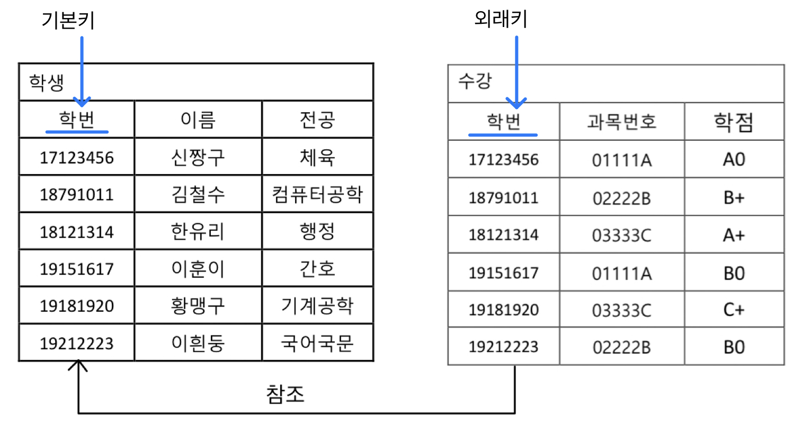
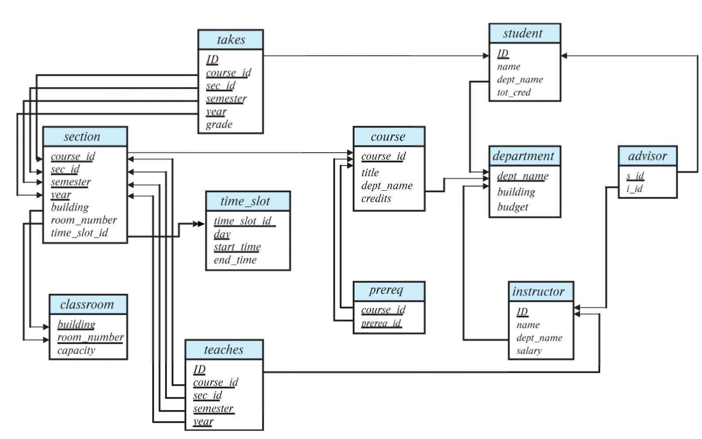
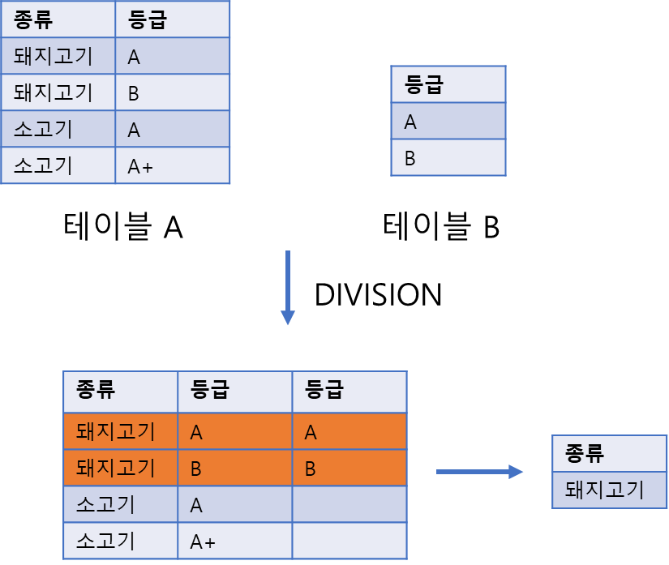

# 2. 관계형 모델이란?

- 상업용 데이터 처리의 기본. **테이블로 이루어져 있다.**

| ID | 이름 | 학과 | 연봉 | 성별 |
| --- | --- | --- | --- | --- |
| 10101 | Srini | 컴공 | 65000 | 남 |
| 12121 | Wu | 재무 | 90000 | 여 |
| 15151 | Mozart | 음악 | 40000 | 남  |
| 22222 | Einstein | 물리 | 95000 | 남 |
| 32343 | El said | 역사 | 60000 | 여 |

- 하나의 테이블을 **릴레이션(relation)**이라고 한다.
- 하나의 행(➡️)은 **튜플(tuple)**이라고 한다.
    - 튜플들의 집합이 relation이다.
- 하나의 열(⬇️)은 **속성(attribute)**라고 한다.

```
튜플의 예시 : (10101	Srini	컴공	65000	남) 

속성의 예시 :
ID
10101
12121
15151
22222
32343
```

- 각 속성이 가질 수 있는 값의 집합을 **도메인(domain)**이라고 한다.
    - 이때, 모든 도메인은 원자적이어야 한다. (= 가장 기본단위라는 뜻)

```
위의 relation을 예시로 들어보자면...

'ID' = 속성 (attribute)
'10101' = 도메인 (domain). '10101'을 쪼개서 '10'과 '101'로 나눠도 의미가 없다.
```

# 데이터베이스 스키마

데이터베이스에는 스키마와 인스턴스라는 개념이 존재한다.

- **스키마** : 데이터베이스의 구조. 속성명과 데이터 타입 등을 의미
- **인스턴스** : 데이터베이스의 값. 튜플들의 집합

# 키 (key)

## 슈퍼키 (Super key)

릴레이션에서는 각 행(튜플)을 구분하는 방법이 필요하다.

즉, 다른 튜플이 가지지 못하는 그 튜플만의 값이 존재해야 한다.

이를 **슈퍼키**라고 하며, 꼭 하나의 속성이 아니어도 된다.

정리하자면, 행마다 고유한 값을 가진 속성이 **슈퍼키!**

## 후보 키 (candidate key)

슈퍼 키 중 불필요한 속성을 포함하지 않는 키.

슈퍼 키 중 꼭 DB 설계에 있어야 하는 키가 바로 후보 키! 

## 주 키 (primary key)

후보 키 중 사용자가 선택한 대표 키!

그 속성이 절대 변하거나 드물게 변하도록 해야 한다.

| ID | 이름 | 학과 | 연봉 | 성별 |
| --- | --- | --- | --- | --- |
| 10101 | Srini | 컴공 | 65000 | 남 |
| 12121 | Wu | 재무 | 90000 | 여 |
| 15151 | Mozart | 음악 | 40000 | 남  |
| 22222 | Einstein | 물리 | 95000 | 남 |
| 32343 | El said | 역사 | 60000 | 여 |

여기서는 ID와 이름이 슈퍼키라고 할 수 있고, 이 중 ID가 주 키라고 할 수 있을 것이다.

## 주 키와 외래 키

릴레이션끼리는 서로 연관성을 가질 수 있다.



왼쪽의 릴레이션을 A, 오른쪽의 릴레이션을 B라고 하자. B는 A를 참조하고 있다.

이때 B의 ‘학번’은 반드시 A의 ‘학번’에서 나와야 한다.

- B의 ‘학번’을 외래 키(foreign key)라고 한다.
- B의 ‘학번’은 무조건 A의 ‘학번’에 있어야 하는데, 이를 **참조 무결성 제약 조건**이라고 한다.

# 스키마 다이어그램

데이터베이스 = 릴레이션들의 묶음. 

많은 릴레이션들은 서로 주 키와 외래 키 종속성을 가지고 있다.

이를 스키마 다이어그램이라는 그림으로 표현할 수 있다.



주의) 스키마 다이어그램과 ERD(개체-관계 다이어그램)은 다르다!

# 관계형 질의어

- Query Language라고 함.
- 데이터베이스에서 정보를 끌어올 때 쓰는 언어
- 크게 3가지 종류가 있다.

명령형 질의어 : 어떻게 데이터를 처리할지 상세히 기술하는 질의어.

- ex. 특정 데이터 검색을 위해 커서를 사용하는 방식.

```sql
DECLARE @name NVARCHAR(50);

DECLARE cursor_name CURSOR FOR
SELECT 이름 FROM 학생 WHERE 전공 = '컴퓨터공학';

OPEN cursor_name;
FETCH NEXT FROM cursor_name INTO @name;

WHILE @@FETCH_STATUS = 0
BEGIN
    PRINT @name;
    FETCH NEXT FROM cursor_name INTO @name;
END;

CLOSE cursor_name;
DEALLOCATE cursor_name;
```

함수형 질의어 : 함수를 이용해 데이터를 변환하거나 반환하는 질의어

- 주로 NoSQL에서 많이 사용한다.

```jsx
db.학생.find({ 전공: "컴퓨터공학" }).map(function(학생) {
    return 학생.이름;
});
```

선언형 질의어 : 무엇을 원하는지(What)를 명시하지만, 데이터를 처리하는 방식은 신경 쓰지 않는 질의어 

- 관계형 데이터베이스의 SQL이 대표적인 선언형 질의어

```sql
SELECT 이름 FROM 학생 WHERE 전공 = '컴퓨터공학';
```

# 관계 대수

관계형 질의어 (query language)를 수학에서의 집합을 이용해 표현해 놓은 것

한 개나 두 개의 릴레이션을 입력받아 새 릴레이션을 만드는 연산 체계.

## 왜 배워야 하는가?

1. 언어 독립적임. SQL은 RDBMS마다 조금씩 다르나, 이들 모두 관계대수를 기반으로 함.
2. 복잡한 연산의 이해 기반. 
3. 데이터베이스 최적화의 핵심 개념

## 관계 대수의 종류

관계 대수에는 필수 연산자와 추가적으로 정의해놓은 연산이 존재한다.

- 필수연산 : 셀렉션, 프로젝션, 합집합, 차집합, 카티션 곱
- 어떠한 질의어가 저 5가지를 표현할 수 있으면 이를 **관계적으로 완전**하다고 함.

## 연산자 소개하기

다음과 같은 릴레이션들을 이용해서 예시를 소개하고자 한다. (릴레이션의 이름은 Student, Market)

| ID | Name | Age | Grade |
| --- | --- | --- | --- |
| 1 | Alice | 20 | A |
| 2 | Bob | 21 | B |
| 3 | Carol | 22 | A |

| food | Point |
| --- | --- |
| Apple | 2000 |
| Banana | 3000 |

### 셀렉션 (selection, 선택연산)

ex. Age가 20 초과인 튜플을 모으기. 

$$
\sigma_{\text{Age}~>~\text{20}} 
~\text{(Student)}
$$

- 아래첨자로 된 조건문 부분을 **선택 술어**라고 한다.
- **선택 술어** 부분에는 and, or, not에 해당하는 연산자도 사용할 수 있다.

### 프로젝션 (Projection, 추출연산)

ex. 전체 릴레이션 중 Name, Grade만 보기

$$
\Pi_{\text{Name, Grade}}
~\text{(Student)}
$$

- 원하는 속성만 추출할 때 사용한다.
- 선택된 속성만 포함된 새로운 릴레이션을 반환.
- 자동으로 중복 제거가 이뤄진다.

### 카티션 곱

ex. 두 릴레이션의 카티션 곱

$$
\text{Student} ~\times~ \text{Market}
$$

- 두 결합관계를 이용해 모든 가능한 튜플 쌍을 생성한다.
- 위의 결과는 다음과 같다.

| ID | Name | Age | Grade | food | Point |
| --- | --- | --- | --- | --- | --- |
| 1 | Alice | 20 | A | Apple | 2000 |
| 1 | Alice | 20 | A | Banana | 3000 |
| 2 | Bob | 21 | B | Apple | 2000 |
| 2 | Bob | 21 | B | Banana | 3000 |
| 3 | Carol | 22 | A | Apple | 2000 |
| 3 | Carol | 22 | A | Banana | 3000 |

### 집합 연산

- 집합에서의 연산들을 생각하면 된다.
- 합집합, 교집합, 차집합이 존재한다.

### 조인 (join)

선택연산과 카테션 곱을 하나로 묶은 것이라고 생각하면 편하다.

기호로는 나비넥타이 기호($\Join$) 를 쓴다.

- 세타 조인 (theta join) : 두 튜플들을 6가지 비교 연산자를 통해 조합하는 것
- 동등 조인 (equi join) : 세타 조인에서 겹치는 것을 제외한 연산
- 자연 조인 (natural join) : 공통 속성의 동일한 값을 기준으로 조인, 중복 속성 제거.
- 외부 조인 (Outer Join) ****: 조건을 만족하지 않는 튜플도 포함하여 반환
- 교차 조인 (Cross Join) : 두 테이블의 모든 튜플 조합.

### 디비전 (division)

- **R ÷ S**로 표현.
- 두 릴레이션 **R**과 **S**에서 **S**가 제공하는 모든 값을 만족하는 **R**의 값들을 반환.


### 배정 연산

화살표 기호를 사용하며, 변수 할당을 의미.

### 재명명 연산

이름을 다시 지정하는 연산자.

ex. Student를 s로 재지정하기

$$
\rho_{\text{s}}~{(Student)}
$$

## 관계 대수의 한계

- 산술연산이 안됨 (진짜 덧셈, 뺄셈)
- 집단 함수(aggregate function)이 안됨. (평균, 분산 등을 구할 수 없음)
- 정렬을 나타낼 수 없음
- 데이터베이스를 수정할 수 없음
- 중복된 튜플을 표현할 수 없음.

그래서 추가적인 관계 대수 연산자가 존재함.  
(ex. AVG, 연도별 그룹핑, 지역별 그룹핑)