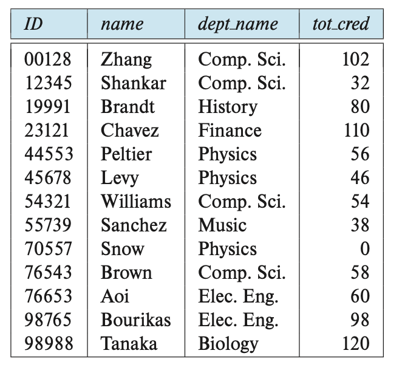
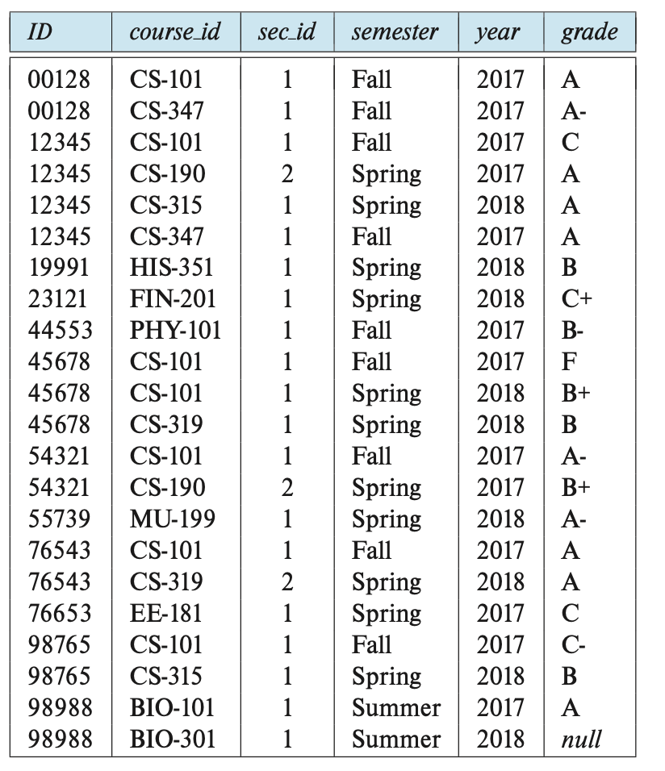
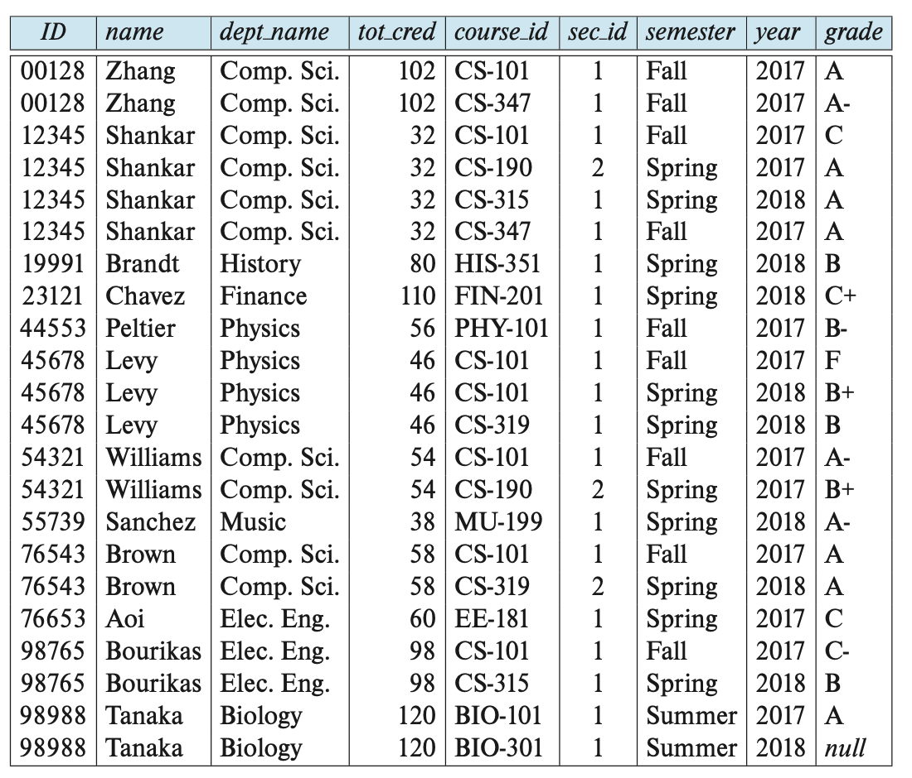
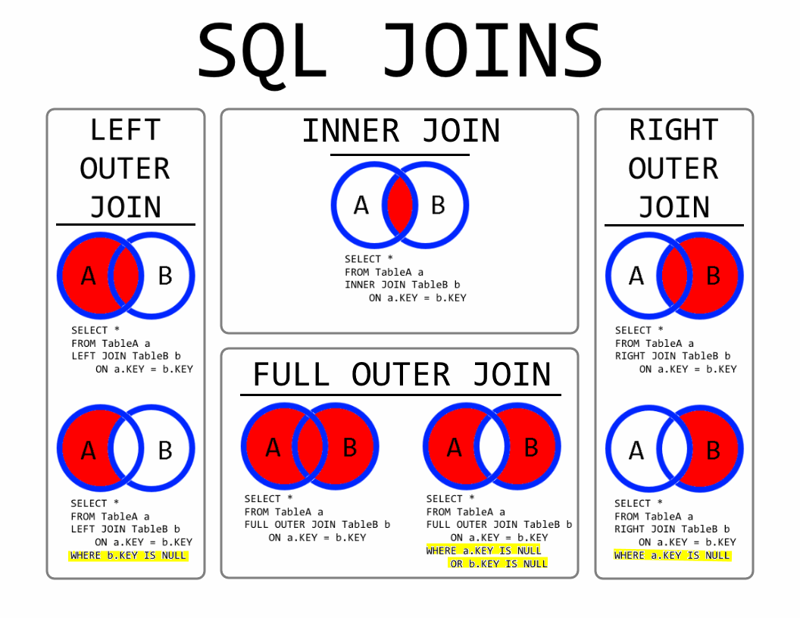

# 4. 중급 SQL (1)
# 조인 표현식

- 조인의 종류로써, 내부 조인과 외부 조인을 배워보자.
- 또한 조인의 조건으로써 `natural, on, using`을 배워보자.

## 내부 조인

두 테이블의 **조인 조건에 일치하는 데이터**만 결과에 포함하는 조인.

예를 들어, 다음과 같은 예시를 생각해 볼 수 있다.



student 릴레이션



takes 릴레이션

이때 내부 조인을 이용해서 한 과목이라도 수강한 학생을 찾을 수 있다.

```sql
-- 암시적 조인으로 작성한 경우
SELECT name, courseid
FROM student, takes
WHERE student.ID = takes.ID
```

```sql
-- 명시적 조인으로 작성한 경우
SELECT name, courseid
FROM student INNER JOIN takes
WHERE student.ID = takes.ID
```

이 경우 최종적인 결과는 다음과 같이 나온다.



## 조인의 조건

### natural 키워드

위의 예시를 다시 생각해보자. 조건문 Where을 생략할 수 있는 방법은 없을까?

그래서 만들어진 것이 바로 자연 조인이고, 자연 조인을 위한 키워드가 바로 `natural`이다.

```sql
SELECT name, courseid
FROM student natural join takes
```

### using 키워드

이번에는 다음과 같은 경우를 생각해보자.

```sql
SELECT name, title
FROM student natural join takes, course
WHERE takes.course_id = course.course_id;

/*
1. student와 takes의 natural join을 먼저 계산한다.
2. 자연 조인 결과와 course의 카티션 곱을 계산한다.
3. where 조건에 맞는 튜플만 모아서 새 릴레이션을 만든다.
*/
```

그러나, 다음과 같은 구문은 오류를 야기할 수 있다.

```sql
SELECT name, title
FROM student natural join takes natural join course
```

왜? 이는 테이블의 구조와 관련이 있다.

```
테이블 구조:
- student : (ID, name, dept_name, tot_cred)
- takes : (ID, course_id, sec_id)
- course : (course_id, title, dept_name, credits)
```

- student와 takes는 ID 열을 공유하므로, 첫 번째 자연 조인은 ID를 기준으로 수행. 그 결과 테이블은 (ID, name, dept_name, tot_cred, course_id, sec_id)의 구조를 가지게 된다.
- 이후 course 테이블과 자연 조인을 수행할 때, **dept_name**과 course_id 두 개의 동일한 열이 존재.
- 자연 조인은 동일한 이름을 가진 모든 열을 기준으로 조인하므로, 이 경우 두 열 모두가 조인 조건이 됨. 따라서 dept_name과 course_id가 모두 일치하는 행만 결과에 포함되며, 이는 의도한 결과와 다를 수 있음.

따라서 이러한 오류를 피하기 위해 `using` 키워드를 사용할 수 있다.

```sql
SELECT name, title
FROM (student natural join takes) join course using (course_id);
```

### on 키워드

또한 `on` 키워드를 이용하면 좀 더 다양한 join 조건을 표현할 수 있다.

```sql
SELECT * FROM student join takes on student.ID = takes.ID;
```

물론, `on`을 쓰지 않고도 표현할 수 있기는 하다.

```sql
SELECT * FROM student join takes where student.ID = takes.ID;
```

그러나 `on`을 꼭 사용해야 하는 이유를 보면…

1. 외부 조인에서 `where`과 다른 방식으로 작동한다.
2. 조인 조건을 `on`에, 나머지 부분을 `where`에 씀으로써 좀 더 쉬운 SQL 구문 해석이 가능하다. 

 

## 외부 조인

**외부 조인(Outer Join)이란?** 

- **두** 테이블을 조인할 때, 한쪽 테이블 또는 양쪽 테이블에 있는 데이터가 다른 테이블에 일치하는 값이 없더라도 결과에 포함되도록 하는 조인 방식.
- 데이터를 더 완전하게 분석하거나 누락된 값을 파악할 때 유용합니다.

**외부 조인의 유형**

1. **LEFT OUTER JOIN** (또는 **LEFT JOIN**) : **왼쪽 테이블**의 모든 행을 포함하고, 오른쪽 테이블에서 일치하는 데이터가 없으면 NULL로 채운다.
2. **RIGHT OUTER JOIN** (또는 **RIGHT JOIN**) : **오른쪽 테이블**의 모든 행을 포함하고, 왼쪽 테이블에서 일치하는 데이터가 없으면 NULL로 채운다.
3. **FULL OUTER JOIN : 두 테이블 모두**의 모든 행을 포함하고, 일치하지 않는 데이터는 NULL로 표시한다.



## 정리하기

- 일반적으로 조인이라고 하면 내부 조인을 의미.
- outer라는 단어가 붙지 않을 경우 대부분 내부 조인
- 지금까지 배운 조인의 종류 4가지 (inner, left outer, right outer, full outer)과 조인의 조건 3가지 (natural, using, on)를 결합해서 필요에 따른 다양한 조인을 만들어 낼 수 있다.

# 뷰 (view)

- 데이터베이스에서 하나 이상의 테이블로부터 데이터를 추출하여 **가상의 테이블**
- 실제 데이터를 저장하지 않고, 기본 테이블의 데이터를 **동적 쿼리 결과로 보여줌.**

**왜 사용하는가?**

1. **데이터 보안 강화 : 특정 사용자에게 전체 데이터가 아닌 필요한 데이터만 접근**
2. **복잡한 쿼리 간소화 : 자주 사용하는 복잡한 쿼리를 뷰로 정의하면, 간단하게 결과를 가져올 수 있음.**
3. **재사용성 : 복잡한 쿼리를 반복적으로 작성할 필요 없음.**

## 뷰 정의하기

```sql
CREATE VIEW 뷰이름 AS
SELECT 열1, 열2, ...
FROM 테이블명
WHERE 조건;
```

**다음과 같은 예시를 생각해보자.**

- instructor 릴레이션에서 salary를 제외한 정보에 접근하려고 한다.
- 단, 직접적으로 instructor 릴레이션에 접근할 수는 없음.

이 경우 다음과 같이 코드를 쓸 수 있다.

```sql
CREATE VIEW faculty as 
SELECT ID, name, dept_name
FROM instructor;
```

**이 코드를 통해서 faculty라는 뷰가 어딘가에 만들어지는 것이 아니다.**

**faculty가 다른 SQL 코드에서 불려지면, 그 때 이 코드가 실행되는 것이다.**

```sql
SELECT name, dept_name 
FROM faculty
WHERE dept_name = 'Computer Science';
```

## 뷰 사용하기

### 1. 뷰의 속성 이름 정하기

다음과 같이 뷰의 속성 이름을 정할 수 있다.

```sql
create view dept_total_salary (dept_name, total_salary) as
select dept_name, sum (salary) from instructor
group by dept_name;
```

이 뷰는 학과별 모든 교수의 연봉의 합을 출력한다. 

표현식 sum(salary)가 이름을 가지고 있지 않기 때문에 속성 이름을 임의로 정한 것이다.

또한 dept_total_salary는 불려질 때마다 salary 릴레이션의 sum을 다시 계산한다.

이를 통해 salary 릴레이션의 업데이트를 계속 반영할 수 있다.

### 2. 뷰로 또 다른 뷰를 정의

이번에는 뷰를 이용해서 또 다른 뷰를 정의해보자.

먼저 다음과 같은 뷰를 정의한다.

```sql
create view physics_2017_watson as 
select course_id, room_number
from physics_2017
where building = 'Watson'; 
```

인제 이를 이용한 새로운 뷰를 만들어보자.

```sql
CREATE VIEW watson_room_101 AS
SELECT course_id
-- 
FROM physics_2017_watson
-- 위 뷰에서 추가 조건(room_number = '101')을 넣음
WHERE room_number = '101'; 
```

이 방식으로 여러 뷰를 계층적으로 정의하여 복잡한 데이터 처리 작업을 단순화할 수 있다.

## 실체화 뷰

그렇다면, 뷰를 실제 릴레이션으로 만들 순 없는걸까? 

일부 데이터베이스의 경우 이 기능을 제공하며 이를 실체화 뷰라고 한다.

```sql
-- PostgreSQL에서의 예제
CREATE MATERIALIZED VIEW product_sales_summary AS
SELECT 
    p.product_id,
    p.product_name,
    SUM(s.amount) AS total_sales
FROM
    products p
LEFT JOIN
    sales s
ON
    p.product_id = s.product_id
GROUP BY
    p.product_id, p.product_name;
```

만약 해당 실체화 뷰가 참조하는 릴레이션이 업데이트 된다면, 실체화 뷰는 어떻게 업데이트 할 것인가?

이를 **실체화 뷰 관리**라고 하며, 각 데이터베이스마다 다양한 방법을 통해 이를 지원하고 있다.

## 뷰의 갱신

뷰를 이용해서 릴레이션을 수정할 수 있을까?

예를 들어, 다음과 같은 질의를 수행한다고 해보자.

```sql
insert into faculty values ('30765', 'Green', 'Music')
```

faculty 뷰의 경우, instructor 릴레이션을 참고해 만들어졌기 때문에 이러한 삽입은 instructor에 대해서 수행되어야 한다. 하지만 instructor 릴레이션에는 salary에 해당하는 속성이 없다.

이럴 때 다음과 같은 2가지 방법을 채택할 수 있다.

1. 삽입을 거부하고 오류 메시지를 출력한다
2. instructor 릴레이션에 `('30765', 'Green', 'Music', Null)`을 삽입한다.

뷰를 통한 데이터베이스 수정은 다음과 같은 문제도 가지고 있다.

```sql
CREATE VIEW inst_info as 
SELECT ID, name, building
FROM instructor, department
WHERE instructor.dept_name = department.dept_name;
```

이 뷰에 다음과 같은 삽입 질의를 생각해보자.

```sql
insert into instructor_info
values ('69987', 'White', 'Taylor');
```

- 새로운 강사 '69987', 'White'를 Taylor 건물에 삽입하려고 한다.
- 문제는 이 뷰가 실제로 물리적인 데이터를 저장하지 않는다는 점이다. 이 뷰는 instructor와 department 테이블의 데이터를 참조할 뿐이므로, 이 삽입 작업이 두 테이블 모두에 올바르게 반영되어야 한다.

그래서 instructor와 department 테이블을 보면…

- instructor 테이블에 '69987', 'White'를 추가하려면, 해당 강사의 dept_name이 필요. 그러나 Taylor라는 건물에 해당하는 dept_name이 아직 department 테이블에 없으므로 삽입할 수 없다.
- 마찬가지로, department 테이블에 Taylor 건물 정보를 추가하려고 해도 dept_name이 필요.
- 결과적으로, 두 테이블 중 하나에 데이터를 추가하려면 서로의 데이터가 필요하므로 이 작업이 불가능함.

이러한 문제 떄문에 왠만하서는 뷰 릴레이션에 대한 변경을 허락하지 않는 경우가 많다.

단, 특정한 조건을 만족하면 update가 가능하게 설계해 둔 경우가 있고, 이를 갱신 가능(updatable)이라고 한다.

### 갱신 가능 조건

일반적으로 SQL 뷰가 다음 조건 모두를 만족하면 갱신 가능(updatable) 이라고 한다.

- from 절은 오직 1개의 릴레이션을 가진다
- select 절은 오직 릴레이션의 속성 이름만 포함. 표현, 집계(aggregation), distinct 명세 등이 있으면 안됨.
- select 절에 나열되지 않은 어떤 속성도 null 값이 될 수 있어야 한다. 즉 이러한 속성은 not null 조건을 가지거나 주 키의 일부여서는 안 된다.
- 질의는 group by나 having 절을 가져서는 안 된다.

이러한 제약 조건 하에서 다음과 같이 뷰를 정의하면, 그 뷰는 update, insert, delete 연산이 가능하다.

```sql
create view history_instructors as
select * from instructor
where dept_name = 'history';
```

물론, 이것 역시 완벽한 해결책은 아니다. 따라서 트리거와 같은 더 다양한 규칙이 있으나, 너무 복잡해서 여기서는 다루지 않는다.

# 트랜잭션

- 트랜잭션이란? 데이터베이스에서 수행되는 **하나의 논리적 작업 단위**
- 트랜잭션은 여러 개의 작업(예: 데이터 삽입, 수정, 삭제)을 하나로 묶어 처리하며, 이 모든 작업이 성공하거나, 모두 실패하는 방식으로 동작

트랜잭션은 다음의 SQL문 중 하나로 끝나야 함.

1. `Commit` : 현재 수행 중인 트랜잭션을 커밋. 수정을 영구적으로 반영한다는 뜻
2. `Rollback` : 현재 수행 중인 트랜잭션을 롤백. 수정을 취소한다는 뜻.

하나의 트랜잭션은 원자적임. 즉, 트랜잭션의 일부만 커밋하거나 일부만 롤백할 수 없음.

반드시 하나의 트랜잭션 전체가 모두 커밋되거나, 모두 취소되어야 함.

트랜잭션을 실행하는 중 오류가 일어난 경우, 전체 트랜잭션 중 이미 실행된 것을 무효화해야 함.

많은 데이터베이스는 기본적으로 **자동 커밋(Auto Commit)**을 켜둔 상태로 작동.

자동 커밋이 켜져 있으면, 각 SQL 명령어가 **자동으로 하나의 트랜잭션으로 간주**되고, 명령어가 성공적으로 실행되면 즉시 저장된다.

이를 해제하는 방법은 각 데이터베이스마다 다름.

여러 개의 SQL 명령어를 묶어서 하나의 트랜잭션으로 설정할 수도 있음. 

1. `BEGIN ATOMIC ... END` 

- SQL:1999 **표준**에서는 여러 SQL 명령어를 하나의 트랜잭션으로 묶는 방법으로 `BEGIN ATOMIC ... END` 구문을 제공합니다.
- 이 구문 안에 작성된 모든 SQL 명령어는 하나의 트랜잭션으로 처리되며, 마지막까지 성공적으로 실행되면 자동으로 커밋(Commit)된다.
1. `BEGIN ...`  만 있는 경우
- 일부 데이터베이스는 `BEGIN ...` 구문으로 트랜잭션을 시작할 수 있지만, END 키워드는 지원하지 않음.
- 대신, 트랜잭션을 종료하려면 명시적으로 다음 중 하나를 실행해야 함
    - COMMIT WORK : 트랜잭션 결과를 저장
    - ROLLBACK WORK : 트랜잭션 작업을 취소