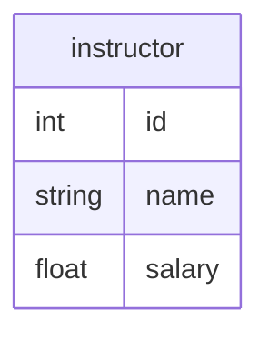

# 6단원 : E-R 모델 기반 설계

데이터베이스를 이용하는 프로그램의 설계 과정을 표현하면, 몇 가지 단계가 나온다.

## 설계 단계

1. 데이터 규정 : 일종의 명세서 (specification)을 만드는 것이라고 할 수 있음
2. 개념적 설계
    - 사용자의 요구사항을 분석하여 **데이터의 구조와 관계를 추상적으로 모델링하는 단계**
    - **데이터베이스 하면 떠오르는 그 그림(ER 다이어그램)을 그리는 단계!**
3. 논리적 설계
    - 개념적 설계를 바탕으로 **구체적인 데이터베이스 모델을 정의하는 단계**.
    - 이 단계에서 관계형 데이터 모델로 변환하여 **테이블, 컬럼, 키, 관계** 등을 설계함.
    - **위의 그림을 테이블 형태(릴레이션 스키마)로 바꾸는 것**
4. 물리적 설계
    - 논리적 설계를 기반으로 **실제 데이터베이스에 구현하는 단계**.
    - 성능 최적화와 저장 구조를 고려하여 테이블을 생성하고 인덱스를 설정함.
    - **코딩을 통해 실제 DB를 만드는 과정!**

우리는 여기서 개념적 설계에 주목해보자.

## 설계 대안

그 전에, 설계 시 조심해야 할 것들을 생각해보자.

1. **중복성 : 같은 데이터가 여러 군데에 중복 저장되는 현상**
    - 데이터 일관성을 해칠 수 있고, 저장 공간 낭비와 성능 저하를 초래할 수 있음.
    - 해결책 : 정규화
2. **불완전성 : 데이터가 충분하지 않거나, 누락된 상태**를 의미
    - 필요한 정보가 없으면 데이터 활용이 어려워지고, 시스템의 신뢰성이 떨어질 수 있음.
    - NULL 값, **데이터 누락,** 정합성 문제 ****(특정 필드가 필수임에도 누락됨) ****등이 대표적임.
    - 해결책 : **NOT NULL 제약 조건, 기본값(Default Value) 설정**

# E-R 관계 모델

이제 개념적 설계에 사용되는 대표적인 모형인 E-R (Entity-Relation, 개체-관계) 모델에 대해서 알아보자.

## 어떠한 요소가 있는가?

1. 속성, 개체 & 개체 집합 = (attribute, entity & entity set)
2. 관계 & 관계 집합 = (relationship & relationship set)
3. 대응 카디널리티
4. 주 키
5. 개체 집합

## 개체와 개체 집합

ER 다이어그램에서 주로 보이는 사각형이 바로 개체 집합.

- 학교 안 모든 instructor = 개체 집합
- 개인(1명)인 instructor A =  개체
- Instructor의 id, name, salary = 속성
- A의 실제 id, name, salary = 값

실제 데이터베이스와 ER 다이어그램을 연결해보자면,

✅ **개체 집합(Entity Set) → 하나의 테이블 (Table)**

✅ **개체(Entity) → 하나의 튜플 (Row, 행)**

✅ **속성(Attribute) → 테이블의 컬럼 (Column, 필드)**

## 관계와 관계 집합 (1)

두 개 이상의 개체 사이의 연관성을 나타내는 것을 관계(relationship) 이라고 한다.

이를 확장해, 개체 집합 사이의 연관성을 나타내는 것을 관계 집합(relationship set) 이라고 한다.

- ex. instructor Abraham과 student Peter는 advisor라는 관계

관계 또는 관계 집합은 ER 다이어그램에서 다이아몬드로 표기한다.

## 관계와 관계 집합 (2)

관계 집합을 수학적으로 표기하자면 다음과 같다.

$$
R \subset \{ (e_1, e_2, \cdots e_n) | e_1 \in E_1, e_2 \in E_2, \cdots,
e_n \in E_n \}
$$

만약 **E1 = 학생 집합, E2 = 수업 집합**이라면, 관계 집합 **R**은 E1과 E2의 가능한 모든 조합 중에서 실제로 존재하는 관계를 모아놓은 **부분집합이다.**

예를 들어:

- $E_1$ =  {Alice, Bob} (학생 집합)
- $E_2$ =  {Math, CS} (수업 집합)
- $R$ =  {(Alice, Math), (Bob, CS)}  → Alice는 Math 수업을 듣고, Bob은 CS 수업을 듣는 관계를 나타냄.

그래서 우리는 $E_i$들이 $R$에 참여한다고 표현한다.

### 개체의 역할

관계에서 개체는 역할을 가질 수 있다.

보통은 역할을 명시적으로 나타낼 필요가 없지만, **같은 엔터티 집합이 하나의 관계에서 여러 번 등장할 때(=재귀 관계, Recursive Relationship)** 역할을 구분하는 것이 필요.

📌 **시나리오**:

- 한 대학에서 강의(Course)들은 **선수 과목(Prerequisite)이 있을 수 있음.**
- 예를 들어, “자료구조(C2)“를 들어야만 “알고리즘(C1)“을 들을 수 있다고 하자. 우리는 이 관계를 **prereq 관계**로 표현 가능하다.
- 문제는 **“강의(Course)” 엔터티 집합이 같은 관계(prereq)에 두 번 등장한다는 점! 따라서** 첫 번째 등장하는 Course는 **C1 (현재 듣고 싶은 과목)**, 두 번째 등장하는 Course는 **C2 (선수 과목)** 역할을 수행.

📌 **수학적으로 표현하면**:

- $prereq \subseteq \{(C1, C2) | C1, C2 \in Course\}$
- 여기서 (C1, C2)는 “C1을 듣기 전에 C2를 먼저 들어야 한다”는 의미를 가짐.
- 즉, **(C1, C2)는 존재할 수 있지만 (C2, C1)은 존재하지 않음!**

이를 ER 다이어그램으로 그려보면 다음과 같이 나타낼 수 있다.

왼쪽 개체의 course_id -> course_id 역할선 -> prereq 마름모 -> prereq_id 역할선 순서로 읽으면 된다.

즉, course_id 역할선이 C1에 해당하고, prereq_id 역할선이 C2에 해당한다.

### 설명 속성

