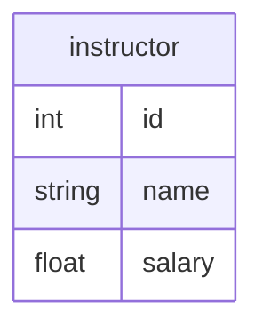
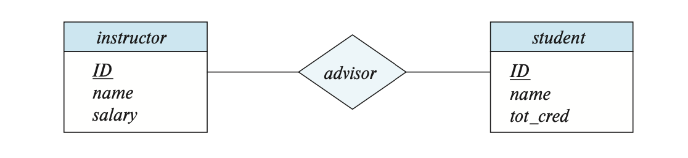
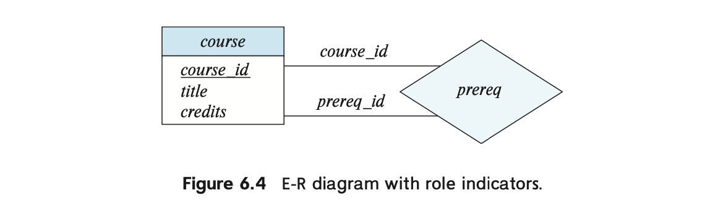
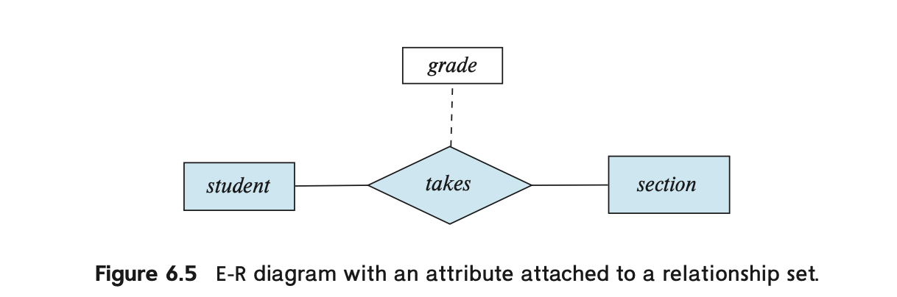
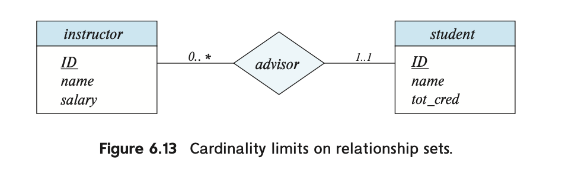
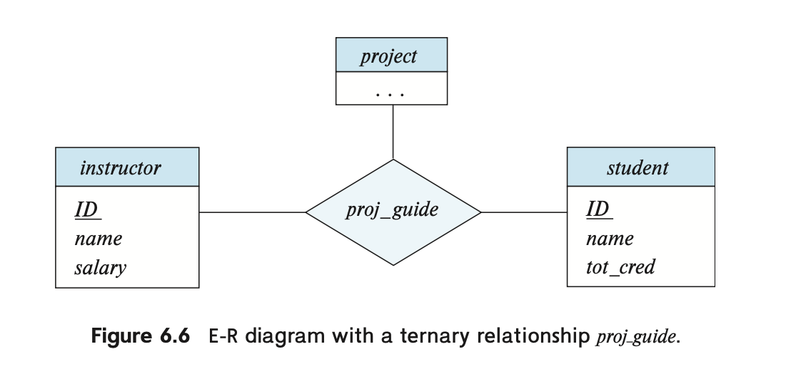
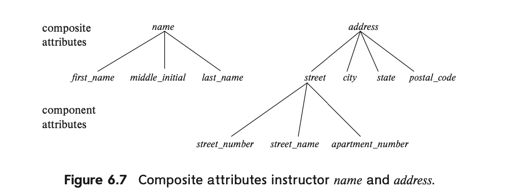
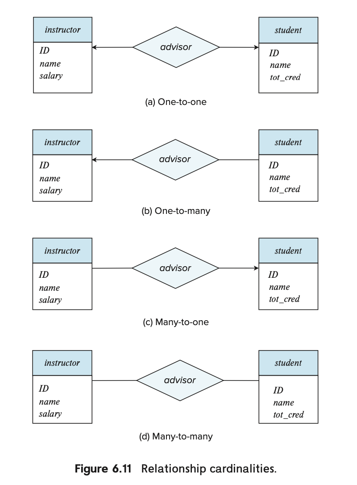
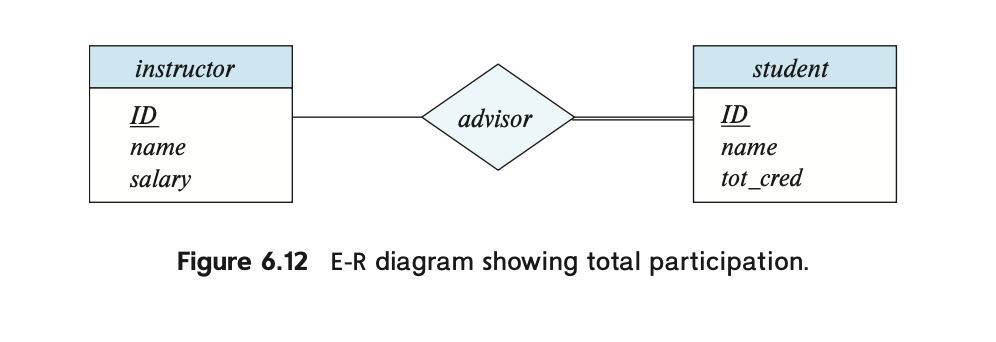
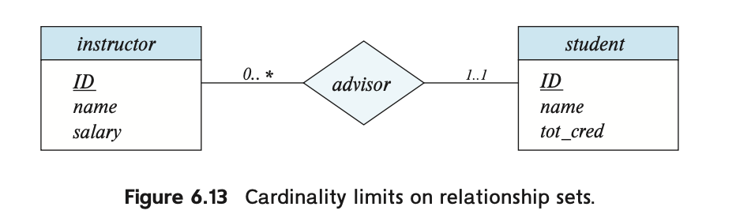

# E-R 모델 기반 설계 (1)

# 데이터베이스의 설계

데이터베이스를 이용하는 프로그램의 설계 과정을 표현하면, 몇 가지 단계가 나온다.

## 설계 단계

1. 데이터 규정 : 일종의 명세서 (specification)을 만드는 것이라고 할 수 있음
2. 개념적 설계
    - 사용자의 요구사항을 분석하여 **데이터의 구조와 관계를 추상적으로 모델링하는 단계**
    - **데이터베이스 하면 떠오르는 그 그림 (ER 다이어그램)을 그리는 단계!**
3. 논리적 설계
    - 개념적 설계를 바탕으로 **구체적인 데이터베이스 모델을 정의하는 단계**.
    - 이 단계에서 관계형 데이터 모델로 변환하여 **테이블, 컬럼, 키, 관계** 등을 설계함.
    - **위의 그림을 테이블 형태(릴레이션 스키마)로 바꾸는 것**
4. 물리적 설계
    - 논리적 설계를 기반으로 **실제 데이터베이스에 구현하는 단계**.
    - 성능 최적화와 저장 구조를 고려하여 테이블을 생성하고 인덱스를 설정함.
    - **코딩을 통해 실제 DB를 만드는 과정!**

우리는 여기서 개념적 설계에 주목해보자.

## 설계 대안

그 전에, 설계 시 조심해야 할 것들을 생각해보자.

1. **중복성 : 같은 데이터가 여러 군데에 중복 저장되는 현상**
    - 데이터 일관성을 해칠 수 있고, 저장 공간 낭비와 성능 저하를 초래할 수 있음.
    - 해결책 : 정규화
2. **불완전성 : 데이터가 충분하지 않거나, 누락된 상태**를 의미
    - 필요한 정보가 없으면 데이터 활용이 어려워지고, 시스템의 신뢰성이 떨어질 수 있음.
    - NULL 값, **데이터 누락,** 정합성 문제 ****(특정 필드가 필수임에도 누락됨) ****등이 대표적임.
    - 해결책 : **NOT NULL 제약 조건, 기본값(Default Value) 설정**

# E-R 관계 모델

이제 개념적 설계에 사용되는 대표적인 모형인 E-R (Entity-Relation, 개체-관계) 모델에 대해서 알아보자.

각 요소에 대한 개념적 설명을 이해하고, 이를 실제로 그림으로 그리는 방법에 대해 알아보자.

## 어떠한 요소가 있는가?

1. 속성, 개체 & 개체 집합 = (attribute, entity & entity set)
2. 관계 & 관계 집합 = (relationship & relationship set)
3. 대응 카디널리티
4. 주 키
5. 개체 집합

## 개체와 개체 집합

ER 다이어그램에서 주로 보이는 사각형이 바로 개체 집합.

- 학교 안 모든 instructor = 개체 집합
- 개인(1명)인 instructor A =  개체
- Instructor의 id, name, salary = 속성
- A의 실제 id, name, salary = 값

실제 데이터베이스와 ER 다이어그램을 연결해보자면,

✅ **개체 집합(Entity Set) → 하나의 테이블 (Table)**

✅ **개체(Entity) → 하나의 튜플 (Row, 행)**

✅ **속성(Attribute) → 테이블의 컬럼 (Column, 필드)**

## 관계와 관계 집합

두 개 이상의 개체 사이의 연관성을 나타내는 것을 관계(relationship) 이라고 한다.

이를 확장해, 개체 집합 사이의 연관성을 나타내는 것을 관계 집합(relationship set) 이라고 한다.

- ex. instructor Abraham과 student Peter는 advisor라는 관계

관계 또는 관계 집합은 ER 다이어그램에서 다이아몬드로 표기한다.

### 관계 집합의 수학적 표기

관계 집합을 수학적으로 표기하자면 다음과 같다.

$$
R \subset \{ (e_1, e_2, \cdots e_n) | e_1 \in E_1, e_2 \in E_2, \cdots,
e_n \in E_n \}
$$

만약 **E1 = 학생 집합, E2 = 수업 집합**이라면, 관계 집합 **R**은 E1과 E2의 가능한 모든 조합 중에서 실제로 존재하는 관계를 모아놓은 **부분집합이다.**

예를 들어:

- $E_1$ =  {Alice, Bob} (학생 집합)
- $E_2$ =  {Math, CS} (수업 집합)
- $R$ =  {(Alice, Math), (Bob, CS)}  → Alice는 Math 수업을 듣고, Bob은 CS 수업을 듣는 관계를 나타냄.

그래서 우리는 $E_i$들이 $R$에 참여한다고 표현한다.

### 개체의 역할

관계에서 개체는 역할을 가질 수 있다.

보통은 역할을 명시적으로 나타낼 필요가 없지만, **같은 엔터티 집합이 하나의 관계에서 여러 번 등장할 때(=재귀 관계, Recursive Relationship)** 역할을 구분하는 것이 필요.

📌 **시나리오**:

- 한 대학에서 강의(Course)들은 **선수 과목(Prerequisite)이 있을 수 있음.**
- 예를 들어, “자료구조(C2)“를 들어야만 “알고리즘(C1)“을 들을 수 있다고 하자. 우리는 이 관계를 **prereq 관계**로 표현 가능하다.
- 문제는 **“강의(Course)” 엔터티 집합이 같은 관계(prereq)에 두 번 등장한다는 점! 따라서** 첫 번째 등장하는 Course는 **C1 (현재 듣고 싶은 과목)**, 두 번째 등장하는 Course는 **C2 (선수 과목)** 역할을 수행.

📌 **수학적으로 표현하면**:

- $\text{prereq} \subseteq \{\text{(C1, C2)}~|~\text{C1, C2} \in \text{Course}\}$
- 여기서 (C1, C2)는 “C1을 듣기 전에 C2를 먼저 들어야 한다”는 의미를 가짐.
- 즉, **(C1, C2)는 존재할 수 있지만 (C2, C1)은 존재하지 않음!**

이를 ER 다이어그램으로 그려보면 다음과 같이 나타낼 수 있다.

왼쪽 개체의 `course_id` -> `course_id` 역할선 -> `prereq` 마름모 -> `prereq_id` 역할선 순서로 읽는 것이 중요하다.

즉, `course_id` 역할선이 C1에 해당하고, `prereq_id` 역할선이 C2에 해당한다.

### 설명 속성

관계는 설명 속성이라는 것을 가질 수 있음.

표기는 아래 예시와 같이 점선으로 이어진 사각형으로 표기함.

- grade는 student와 section을 연결하는 takes 관계를 더 상세히 설명하는 정보.
- student와 section 개체 자체의 속성이 아니라 **관계에 대한 추가 정보**.
- 이 속성이 없어도 takes 관계 자체는 성립하지만, **더 많은 정보를 제공하기 위해 추가**된 속성.

## 관계 집합의 특징

1. **ERD에서 속성 생략**

E-R 다이어그램을 그릴 때 개체 집합의 속성은 **첫 번째 등장 시에만 표시**하며, 이후 반복되는 경우 속성을 생략하여 **중복과 불일치 문제를 방지**함.

- student와 section 개체 집합의 속성이 생략되었음.
- 이는 대학 전체 데이터 모델을 구성할 때 **복잡한 E-R 다이어그램을 여러 개의 다이어그램으로 나눌 필요가 있기 때문**.

1. **동일한 개체 집합이 여러 관계 집합에 참여 가능**
- 예를 들어, student와 section은 takes 관계에 참여하지만, **추가적으로 teaching_assistant 관계에도 참여 가능**.
- 즉, 같은 개체 집합이 여러 개의 관계 집합에 포함될 수 있음.

1. **관계 집합은 중복을 허용하지 않음**
- takes 관계는 student와 section 간의 연결을 나타내며, **집합(Set) 개념을 따르므로 중복이 불가능**.
- 따라서 **같은 학생이 같은 강의를 중복 수강할 수 없음**.
- 만약 같은 강의를 여러 번 수강할 수 있도록 하려면, 다중값 속성(Multivalued Attribute)인 grades를 사용해야 함.

1. **이항 관계(Binary Relationship)와 다항 관계(N-ary Relationship)**
- 대부분의 관계 집합은 **이항 관계(Binary Relationship, 개체 집합 2개가 참여)**.
- 하지만 가끔씩 **세 개 이상의 개체 집합이 포함되는 다항 관계(N-ary Relationship)**가 필요할 수도 있음.
- 관계 집합의 차수(Degree):
    - **2개의 개체 집합이 참여** → **이항(Binary) 관계**
    - **3개의 개체 집합이 참여** → **삼항(Ternary) 관계**
    - 그 이상도 가능하지만, 데이터베이스 모델에서는 보통 이항과 삼항 관계를 주로 사용.

1. **예시 : 삼항 관계(Ternary Relationship**)
- 삼항 관계는 **세 개의 개체 집합을 하나의 관계로 연결하여 표현**.
- proj_guide(instructor, student, project)는 **“어떤 교수(instructor)가 어떤 학생(student)을 어떤 프로젝트(project)에서 지도하는지”**를 의미.

- 개체 집합 `instructor, student, project`가 존재한다고 가정.
- 연구 프로젝트(`project`)에는 여러 명의 학생(`student`)과 여러 명의 교수(`instructor`)가 참여 가능.
- 특정 학생이 특정 프로젝트에서 **어떤 교수의 지도**를 받는지 나타내기 위해 삼항 관계 `proj_guide`를 정의.
- 만약 이 정보를 **이항 관계만으로 표현하면 지도 교수와 학생의 연결 정보를 명확히 나타내기 어려움**.

# 복합 속성

인제 좀 더 다양한 유형의 속성을 알아보자.

## 단순 속성 vs 복합 속성

아래의 예시에서 id, name, salary 처럼 더 이상 쪼개지지 않는 속성들을 우리는 단순 속성이라고 한다.

반면, 더 작은 단위로 나눠지는 속성들 역시 존재하며, 이를 **복합 속성**이라고 부른다.

- 복합속성 address는 street, city 등의 속성으로 나눠진다.
- address 내부의 속성인 street 역시 복합속성으로, street_number, street_name 등으로 나눠진다.

## 단일값 속성 vs 다중값 속성

**✅ 단일값 속성 (Single-valued Attribute)**

하나의 값만 가질 수 있는 속성. 한 개체(Entity)에서 특정 속성은 오직 **하나의 값**만을 가짐.

- **사람(Person)** 개체의 주민등록번호(SSN), 생년월일(Birthdate), 이름(Name)
- **자동차(Car)** 개체의 차대번호(VIN), 제조사(Manufacturer)

**✅ 다중값 속성 (Multi-valued Attribute)**

하나의 개체가 해당 속성에 대해 **여러 개의 값을 가질 수 있는 경우**. 속성이 **집합(Set), 리스트(List) 형태**로 저장.

- **사람(Person)** 개체의 이메일(Email) → 한 사람이 여러 개의 이메일을 가질 수 있음.
- **자동차(Car)** 개체의 색상(Color) → 한 자동차가 여러 색상을 가질 수 있음 (투톤 컬러 등).

## 유도 속성

**다른 속성(또는 속성들의 조합)으로부터 계산될 수 있는 속성**을 의미.

**저장되지 않고, 실시간으로 계산 가능하며, 다른 속성을 기반으로 유추된다.**

**✅ 유도 속성 예시**

**1️⃣ 나이(Age)**

- 나이(Age) = 현재 연도(Current Year) - 출생 연도(Birth Year)
- Age는 **출생 연도(Birth Year)**를 통해 계산할 수 있기 때문에 유도 속성이다.
- 데이터베이스에는 `Birth Year`만 저장하고, `Age`는 필요할 때마다 계산할 수 있음.

**2️⃣ 근속 연수(Years of Service)**

- 근속 연수(Years of Service) = 현재 연도 - 입사 연도(Join Year)
- 근속 연수는 저장된 입사 연도 값을 이용해 계산할 수 있음.

# 대응 카디널러티

엔티티끼리 맺는 일종의 함수 관계.

## **📌 대응 카디널리티 종류**

대응 카디널리티는 크게 **1:1(일대일), 1:N(일대다), M:N(다대다)** 세 가지로 나뉜다.

### **1️⃣ 1:1 (일대일, One-to-One)**

한 엔터티의 한 레코드가 다른 엔터티의 **오직 하나의 레코드**와만 연결됨.

- 사람(Person) - 여권(Passport) 관계
    - 한 사람은 하나의 여권만 가질 수 있고, 하나의 여권은 한 사람에게만 발급됨.
- 사용자의 상세 정보(User - UserProfile)
    - 한 사용자는 하나의 프로필만 가질 수 있음.

### **2️⃣ 1:N (일대다, One-to-Many)**

한 엔터티의 한 레코드가 다른 엔터티의 **여러 개의 레코드**와 연결될 수 있음.

- 고객(Customer) - 주문(Order) 관계
    - 한 고객은 여러 개의 주문을 할 수 있지만, 하나의 주문은 오직 한 고객에게만 속함.
- 블로그(Blog) - 게시글(Post) 관계
    - 한 블로그에 여러 개의 게시글이 있을 수 있지만, 하나의 게시글은 하나의 블로그에만 속함.

### **3️⃣ M:N (다대다, Many-to-Many)**

한 엔터티의 여러 개의 레코드가 다른 엔터티의 여러 개의 레코드와 연결될 수 있음.

다대다 관계는 보통 중간 테이블(Bridge Table, Junction Table)을 이용하여 해결함.

- 학생(Student) - 과목(Subject) 관계
    - 한 학생은 여러 개의 과목을 들을 수 있고, 한 과목은 여러 학생이 수강할 수 있음.
- 영화(Movie) - 배우(Actor) 관계
    - 한 영화에는 여러 명의 배우가 출연할 수 있고, 한 배우는 여러 개의 영화에 출연할 수 있음.

## 대응 카디널리티 그리기

- ‘일’ 쪽인 부분에 화살표(⬅️)를 그린다.
- ‘다’ 쪽인 부분에 일반적인 선을 그린다.

## 전체 참여와 부분 참여

**1️⃣ 전체 참여(Total Participation)**

✔ 모든 엔터티가 관계에 반드시 참여해야 하는 경우

✔ 관계(relationship)에 포함되지 않는 엔터티가 없을 때

✔ ERD에서 **이중선(Double Line)**으로 표현됨.

🔹 **예시: 직원(Employee) - 회사(Company) 관계**

- 모든 직원은 반드시 **어느 한 회사에 속해야 함**.
- 즉, Employee 엔터티의 모든 레코드는 반드시 Company와 연결됨.
- 직원이 속하지 않는 회사가 존재할 수 있지만, 직원은 반드시 회사에 소속되므로 Employee는 **전체 참여**.

**2️⃣ 부분 참여(Partial Participation)**

✔ **일부 엔터티만 관계에 참여하는 경우**

✔ **관계에 속하지 않는 엔터티가 있을 수 있음**

✔ ERD에서 **단일선(Single Line)**으로 표현됨.

🔹 **예시: 학생(Student) - 동아리(Club) 관계**

- 모든 학생이 반드시 동아리에 가입할 필요는 없음.
- 일부 학생은 동아리에 가입하지만, 가입하지 않은 학생도 존재할 수 있음.
- 즉, Student 엔터티는 Club 관계에서 **부분 참여**.

### ERD에 그리기

먼저 전체 참여의 경우 다음과 같이 이중선을 사용한다.

부분 참여의 경우 $l..h$의 형태로 각 개체가 얼마나 관계에 참여하는지(=카디널리티)를 표기한다.

%201890901b87f180a7b446e1881af546d4/%E1%84%89%E1%85%B3%E1%84%8F%E1%85%B3%E1%84%85%E1%85%B5%E1%86%AB%E1%84%89%E1%85%A3%E1%86%BA_2025-03-03_%E1%84%8B%E1%85%A9%E1%84%8C%E1%85%A5%E1%86%AB_1.09.19.png)

$l$은 최솟값을, $h$는 최댓값을 의미. 

- h = 1이면 어떠한 개체 1개는 관계 1개만 참여할 수 있음.
- h = * 이면 어떠한 개체 1개는 아무 관계에나 무한히 참여할 수 있음.

예를 들어, 다음과 같은 ERD가 있다고 하자.

이 경우 다음과 같이 해석할 수 있다.

- 교수(개체집합) ↔️ 지도관계 (관계집합) ↔️ 학생(개체집합)
- 학생은 무조건 1개의 지도관계가 있어야 함.
- 교수는 지도관계가 없어도 되고, 무한히 많이 두어도 됨.