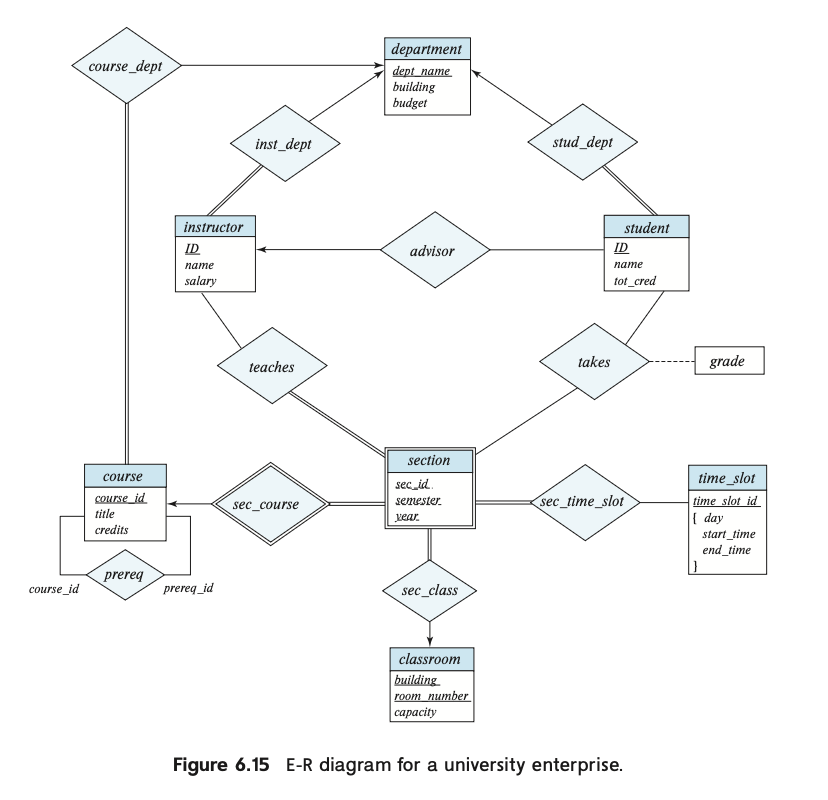
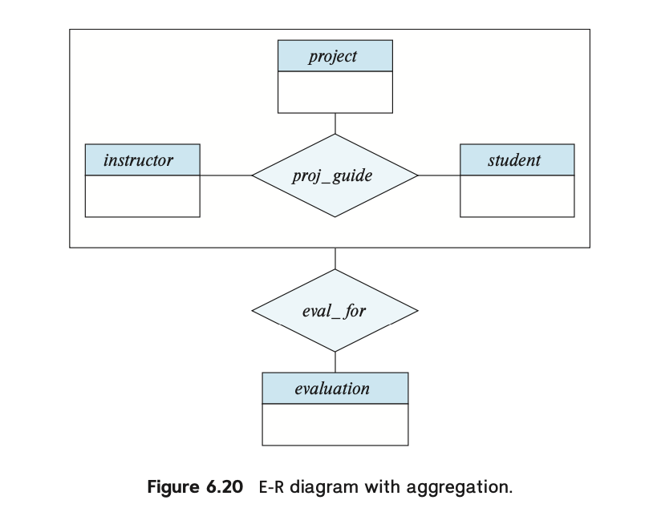

# E-R 모델 기반 설계 (2)

# 주 키 (primary key)

## 관계 집합에서의 주 키

- 개체 집합 내에서 개체들을 구분할 때 주 키가 필요하듯, 관계 집합 내에서 관계들을 구분할 때도 주 키 필요
- 그런데, 관계 집합이라는 것 자체가 개체들의 영향을 받으므로, 관계 집합의 주 키는 각 개체들이 가진 주 키들의 합집합이라고 할 수 있음.

$$
pk(E_1) ~\cup~ pk(E_2) ~\cup~ \cdots ~\cup~ pk(E_n)
$$

- 만약 관계 집합이 아래 그림과 같이 추가적인 속성들을 가지면, 해당 관계 집합의 주 키는 각 개체들이 가진 주 키들과 추가적인 속성들의 합집합이라고 할 수 있음.


$$
pk(E_1) ~\cup~ pk(E_2) ~\cup~ \cdots ~\cup~ pk(E_n) ~\cup~ \{a_{1,} \cdots a_{n}\}
$$

- 만약 주 키의 속성 이름이 개체1에도 있고 개체2에도 있다면, 속성을 구별할 수 있도록 이름을 다시 지어야 함.
- 만약 어떤 개체가 여러 관계들에서 나타나면, 해당 개체의 이름 대신 해당 개체의 역할 이름을 사용
- 집합 기호로 표기한 앞의 두 케이스 모두 관계 집합의 슈퍼키를 형성

이진 관계 집합의 경우, 대응 카디널리티를 고려해 주 키를 결정할 수 있음

- 다대다 관계의 경우, 각 개체별 주 키의 합집합이 관계집합의 주 키가 될 수 밖에 없음.
    - 왜? A 개체와 B 개체가 다대다로 연결된 경우, 관계 테이블에서는 A의 주 키와 B의 주 키가 함께 있어야만 “관계 인스턴스(어떤 A 튜플과 어떤 B 튜플이 연결되었는지)”를 유일하게 구분할 수 있기 때문에 그 합집합이 관계 릴레이션의 주 키가 됨.
- 일대다, 다대일 관계의 경우, ‘다’에 해당하는 쪽이 최소성을 가진 슈퍼키, 즉 주 키라고 할 수 있음
- 일대일 관계의 경우, 어느 한쪽의 주 키가 최소성을 가진 슈퍼키가 됨.

비이진 관계 집합의 경우, 

- 카디널리티 제약 조건이 없으며 각 개체별 주 키의 합집합이 곧 관계 집합의 주 키가 된다.
- 카디널리티 제약 조건이 있으면 해석이 더 복잡해지게 됨. 따라서 비이진 관계에 대해서는 **화살표가 최대 한 개**만 나오도록 제한해 해석의 여지를 줄임.

예를 들어, 관계 R이 개체 E1, E2, E3, E4와 연결되어 있고 화살표가 E3와 E4로 각각 향하는 상황을 가정해보자.


이 경우 우리는 두 가지 해석을 할 수 있다.

1. E1, E2 개체의 특정 조합은 최대 하나의 E3, E4와 연관될 수 있다. 따라서 관계 R의 주 키는 E1, E2 주 키의 합집합으로 볼 수 있다.
2. E1, E2, E3 개체의 특정 조합은 최대 하나의 E4와 연관될 수 있다. 또, E1, E2, E4 개체의 특정 조합은 최대 하나의 E3와 연관될 수 있다. 따라서 관계 R의 주 키는 E1, E2, E3 주 키의 합집합 하나, 그리고 E1, E2, E4 주 키의 합집합 하나가 후보 키가 될 수 있다.

단, 이러한 해석이 너무 어렵기 때문에 우리는 함수 종속을 쓸 수 있다.

## 약한 개체 집합

다음과 같은 개체-관계 모형이 있다고 가정해보자.

- Section(강의) 개체
- Course(수업) 개체
- *section* 엔티티 집합과 *course* 엔티티 집합 사이에 sec.course라는 관계 집합(relationship set)이 있음.

Section(강의) 개체는 과목 식별자(course id), 학기(semester), 연도(year), 섹션 식별자(section identifier)를 이용해 유일하게 식별함. “이 섹션은 어떤 과목에 속하느냐”라는 정보를 **직접** 가지고 있음

그런데, Course(수업) 개체로 연결된 sec.course라는 별도의 관계(relationship)도 존재하므로, “이 섹션이 어떤 과목에 속하는지”가 **중복**되어 있음.

이를 해결하는 방법으로…

- *section* 개체에서 course_id 속성을 아예 제거하고 sec_id, year, semester만 저장
- 그 대신 “어떤 course에 속해 있는 섹션인가?”를 **약한 엔티티 관계(identifying relationship)로**만 표현하도록 함.
- 이렇게 하면 section은 더 이상 자기만의 완전한 식별자(기본 키)가 없게 되므로, **부모 엔티티(course)의 기본 키**와 **section에서 자체적으로 구분하기 위한 몇몇 속성**(예: 분반 번호, 연도, 학기 등)을 합쳐서 “(부모 + 부분 식별자)” 형태로 섹션을 유일하게 식별하게 됨.
- 이처럼 자기만의 PK 없이 부모의 PK에 **존재적으로 의존**하는 엔티티가 ‘**약한 엔티티(weak entity)**’라고 함.


즉 이 예시를 다시 보자면

- course는 강한 개체 (strong entity), section은 약한 개체 (weak entity)가 된다
- sec.course는 course와 section 간의 관계이며, section이 어떤 course에 속해 있는지를 식별하도록 하는 식별 관계
- 약한 엔티티 section의 주 키(primary key) = `식별 엔티티(course)의 기본 키인 course_id` + 
`분반을 구별하기 위한 식별자(여기서는 sec_id, year, semester)`

## 약한 엔티티 그리기

- 약한 엔티티 집합은 **이중 사각형(double rectangle)**으로 표기하고, 그 안에 **식별자(discriminator) 속성은 점선으로 밑줄.**
- 약한 엔티티와 강한 엔티티를 이어 주는 식별 관계 집합은 **이중 마름모(double diamond)**로 표시
- 약한 엔티티는 식별 관계에 전체 참여(total participation) 하므로, 관계선을 이중선(double line)으로 그립니다.

# 중복 속성 제거하기

E-R 모델로 데이터베이스를 설계할 때, 먼저 어떤 엔티티 집합(예: instructor, department)을 둘지 결정하고, 각 엔티티 집합에 어떤 속성들을 포함할지 선택한다.

여러 엔티티 집합을 설계하다 보면, 같은 속성이 여러 엔티티에 겹쳐서 들어가는 상황이 발생할 수 있는데, 이러한 중복은 일반적으로 바람직하지 않다.

## 예시 : **instructor와 department**

- *instructor* 개체: ID, name, dept_name, salary
- *department*  개체: dept_name, building, budget

*department* 엔티티에서 dept_name은 기본 키이므로, *instructor*가 동일한 dept_name 속성을 갖고 있는 것은 중복이다.

이를 해결하기 위해 inst_dept라는 관계 집합을 정의하고, *instructor*와 *department* 간의 연결(“어떤 강의자가 어떤 학과에 속하는가?”)을 관계로 표현한다.

그러면 *instructor* 엔티티에서 dept_name 속성을 제거해도, 관계를 통해 학과 정보를 연결할 수 있다.

- 만약 한 강의자가 오직 하나의 학과에만 속한다면, 실제 관계형 스키마를 만들 때 *instructor* 테이블에 `dept_name`을 다시 추가(외래 키 형태)할 수도 있다.
- 그러나 한 강의자가 여러 학과에 속할 수 있는 경우에는, 별도의 관계 테이블 `inst_dept`로 분리해야 한다.

**따라서 엔티티 간의 관계를 속성으로 단순히 넣는 대신, 명시적인 ‘관계’(relationship)로 표현하면 중복을 줄이고 데이터 구조를 유연하게 유지할 수 있음.**

## **예시: section과 time_slot**

- *section* 개체가 time_slot_id를 직접 속성으로 갖고 있을 경우, *time_slot*의 기본 키가 중복되어 나타나는 문제가 생긴다.
- 이를 제거하기 위해 sec_time_slot이라는 관계 집합을 둬서, 분반과 시간 슬롯을 연결한다.

## 예시: section과 classroom

- 마찬가지로, 교실(classroom) 개체의 속성들(building, room_number 등등)을 *section* 개체의 속성으로 직접 넣는 대신, sec_class라는 관계 집합을 만들어 중복을 없앤다.

## 예시: 대학 전체의 ERD

위의 예시들을 포괄해서 대학 전체의 ERD를 보면 다음 그림과 같다.



최종 개체 집합과 해당 속성들을 정리해보면 다음과 같다.

```
	<개체>
	•	department: (dept_name), building, budget
	•	course: (course_id), title, credits
	•	instructor: (ID), name, salary
	•	section: (course_id, sec_id, semester, year)
	•	student: (ID), name, tot_cred
	•	time_slot: (time_slot_id), {(day, start_time, end_time)}
	
	<관계>
	•	stud_dept: student와 department 연결
	•	teaches: instructor와 section 연결
	•	takes: student와 section 연결 (여기에는 grade라는 기술(descriptive) 속성이 있다)
	•	course_dept: course와 department 연결
	•	sec_course: section과 course 연결
	•	sec_class: section과 classroom 연결
	•	sec_time_slot: section과 time_slot 연결
	•	advisor: student와 instructor 연결
	•	prereq: course와 course(선수 과목) 연결
```

이 E-R 다이어그램은 본문에서 제시된 대학 데이터베이스 사례를 모두 반영하되, 관계형 스키마에서 속성으로 처리되던 것 중 일부가 명시적인 ‘관계’로 표현됨에 따라, 중복 속성과 불필요한 제약을 피하고 더 명확한 구조를 갖게 되었다. 이를 통해 불필요한 속성 중복이나 잘못된 가정(예: 한 instructor는 반드시 하나의 학과만 속해야 하는지 등)을 더 유연하고 명시적으로 표현할 수 있게 되었다.

# 관계형 스키마로 변환하기

## 강한 개체집합 (1)

> 단순 속성을 지닌 경우
> 
- 강한 개체 집합은 독자적인 기본 키를 가지며, 이를 관계 스키마로 변환할 때 해당 기본 키가 테이블의 기본 키가 된다.
- ex) `student` 엔티티의 ID가 기본 키 → 실제 테이블에서도 `student(ID, name, tot_cred)` 형태로 
변환됨.

## 강한 개체집합 (2)

> 복합 속성을 지닌 경우
> 
- 복합 속성은 **하위 속성들**로 분해하여 테이블의 여러 컬럼으로 매핑한다.
- “원래 복합 속성 이름” 자체를 별도의 속성으로 두지는 않는다.
- 예제 : `name` → `first_name, middle_initial, last_name`

> 다중값 속성을 지닌 경우
> 

다중값 속성은 **새로운 테이블**을 만들어서 관리한다.

- 이 테이블은 (엔티티의 기본 키) + (다중값 속성)을 기본 키로 삼고, (엔티티 테이블)과 **외래 키 관계**를 맺는다.
- 예: *instructor*에 phone_number라는 다중값 속성이 있으면 → instructor_phone(ID, phone_number) 테이블을 별도로 만든다.

> 복합 + 다중값 속성
> 
- *ex) instructor* 엔티티에 복합 속성(name, address 등)과 다중값 속성(phone_number)이 동시에 
있을 경우를 가정해보자.
- 복합 속성은 하위 속성으로 분해해 본 테이블(*instructor*)에 넣고,
- 다중값 속성은 별도 테이블(*instructor_phone*)로 만들어서 여러 전화번호를 관리한다.

> 엔티티에 기본 키 1개 + 다중값 속성 1개만 있는 경우
> 
- 이처럼 속성이 거의 없고, 다중값 속성만 있는 엔티티의 경우, 실제로는 (기본 키만 있는) 본 테이블과 (기본 키 + 다중값 속성) 테이블만 만들어지는 형태가 된다.
- 스키마가 단순화되는 이점이 있지만, 외래 키가 늘어나면서 발생하는 이슈도 있다.

> time_slot 예시
> 
- time_slot_id가 기본 키, day, start_time, end_time이 복합 혹은 다중값 속성인 경우, 한 테이블(time_slot)로 구성할 수도 있고, 경우에 따라 별도의 테이블로 분할할 수도 있다.
- 논리적 제약(예: 같은 시간 슬롯에 겹치지 않게 하는 제약)을 어떻게 다룰지는 모델링 및 구현 단계에서 결정한다.

## 약한 개체집합

약한 개체 집합은 독자적인 완전한 기본 키가 없음.

**대신 강한 개체 집합의 기본 키와 자신의 식별자를 결합하여 기본 키를 만든다.**

따라서 이를 스키마로 변환할 때는, (1) 약한 엔티티의 속성들 + (2) 강한 엔티티의 기본 키를 모두 포함하는 테이블(릴레이션)을 만든다.

**외래 키 제약 설정**

약한 개체 스키마에는, 강한 엔티티 집합의 기본 키를 참조하는 **외래 키**를 설정하여, 각 약한 엔티티 레코드가 대응되는 강한 엔티티 레코드와 매핑되도록 한다.

> **예시: section의 스키마 표현**
> 
- *section*은 약한 엔티티: sec_id, semester, year라는 식별자 속성(=discriminator)을 가지고 있음.
- *course*는 강한 엔티티: course_id가 기본 키.

따라서 *section*의 스키마 표현은 ⇒ `section (course_id, sec_id, semester, year)`

- 여기서의 기본 키: `(course_id, sec_id, semester, year)`
- `course_id`는 `course` 스키마의 기본 키를 참조하는 외래 키.

## 관계 집합

- 관계 집합 R에 참여하는 각 엔티티 집합의 **기본 키** + 관계 집합 자체가 갖는 기술(설명) 속성들을 합쳐서 테이블(릴레이션)로 만든다.
- 이 때, 관계 집합의 ‘기본 키’(주 키)는 다중 참여 양상에 따라 결정된다(예: 다대일 관계에서는 ‘N’쪽 엔티티의 기본 키만으로도 충분).
- 생성된 관계 스키마에는, 참여하는 엔티티 집합(스키마) 각각을 가리키는 **외래 키**를 설정한다.
    - 예: advisor(i_ID, s_ID) → i_ID는 instructor(ID), s_ID는 student(ID)를 참조.

밑의 그림을 예시로 보면서 생각해보자.


**advisor 관계 집합의 경우**

- 다중값 속성이나 기술 속성이 없고, 오직 instructor.ID, student.ID만 가져와서 advisor(i_ID, s_ID)를 만든다.
- 관계가 ‘student→instructor’로 many-to-one이면, 기본 키는 s_ID.

**다대일(many-to-one) 관계인 경우**

- 예: sec_course, sec_time_slot
, sec_class 등.
- 이는 다중값 속성 처리를 단순화(최적화)함으로써 생긴 트레이드오프로, 이후 섹션에서 더 다룰 예정

**time_slot 특이 케이스**

- *time_slot* 엔티티가 다중값 속성을 사용해, 테이블 변환 시 **하나의 릴레이션**으로만 만들었더니, 해당 릴레이션과 sec_time_slot 사이에 **외래 키**를 설정하기 곤란해지는 문제가 발생.
- 이들 관계의 기본 키는 두 엔티티 중 하나의 기본 키만 쓰면 되며, 나머지는 외래 키로 처리하거나, 관계가 갖는 다른 속성이 있으면 함께 포함한다.
- 또한 이전 장들에서 sec_course, sec_time_slot 같은 스키마가 보이지 않은 것은, **설계 최적화** 과정에서 이런 관계 스키마들이 다른 스키마에 흡수되거나, 규칙에 따라 병합/제거될 수 있었기 때문이다.

## 스키마의 중복성

- “약한 엔티티를 강한 엔티티에 연결하는 관계”는 실제 관계형 스키마 설계에서 *굳이 따로 테이블로 만들 필요가 없다*.
- 관계 다이어그램(E-R) 상에서 명시되긴 하지만, 관계형 DB로 전환 시에는 약한 엔티티 테이블이 이미 강한 엔티티의 키를 포함하므로, *관계 스키마를 제거*해도 문제 없다.
- 즉, **중복을 방지**하기 위해 이러한 관계 테이블을 스키마에서 제외하거나 약한 엔티티 테이블에 병합하는 것이 일반적이다.

## 스키마의 결합

때로는 관계집합과 개체집합 간의 결합도 시도해 볼 수 있다.

> **다대일 관계 & 한 쪽 개체의 전체 참여**
> 

엔티티 A에서 엔티티 B로 가는 다대일 관계 집합 AB에서, 만약 A가 전체 참여라면, (1) A 스키마와 (2) AB 스키마를 하나의 스키마로 합칠 수 있다.

이렇게 합치면, A 스키마에는 AB 스키마의 속성이 추가로 들어가고, 관계 스키마는 더 이상 독립적으로 존재할 필요가 없어진다.

> **일대일(1:1) 관계**
> 

서로가 일대일 관계인 경우, 관계 스키마를 두 엔티티 스키마 중 어느 한쪽이든 합칠 수 있다. (주로 전체 참여인 쪽 엔티티에 합치는 경우가 많다.)

> **부분 참여라도 병합 가능**
> 

NULL 값으로 표현할 수 있다면, 부분 참여 관계도 병합할 수 있다. (해당 관계가 없는 엔티티의 경우, 그 관계 속성에 NULL을 넣음)

> **외래 키 제약 처리**
> 

관계 스키마에 있던 외래 키 중 “병합된” 엔티티 스키마를 참조하던 것은 **필요 없어지거나**, 암묵적으로 엔티티 스키마 속성에 흡수된다. 다른 한쪽 엔티티 스키마를 참조하는 외래 키 제약은 남아 있어야 하므로, 합쳐진 스키마에 그대로 적용된다.

**예시**

- inst_dept를 instructor에 병합 → **instructor** 스키마: {ID, name, dept_name, salary}
- stud_dept를 student에 병합 → **student** 스키마: {ID, name, dept_name, tot_cred}
- sec_class, sec_time_slot 등을 section에 병합 → **section** 스키마: {course_id, sec_id, semester, year, building, room_number, time_slot_id}

# ERD : 확장 개념

기본적인 E-R 모델로 대부분의 데이터베이스 기능을 표현할 수 있지만, 일부 데이터베이스의 경우 확장된 개념을 사용하면 더 적절하게 모델링할 수 있다.

## 구체화

엔티티 집합을 세분화하는 과정을 의미

```
ex. person 을 employee (직원) & student (학생) 로 세분화
- 각 하위 그룹은 person의 모든 속성을 공유하면서, 추가적인 속성을 가질 수 있음 
• 예를 들어:
  • employee 엔티티는 salary(급여) 속성을 추가적으로 가질 수 있음
  • student 엔티티는 tot_cred(총 학점) 속성을 추가적으로 가질 수 있음
  
  **-** student (학생)는 다시 graduate(대학원생) 및 undergraduate(학부생)로 세분화
	  • graduate(대학원생) → office_number(사무실 번호) 속성을 가짐
	  • undergraduate(학부생) → residential_college(기숙사 소속) 속성을 가짐
	
	- 직원도 instructor(강사) 와 secretary(비서) 로 세분화
		•	instructor(강사) → rank(직급) 속성을 가짐
		•	secretary(비서) → hours_per_week(주당 근무시간) 속성을 가짐
```

실제 스키마를 다듬기 위해 구체화를 여러 번 적용할 수도 있다.

즉, 하나의 엔티티(person)는 **여러 개의 특수화된 엔티티 집합에 속할 수도 있음.**

**ERD에서 구체화는 ISA 관계**로 표현됨. 

- ex. Instructor "ISA" Employee : **Instructor는 Employee의 하위 유형**이라는 의미!

또한 구체화는 두 가지의 형태로 나타낼 수 있는데, 이를 실제로 그려보면 다음과 같다.


1. **겹치는 특수화 (Overlapping Specialization)**
- 하나의 엔티티가 여러 개의 특수화된 엔티티 집합에 속할 수 있음
- 예: Person → Employee & Student (동시에 가능)
1. **분리된 특수화 (Disjoint Specialization)**
- 하나의 엔티티는 단 하나의 특수화된 엔티티 집합에만 속할 수 있음
- 예: Employee → Instructor 또는 Secretary (둘 중 하나만 가능)

## 일반화

- 구체화의 반대 개념.
- 여러 개의 하위 엔티티 집합을 **하나의 상위 엔티티 집합으로 통합**하는 **Bottom-Up** 방식
- 상위 수준 엔티티를 superclass, 하위 수준 엔티티를 subclass라고도 함.

```
ex. 강사와 비서
- 강사(instructor) 엔티티: instructor_id, instructor_name, instructor_salary, rank
- 비서(secretary) 엔티티: secretary_id, secretary_name, 
secretary_salary, hours_per_wee

이 두 엔티티는 일부 속성(예: id, name, salary)이 동일하므로, 일반화를 적용하여 employee(직원) 
엔티티 집합을 생성할 수 있음.

- employee는 higher-level(상위 수준) 엔티티 집합이 되고, instructor(강사) 및 
secretary(비서)는 lower-level(하위 수준) 엔티티 집합이 된다.
- 이 과정에서 서로 다른 속성을 공통된 이름으로 통합하여 표현. 즉, instructor_id 및 
secretary_id는 공통 속성 ID로 대체될 수 있습니다.
```

## 속성 상속

- **상위 수준 엔티티의 속성은 하위 수준 엔티티가 상속받는다. 또한 이는 여러 단계의 하위 수준 엔티티까지 확장될 수 있다.**
- 하위 수준 엔티티는 **상위 수준 엔티티가 참여하는 관계도 자동으로 상속한다. 이를 관계 상속 이라고 함.**
- 특수화(Specialization) 또는 일반화(Generalization)를 통해 특정 부분이 설계되었더라도 **결과는 동일!**
- 단일 ISA 관계를 가지면 단일 상속, 여러 관계를 가지면 다중 상속

## 구체화/일반화에 대한 제약 조건

보다 정확한 모델링을 위해 구체화/일반화에 제약조건이 들어갈 수 있음.

1. **완전 특수화(Total Specialization)**: 모든 상위 엔티티는 반드시 하위 엔티티에 속해야 함
2. **부분 특수화(Partial Specialization)**: 일부 상위 엔티티는 하위 엔티티에 속하지 않을 수도 있음

**이러한 제약은 삽입 및 삭제 연산에 영향을 줌**

- 완전 특수화가 적용되면, **상위 엔티티를 추가할 때 하위 엔티티도 함께 추가해야 함**
- 상위 엔티티를 삭제하면, **해당 하위 엔티티도 함께 삭제해야 함**

이러한 개념을 통해 데이터 모델의 **무결성(Integrity)을 유지하고, 논리적인 설계를 보장할 수 있음.**

## 통합화

관계들 간의 관계를 표현하기 위해 쓰는 방법.

관계를 하나의 엔티티처럼 취급하여 새로운 관계를 설정한다.



이때의 이점은 다음과 같다.

- **중복 제거**
- **모델 단순화 (4항 관계 → 2항 관계)**
- **유연한 확장 가능**

## 릴레이션 스키마로의 변환

여러가지 확장 개념들을 어떻게 릴레이션 스키마로 변환시킬지 알아보자.

### 일반화의 표현

**방법 1: 상위 수준 엔티티에 대한 스키마 생성**

1. 상위 엔티티(person)의 스키마를 생성
2. 각 하위 엔티티(employee, student)의 스키마를 생성. 
- 단, 상위 엔티티의 기본 키(ID)를 포함해야 함

```
person (ID, name, street, city)
employee (ID, salary)
student (ID, tot_cred)

•	ID는 모든 하위 엔티티에서 기본 키(Primary Key) 역할
•	employee.ID 및 student.ID는 person.ID를 참조하는 
외래 키(Foreign Key)
```

**방법 2: 상위 엔티티 없이 하위 엔티티에 모든 속성 포함**

**단, 이 경우 전제가 필요함**:

- **일반화가 분리형(Disjoint)이고 완전(Complete)할 경우**에만 적용 가능
- 즉, **모든 상위 엔티티가 반드시 하위 엔티티 중 하나에 속해야 함**

```
employee (ID, name, street, city, salary)
student (ID, name, street, city, tot_cred)
```

- person 스키마를 따로 만들지 않고, 하위 엔티티에서 모든 속성을 포함
- ID는 상위 엔티티(person)의 기본 키 역할

**단점**:

1. **외래 키 문제**
- person을 참조하는 관계가 있을 경우, 참조할 단일 테이블이 없어 문제 발생
- 해결 방법: person 테이블을 유지하면서 최소한의 속성만 포함
1. **데이터 중복 문제**
- 한 사람이 employee와 student 모두에 속할 경우, name, street, city 값이 중복 저장됨

### 통합화의 표현

- 관계를 엔티티처럼 다루어 중복 문제를 해결
- 별도의 엔티티 생성 없이, 기존 관계를 활용하여 표현