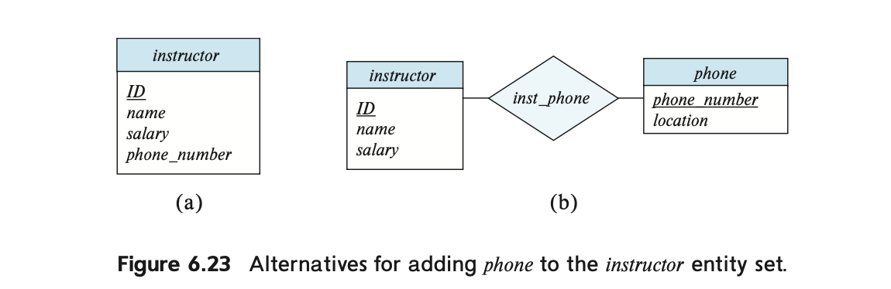

# E-R 모델 기반 설계 (3)

# ERD 설계의 쟁점

## 자주 하는 실수

1. 개체 집합의 주 키를 다른 개체 집합의 속성으로 사용하는 것
2. 관계 집합의 속성으로 관련 개체 집합의 주 키 속성을 지정하는 것
3. 다중값 속성이 필요한 상황에서 단일값 속성을 포함하는 관계를 사용

- (a) : 개체 집합 `student`의 주 키 `dept_name`를 다른 개체 집합 `department`의 속성으로 사용했다.
    - 속성 `dept_name`과 관계 `stud_dept`가 함께 있으면 정보가 중복될 수 있다.
- (b) : 학생이 특정 과목의 여러 과제(Assignment)에 대한 점수를 받는 경우, **과제(assignment)와 점수(marks)를 관계(relationship)인 takes의 속성으로 추가함.**
    - 학생(Student)과 강의 섹션(Section) 간의 관계가 단 한 개의 과제만 저장할 수 있도록 제한됨.

- (b)의 오류를 잡는 2가지 방법
    - (1) 과제(Assignment)를 **약한 개체(Weak Entity)로 모델링**하고, 학생과 marks 관계 설정
    - (2) takes 관계에 **복합 다중 값 속성 {assignment marks}** 추가

추가적으로, ERD가 너무 커서 한 페이지에 모두 표시하기 어려울 경우, 여러 개의 부분으로 나누어 표현하는 것이 필요.

이때, 동일한 개체 집합을 여러 페이지에 나타내야 하는 경우, **첫 번째 등장하는 곳에서만 속성을 표시하고, 이후 등장하는 곳에서는 속성을 생략해야 한다.**

이는 **중복된 정보로 인해 발생할 수 있는 일관성 문제를 방지하기 위함**이다.

## 개체 집합 vs 속성

어떤 정보를 ERD에 포함시키고자 할 때, 새로운 개체 집합으로 둘 것인지 아니면 원래 있던 개체 집합의 속성으로 둘 것인지 결정해야 할 때가 있다.

1. 강사(Instructor) 개체가 전화번호(phone number) 속성을 가진 경우 
2. **전화(Phone)를 하나의 독립적인 개체로 간주한 경우**
- 이 경우, 전화 개체는 **전화번호(phone number)와 위치(location) 속성을 포함**할 수 있다.

**📌 속성을 개체로 취급하는 것과 속성 그대로 두는 것의 차이점**

**1️⃣ 전화번호를 속성(Attribute)으로 사용할 경우**

- 강사는 **정확히 하나의 전화번호만 가질 수 있음**
- 다중 전화번호를 허용하려면 **다중 값 속성(Multivalued Attribute)으로 설정해야 함**

**2️⃣ 전화번호를 개체(Entity)로 사용할 경우**

- 강사는 **여러 개의 전화번호(또는 0개)를 가질 수 있음**
- 전화번호에 **추가 정보(위치, 유형 등)를 저장할 수 있음**
- 예: 전화 유형(Type: Mobile, IP Phone, Landline), 공유 여부(Shared Phone) 등

즉, **전화(Phone)를 개체로 모델링하면 더 일반적인 상황을 표현할 수 있으며, 추가 정보를 저장하기에 유리함**.

---

**📌 속성을 개체로 만들 수 없는 경우**

예를 들어, **강사의 이름(Name)을 개체로 만드는 것은 적절하지 않음**.

이름(Name)은 독립적인 개체로 보기 어렵기 때문에, **강사 개체의 속성으로 두는 것이 타당함**.

---

**📌 속성과 개체를 구분하는 기준은?**

두 가지 질문이 자연스럽게 발생함:

1. **어떤 것은 속성(Attribute)으로 취급해야 하고, 어떤 것은 개체(Entity Set)로 만들어야 할까?**
2. **그 차이는 무엇일까?**

하지만 이 질문에 대한 단순한 정답은 없음. 속성과 개체의 구분은 모델링하려는 실제 세계(Real-World Enterprise)의 구조와 의미(Semantics)에 따라 달라짐.

## 개체 집합 vs 관계 집합

어떤 개체(Object)를 **개체 집합(Entity Set)으로 표현해야 할지, 관계 집합(Relationship Set)으로 표현해야 할지** 명확하지 않을 때가 있다.

예를 들어, **학생(Student)이 특정 강의 섹션(Section of a Course)을 수강하는 상황**을 모델링한다고 하자.

- **방식 1:** takes 관계 집합을 사용하여, 학생과 섹션 간의 관계를 나타낸다 (그림 6.15).
- **방식 2:** 학생이 수강하는 **각 강의에 대한 “수강 기록(course-registration record)” 개체를 만든다.**
    - 이 개체를 **registration(수강 기록) 개체 집합**이라 하자.
    - **각 registration 개체는 정확히 하나의 학생(Student)과 하나의 섹션(Section)에 연결됨.**
    - 따라서 두 개의 관계 집합이 필요하다 :
        1. **section_reg** → 수강 기록과 강의 섹션 간의 관계
        2. **student_reg** → 수강 기록과 학생 간의 관계

📌 위의 **그림 6.24에서는 takes 관계를 제거하고, 대신 registration 개체와 두 개의 관계(section_reg, student_reg)를 사용**하였다.

📌 **registration 개체는 항상 학생과 강의 섹션에 연결되므로, 전체 참여(Total Participation)를 나타내기 위해 이중 선(Double Line)으로 표시됨.**

**📌 두 모델 비교: takes vs registration**

| **모델** | **장점** | **단점** |
| --- | --- | --- |
| **takes 관계 집합 (그림 6.15)** | - 더 **간결**한 모델링  - 직관적으로 이해하기 쉬움 | - 추가 정보를 저장하기 어려움 |
| **registration 개체 집합 (그림 6.24)** | - **수강 기록에 추가 정보(등록 날짜, 등록 상태 등)를 저장 가능**  - 더 **유연한 모델** | - 더 많은 개체와 관계가 필요하여 **모델이 복잡해짐** |

📌 **즉, takes 관계 집합이 더 단순하고 적절하지만, 추가 정보를 저장해야 한다면 registration 개체를 사용하는 것이 더 나을 수 있음.**

**📌 개체 집합(Entity Set)과 관계 집합(Relationship Set) 선택 가이드라인**

**❓ 언제 개체 집합을 만들고, 언제 관계 집합을 사용해야 할까?**

✔ **일반적으로, “행동(Action)“을 나타내는 경우 관계 집합(Relationship Set)을 사용하는 것이 적절하다.**

✔ 그러나, **행동(Action)에 추가 정보를 저장할 필요가 있다면, 해당 행동을 개체(Entity Set)로 모델링하는 것이 좋다.**

✅ **예시:**

- 학생이 강의를 수강하는 단순한 관계 → takes 관계 집합이 적절
- 수강 기록에 **“등록 날짜, 학점, 등록 상태”** 등의 정보를 저장해야 한다면 → registration 개체 집합이 더 나은 선택

## 이항 관계 vs 다항 관계

데이터베이스에서 **관계(Relationship)는 대부분 이항(Binary, 두 개의 개체 간 관계)**으로 표현된다. 하지만 다항(n-ary, n > 2) 관계가 더 적절해 보이는 경우도 있다.

예를 들어, **어린이(Child), 어머니(Mother), 아버지(Father)** 간의 관계를 생각해 보자.

- **방법 1:** parent라는 삼항(ternary) 관계를 만들어 **어린이, 어머니, 아버지**를 하나의 관계로 연결할 수 있다.
- **방법 2:** 두 개의 이항(binary) 관계 mother와 father를 사용하여 **어린이와 어머니, 어린이와 아버지를 개별적으로 연결할 수도 있다.**

✔ **이항 관계(mother, father)를 사용하면, 어머니 정보를 알고 있지만 아버지 정보를 모를 경우에도 데이터를 저장할 수 있음.**

✔ 반면, 삼항 관계(parent)를 사용하면 **아버지 정보가 없는 경우 NULL 값이 필요하게 됨**.

✅ 따라서 **이항 관계를 사용하는 것이 더 나은 선택**이다.

---

**📌 다항(n-ary) 관계를 이항(Binary) 관계로 변환하는 방법**

이항 관계만을 사용하도록 **모든 다항(n-ary) 관계를 변환할 수 있음**.

예를 들어, **세 개의 개체 집합 A, B, C가 존재하고, 이를 연결하는 삼항(ternary) 관계 R이 있다고 가정하자.**

이 경우, 다음과 같이 변환할 수 있다:

1. **새로운 개체 집합 E를 생성** → E는 원래 삼항 관계 R을 표현하는 개체
2. **세 개의 이항 관계(RA, RB, RC)를 생성**
- RA: E → A (many-to-one 관계)
- RB: E → B (many-to-one 관계)
- RC: E → C (many-to-one 관계)

📌 E 개체는 반드시 RA, RB, RC 관계에 **모두 참여해야 한다(Total Participation).**

📌 원래 R 관계에 속성이 있었다면, 이 속성은 E 개체의 속성으로 저장됨.

📌 새로운 E 개체를 식별할 수 있도록 **고유한 ID(식별 속성)를 추가해야 함.**

이 변환을 통해, **모든 다항(n-ary) 관계는 이항(Binary) 관계만으로 표현할 수 있음.**

---

**📌 다항(n-ary) 관계를 이항 관계로 변환하는 것이 항상 좋은 선택일까?**

다항 관계를 이항 관계로 변환하는 것이 **반드시 좋은 선택은 아님**.

다음과 같은 단점이 있기 때문:

1. **설계 복잡성 증가**
- 새로운 개체 E를 생성해야 하고, 이를 위한 추가적인 관계와 속성이 필요함.
- **디자인이 더 복잡해지고, 저장 공간이 더 많이 필요할 수 있음.**
1. **데이터 표현이 더 어려워질 수도 있음**
- 삼항 관계는 **세 개의 개체가 동시에 연결됨을 직관적으로 보여줌.**
- 이항 관계로 변환하면, **각 개체 간의 연관성을 명확하게 표현하기 어려울 수 있음.**
1. **일부 제약 조건(Constraints)을 표현하기 어려움**
- 예를 들어, R 관계에서 “각 (A, B) 쌍이 최대 하나의 C 개체와 연결될 수 있다”는 제약이 있다고 하자.
- 이를 이항 관계(RA, RB, RC)로 변환하면 **이 제약을 동일하게 표현하기 어려움.**

---

**📌 예제: proj_guide 관계 (지도 교수, 학생, 프로젝트 간 관계)**

proj_guide 관계는 **교수(Instructor), 학생(Student), 프로젝트(Project)** 간의 삼항 관계를 나타낸다.

이를 이항 관계로 단순히 분리할 경우 문제가 발생할 수 있다.

**예제 데이터**

- 교수 Katz가 **Shankar 학생과 프로젝트 A**를 진행
- 교수 Katz가 **Zhang 학생과 프로젝트 B**를 진행

✔ 단순히 **이항 관계(Instructor-Project, Instructor-Student)로 변환하면, 교수 Katz가 A, B 프로젝트를 모두 진행하며 두 학생과 연결된다는 것만 표현됨.**

✔ **그러나, Katz가 A 프로젝트에서는 Shankar와만, B 프로젝트에서는 Zhang과만 작업한다는 세부 정보를 표현할 수 없음!**

✔ 즉, **삼항 관계를 무조건 이항 관계로 변환하면 정보 손실이 발생할 수도 있음.**

✅ 따라서, proj_guide 관계는 삼항 관계로 유지하는 것이 더 적절함.

# ERD의 대안

데이터 모델을 다이어그램으로 표현하는 것은 **데이터베이스 스키마 설계에서 매우 중요한 과정!**

데이터베이스를 설계하려면 **데이터 모델링 전문가뿐만 아니라, 애플리케이션의 요구사항을 아는 도메인 전문가도 참여**해야 한다. 하지만 도메인 전문가는 데이터 모델링에 익숙하지 않을 수 있으므로, **직관적인 다이어그램 표현이 중요하다.**

따라서 이를 위해 ERD 외에도 쓸 수 있는 다양한 데이터베이스 표기법을 알아보자

## **대체 E-R 다이어그램 표기법**

1️⃣ **속성(Attribute)의 표현 방식**

- 전통적인 방식: 개체(Entity)를 나타내는 **박스(Box)**에 속성을 표시
- 또 다른 방식: **속성을 타원(Oval)으로 표현하고, 개체 또는 관계와 연결**
- 기본 키(Primary Key)는 **밑줄(Underline)** 을 사용하여 표시

2️⃣ **관계(Relationship)의 표현 방식**

- 관계를 **다이아몬드(Diamond)로 표시**하고, 개체와 연결
- 관계에 속성이 있는 경우, **속성을 다이아몬드에 연결된 타원으로 표현**

3️⃣ **대응(Cardinality) 표기 방식**

- **왼쪽 표기법:** 관계의 양 끝에 * 또는 1을 붙여서 **다대다(M:N), 일대일(1:1), 다대일(N:1) 관계 표현**
- **오른쪽 표기법 (Crow’s-Foot 표기법)**
    - **“까마귀 발(Crow’s-Foot)” 기호를 사용하여 다중성을 표현**
    - 두 개체 간 관계선을 다이아몬드 없이 직접 연결
    - **수직 막대(Vertical Bar)** → **전체 참여(Total Participation)**
    - **원(Circle)** → **부분 참여(Partial Participation)**

4️⃣ **일반화(Generalization) 표현 방식**

- 일부 표기법에서는 **삼각형(Triangle)** 을 사용하여 일반화를 표현
- **기존 표기법에서는 비어 있는 화살표(Hollow Arrowhead)를 사용**

다양한 **대체 E-R 다이어그램의 종류를 소개해보자면…**

📌 **Chen’s Notation (첸 표기법)**

- E-R 모델링을 처음 제안한 **Chen (첸)이 개발한 전통적인 표기법**
- **타원(Oval)로 속성을 표현, 다이아몬드(Diamond)로 관계를 표현**
- **고전적인 형태지만, 최근에는 더 간결한 표기법이 선호됨**

📌 **IDEF1X 표기법 (미국 NIST 표준, 1993)**

- **Crow’s-Foot 기호 사용** (수직 막대는 전체 참여, 원은 부분 참여)
- 보다 **정형화된 데이터 모델링 방식**

📌 **UML 클래스 다이어그램과의 연결**

- UML (Unified Modeling Language)이 확산되면서, **E-R 다이어그램도 UML 표기법과 유사한 형태로 변화**
- UML 클래스 다이어그램은 **보다 객체지향적인 접근 방식**을 지원

📌 **데이터 모델링 도구의 표기법 차이**

- 다양한 **E-R 모델링 도구(ERD 툴)마다 표기법이 다를 수 있음**
- 일부 도구에서는 **개체(Entity)와 관계(Relationship) 두 가지 뷰(View) 제공**
- **개체(Entity) 뷰:** 관계 속성을 표시하지 않음
- **릴레이션(Relational) 뷰:** 관계 속성을 포함하여 표현

## UML 다이어그램

📌 **UML (Unified Modeling Language, 통합 모델링 언어)**

- OMG(Object Management Group)**에서 개발한 **소프트웨어 시스템을 설계하는 표준 모델링 언어**
- 시스템의 여러 구성 요소를 표현하는 다양한 다이어그램을 포함

**UML의 주요 다이어그램:**

1️⃣ **클래스 다이어그램 (Class Diagram)**

- **E-R 다이어그램과 유사하며, 데이터 모델링에 사용됨**
- UML에서는 개체(Entity)가 아니라 **객체(Object)를 모델링**
- **객체는 속성(Attribute)뿐만 아니라 함수(Method)도 포함 가능**

2️⃣ **유스케이스 다이어그램 (Use Case Diagram)**

- 사용자와 시스템 간의 **상호작용**을 표현
- 예: **ATM에서 돈을 출금하는 과정, 수강 신청 과정**

3️⃣ **활동 다이어그램 (Activity Diagram)**

- **시스템의 동작 흐름을 표현** (각 기능 간의 작업 순서)

4️⃣ **구현 다이어그램 (Implementation Diagram)**

- **소프트웨어 및 하드웨어 구성 요소와 상호 연결을 표현**

📌 이 장에서는 UML 전체를 다루지는 않으며, **데이터 모델링과 관련된 UML 개념**을 소개함.

---

**📌 UML과 E-R 다이어그램의 차이점**

📌 **UML 클래스 다이어그램과 E-R 다이어그램의 비교 (그림 6.28 참고)**

✅ **E-R 다이어그램 → 개체(Entity)와 관계(Relationship)를 모델링**

✅ **UML 클래스 다이어그램 → 객체(Object)와 클래스(Class)를 모델링**

| **개념** | **E-R 다이어그램** | **UML 클래스 다이어그램** |
| --- | --- | --- |
| **개체(Entity) / 객체(Object)** | 개체(Entity) | 객체(Object) |
| **속성(Attribute)** | 타원(Oval) | 클래스 내부에 포함 |
| **기본 키(Primary Key)** | 밑줄(Underline) | 별도로 표시 없음 |
| **메서드(Methods)** | 없음 | 클래스 내부에 포함 |
| **관계(Relationship)** | 다이아몬드(Diamond) 사용 | 선(Line) 사용 |
| **다중성(Cardinality)** | 1, N 등으로 표현 | 0..*, 1..1 등으로 표현 |
| **상속(Generalization)** | 빈 삼각형(Hollow Arrowhead) | 동일한 삼각형 사용 |

---

**📌 UML에서 관계(Associations) 표현 방법**

📌 **UML에서는 관계(Relationship)를 “Association”이라고 부름**

📌 **이항(Binary) 관계 표현**

- UML에서는 **선(Line)만 사용하여 개체를 연결** (E-R 다이어그램의 다이아몬드 없이 표현)
- **관계 이름을 선 근처에 적음**
- **역할(Role)을 명확히 하기 위해 선 끝에 역할명을 적을 수도 있음**

📌 **다항(n-ary) 관계 표현**

- UML 1.3 이전 → **다항 관계를 직접 표현할 수 없었음** → **이항 관계로 변환해야 했음**
- UML 1.3 이후 → **E-R 다이어그램과 동일하게 다이아몬드(Diamond) 사용 가능**

---

**📌 UML에서 다중성(Cardinality) 표현 방식**

📌 UML에서는 **다중성(Cardinality)을 l..h 형태로 표시**

•	l = 최소값 (Minimum)

•	h = 최대값 (Maximum)

✅ **예제:**

•	0..* → 최소 0개, 최대 무한대 (Many)

•	1..1 → 정확히 1개 (One-to-One)

•	0..1 → 최소 0개, 최대 1개 (Optional)

📌 **E-R 다이어그램과 UML의 다중성 표기 위치 차이**

•	E-R 다이어그램 → **관계에서 참여하는 개체(Entity) 쪽에 다중성 표기**

•	UML → **반대편에 다중성 표기**

---

**📌 UML의 추가 개념: 합성(Composition)과 집합(Aggregation)**

📌 **UML에서 “부분-전체 관계” 표현 방식**

| **개념** | **설명** | **UML 표기** |
| --- | --- | --- |
| **합성(Composition)** | **부분(E2)이 전체(E1)에 종속됨 (필수적 관계)** | **E2 → E1으로 채워진(●) 작은 다이아몬드 사용** |
| **집합(Aggregation)** | **E2가 E1에 포함되지만, 독립적으로 존재 가능 (비필수적 관계)** | **E2 → E1으로 비어있는(◌) 작은 다이아몬드 사용** |

📌 **E-R 다이어그램에서 약한 개체(Weak Entity)와 비슷한 개념**

✅ **합성(Composition)**

- “전체가 없으면 부분도 존재할 수 없음”
- 예: 자동차(Car) → 엔진(Engine)

✅ **집합(Aggregation)**

- “전체가 없어도 부분은 독립적으로 존재 가능”
- 예: 회사(Company) → 부서(Department)

# DB 설계의 다른 관점

📌 데이터베이스 설계에서 **스키마 설계(schema design)** 가 가장 중요한 요소로 보일 수 있지만, **실제로는 여러 다른 고려 사항도 중요**하다.

📌 이 장에서는 데이터베이스 설계의 **기능적 요구사항, 데이터 흐름, 워크플로우, 스키마 진화(schema evolution)** 등의 요소를 간략히 설명한다.

---

**📌 기능적 요구사항 (Functional Requirements)**

✅ **기업(Enterprise) 애플리케이션은 특정 기능을 지원해야 하며, 데이터베이스 설계 시 이를 고려해야 한다.**

✔ 기능적 요구사항은 **데이터를 조회하는 쿼리(Query)와 데이터를 변경하는 트랜잭션(Transaction)으로 구성됨**

✔ 단순히 데이터 저장만 고려하는 것이 아니라, **사용자가 어떤 방식으로 데이터를 사용할 것인지도 고려해야 함**

📌 **사용자 접근 권한 (Authorization Mechanism)**

- 모든 사용자가 **모든 데이터를 조회하거나 수정할 수 있는 것은 아님**
- **보안 및 권한 관리가 중요함**
- 예: **데이터베이스 수준(DB Authorization)에서 접근을 제한** 또는 **애플리케이션 기능별로 접근 권한을 설정** (특정 인터페이스를 사용할 수 있는 사용자 제한)

---

**📌 데이터 흐름 및 워크플로우 (Data Flow & Workflow)**

📌 **데이터베이스 애플리케이션은 단독으로 운영되지 않고, 다양한 시스템과 연계됨**

📌 **“워크플로우(Workflow)”** 는 **업무 프로세스에서 데이터와 작업이 어떻게 이동하는지를 설명**

✅ **예제: 출장비 보고서 처리 시스템**

1. 직원(Employee)이 출장 후 **출장비 보고서를 작성**
2. 작성된 보고서는 **직속 상사(Manager)에게 전달됨**
3. 이후 **상위 관리자(Higher-level Manager) 및 회계 부서(Accounting Department)에서 승인 후 지급됨**
4. **이 과정에서 데이터베이스와 회계 시스템이 상호작용**

✔ **워크플로우는 단순한 데이터 저장이 아니라, 데이터가 업무 프로세스를 따라 어떻게 이동하는지도 포함**

✔ **데이터베이스에는 단순한 데이터뿐만 아니라, 워크플로우 정보를 저장할 수도 있음**

- 워크플로우가 수행해야 하는 **작업(Task)**
- **사용자 간의 데이터 이동 경로(Routing)**

📌 **기업의 비즈니스 프로세스를 효과적으로 모델링하려면, 데이터뿐만 아니라 워크플로우도 고려해야 함**

---

**📌 스키마 진화 (Schema Evolution)**

📌 데이터베이스 설계는 **한 번으로 끝나는 작업이 아니라, 지속적으로 변경될 가능성이 높음**

📌 **기업의 요구사항이 변함에 따라 데이터베이스 스키마도 변경될 필요가 있음**

✅ **스키마 변경이 발생하는 시점**

- 초기 데이터베이스 설계 단계
- 애플리케이션 개발 중
- 기업 정책 또는 업무 절차 변경

✔ **스키마 변경은 데이터베이스 애플리케이션의 모든 부분에 영향을 줄 수 있음**

✔ **좋은 설계는 향후 변경 가능성을 고려하여 최소한의 수정으로도 변경이 가능해야 함**

📌 **예제: 교수(Instructor)와 학과(Department) 관계**

1. **기본적인 제약 조건(Fundamental Constraint)**
- 교수 Instructor-ID는 **항상 유일한 교수(Unique Instructor)를 식별해야 함** → 이 규칙은 변하지 않음
1. **변경될 가능성이 있는 제약 조건**
- 기존 정책: “한 교수는 하나의 학과(Department)만 소속 가능”
- 미래 정책 변경: “한 교수는 여러 학과에 동시에 소속 가능(조인트 임용)”
- 설계를 잘못하면 **새로운 정책을 적용하려면 전체 데이터베이스를 다시 설계해야 할 수도 있음**

✅ **해결책**

✔ 교수-학과 관계를 **다대다(M:N) 관계로 모델링**

✔ 교수 개체를 수정하지 않고, **새로운 관계(relation)를 추가하여 조인트 임용을 지원할 수 있도록 설계**

✔ 설계 단계에서 **현재 정책뿐만 아니라, 미래 변경 가능성까지 고려해야 함**

📌 **좋은 데이터베이스 설계는 “미래에 변경될 가능성이 있는 요소”를 미리 고려하여 최소한의 변경으로 대응할 수 있어야 함.**

---

**📌 데이터베이스 설계는 인간 중심(Human-Oriented) 활동이다**

📌 **데이터베이스의 최종 사용자는 사람이며, 설계 과정에서 사람들과의 협업이 중요함**

📌 **디자이너(Database Designer)는 도메인 전문가(Domain Experts)와 협력하여 데이터 요구사항을 분석해야 함**

📌 **성공적인 데이터베이스 설계는 “사용자 요구사항을 효과적으로 반영”할 수 있어야 함**

✅ **결론:**

✔ 데이터베이스는 **기술적 측면뿐만 아니라, 실제 사용자의 요구와 비즈니스 프로세스를 고려해야 함**

✔ **단순한 데이터 저장이 아니라, 데이터 흐름(Workflow)과 사용자 역할(Authorization)도 함께 고려해야 함**

✔ **좋은 설계는 미래 변화에 유연하게 대응할 수 있어야 함**