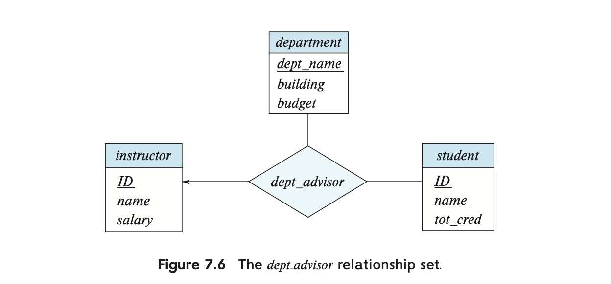

# 관계형 DB 설계 (1)

**관계형 데이터베이스 스키마** 설계의 목표는 **데이터 중복을 최소화하면서도 쉽게 정보를 검색할 수 있도록 하는 것**이다. 이를 위해 **정규형(normal form)** 을 만족하는 스키마를 설계해야 하며, 그 기준이 되는 것이 **함수적 종속성(functional dependency)**이다.

이 장에서는 **관계형 데이터베이스 설계를 위한 공식적인 접근법을 배우고, 정규형 개념을 함수적 종속성을 통해 정의**하게 된다.

# **좋은 관계형 DB 설계의 특징**

대학(University) 데이터베이스를 설계하는 과정에서, 처음에 다음과 같은 스키마를 고려했다고 가정하자.

```
in_dep (ID, name, salary, dept_name, building, budget)
```

이 스키마는 instructor(강사) 테이블과 department(학과) 테이블을 **자연 조인(natural join) 한 것이다.**

이렇게 설계하면 **일부 쿼리에서 조인 연산이 줄어들어 성능이 향상될 수 있다**고 생각할 수도 있다.

그러나, 이 설계에는 심각한 문제가 있다. 예를 들어, 아래의 데이터를 고려해보자.

| **ID** | **name** | **salary** | **dept_name** | **building** | **budget** |
| --- | --- | --- | --- | --- | --- |
| 1001 | Katz | 90000 | Comp. Sci. | Taylor | 100000 |
| 1002 | Srinivasan | 85000 | Comp. Sci. | Taylor | 100000 |
| 1003 | Brandt | 92000 | Comp. Sci. | Taylor | 100000 |

이 경우, **“Comp. Sci.” 학과의 정보(building, budget)가 각 강사에 대해 반복 저장**되고 있다.

즉, 동일한 Taylor, 100000 값이 여러 행에 중복 저장됨을 볼 수 있다.

**❌ 문제 1: 중복 데이터 (Redundancy)**

- 학과 정보(건물 위치, 예산)가 강사마다 반복 저장되므로 **데이터 저장 공간이 비효율적으로 사용**된다.
- 만약 한 사용자가 일부 행에서 budget 값을 수정하고, 다른 행은 수정하지 않는다면 **데이터 불일치(inconsistency) 문제가 발생**할 수 있다.

**❌ 문제 2: 새로운 학과 추가 불가능**

- 새로운 학과를 생성하려면 dept_name, building, budget 정보를 저장해야 하지만, ID, name, salary 값도 필요하다.
- 즉, **해당 학과에 강사가 없으면 정보를 저장할 방법이 없다**.
- 원래 department 테이블을 유지하면 이런 문제를 해결할 수 있지만, in_dep 스키마만 사용하면 강사 없이 학과를 추가하는 것이 어렵다.

## 분해하기

위에서 본 **중복 문제를 해결하기 위한 방법은 in_dep 테이블을 두 개의 스키마로 분해하는 것**이다.

**기존 스키마 (in_dep)**

```
in_dep (ID, name, salary, dept_name, building, budget)
```

**분해 후의 스키마**

1. instructor (ID, name, salary, dept_name)
2. department (dept_name, building, budget)

이제 **강사 정보와 학과 정보를 분리**하여 **중복을 제거하고 데이터 일관성을 유지할 수 있다**.

---

그러나, **모든 스키마 분해가 적절한 것은 아니다**. 잘못된 분해 사례를 살펴보자.

**❌ 잘못된 분해 사례**

```
employee (ID, name, street, city, salary)
```

이를 다음과 같이 분해한다고 가정하자.

1. employee1 (ID, name)
2. employee2 (name, street, city, salary)

이 경우, 두 명의 직원이 **동일한 이름을 가질 경우 문제가 발생**한다.

예를 들어, 두 명의 “Kim” 직원이 있다고 가정하면 다음과 같다.

```
(57766, Kim, Main, Perryridge, 75000)
(98776, Kim, North, Hampton, 67000)
```

이 데이터를 위와 같이 분해하면:

**employee1**

| **ID** | **name** |
| --- | --- |
| 57766 | Kim |
| 98776 | Kim |

**employee2**

| **name** | **street** | **city** | **salary** |
| --- | --- | --- | --- |
| Kim | Main | Perryridge | 75000 |
| Kim | North | Hampton | 67000 |

이제 **다시 자연 조인(natural join)을 수행하면 다음과 같은 문제가 발생**한다.

| **ID** | **name** | **street** | **city** | **salary** |
| --- | --- | --- | --- | --- |
| 57766 | Kim | Main | Perryridge | 75000 |
| 57766 | Kim | North | Hampton | 67000 |
| 98776 | Kim | Main | Perryridge | 75000 |
| 98776 | Kim | North | Hampton | 67000 |

즉 원래의 데이터와 아예 다른 조합이 만들어졌다. 이처럼 **분해 후 다시 조인할 때 원래의 정보를 정확히 복원할 수 없는 경우, 이를 “손실이 있는 분해 (Lossy Decomposition)“라고 한다**. 

우리는 **항상 “손실 없는 분해 (Lossless Decomposition)“만 사용해야 한다**.

## **손실 없는 분해**

관계 스키마 $R$가 있고, 이를 두 개의 스키마 $R_1$과 $R_2$로 분해한다고 하자. 즉, $R = R_1 \cup R_2$ 가 성립하는 경우를 고려한다.

이때, $R$**을** $R_1$**과** $R_2$**로 분해해도 정보 손실이 발생하지 않는 경우**, 이를 **손실 없는 분해(Lossless Decomposition)** 라고 한다.

즉, **원래 관계** $r(R)$**에 포함된 정보가** $r_1(R_1)$**과** $r_2(R_2)$**만으로도 정확하게 표현될 수 있는 경우**를 의미한다.

**❌ 손실이 발생하는 경우**

정보 손실이 발생하는 경우는 다음과 같다.

- 원래 관계 r(R)을 r_1(R_1) 과 r_2(R_2) 로 분해한 후,
- 두 개의 분해된 관계를 **자연 조인(natural join)** 하였을 때,
- 원래 관계에 존재하지 않는 **추가적인 튜플이 생성되거나, 원래의 정보가 완전히 복원되지 않는 경우**.

이를 수식으로 표현하면 다음과 같다:

✅ **손실 없는 분해(Lossless Decomposition)**

$$
\Pi_{R_1}(r) \bowtie \Pi_{R_2}(r) = r
$$

즉, $r$을 $R_1$과 $R_2$로 **프로젝션(projection)** 한 후 **자연 조인** 하면, 원래의 r과 정확히 일치해야 한다.

❌ **손실이 있는 분해(Lossy Decomposition)**

$$
r \subset \Pi_{R_1}(r) \bowtie \Pi_{R_2}(r)
$$

즉, 조인을 수행했을 때 원래의 관계보다 더 많은(잘못된) 튜플이 생성되는 경우 **손실이 있는 분해(Lossy Decomposition)** 이다.

---

**📌 예제: 잘못된 분해의 문제**

이전에 살펴본 employee 테이블의 예제를 다시 보자.

```
employee (ID, name, street, city, salary)
```

이를 다음과 같이 분해한다고 가정한다.
1. employee1 (ID, name)
2. employee2 (name, street, city, salary)

이제 두 명의 직원이 같은 이름을 가진 경우를 생각해보자.

```
(57766, Kim, Main, Perryridge, 75000)
(98776, Kim, North, Hampton, 67000)
```

왜 이를 employee1, employee2에 넣고, employee1과 employee2를 자연 조인(Natural join)하면 원래의 정보와 다른 정보가 나올까?

**→ ID와 주소, 급여의 연결 정보가 깨져버렸기 때문이다.**

→ 이와 같이 **중요한 키 값이 사라져 데이터의 연결이 끊어지면 손실 있는 분해가 발생할 수 있다**.

## 정규화 이론

위에서 본 내용들을 정리해보자면, 우리는 손실 없이 분해를 구현할 수 있으면서도 (**데이터 무결성을 유지)** join 연산을 줄이는 (**중복을 최소화) 방향으로 데이터베이스를 설계해야 한다.**

**이를 정규화(normalization)이라고 하며, 그 방법은 다음과 같다.**

- 주어진 관계 스키마가 "좋은 형태"인지 결정한다. 7.3절에서 다룰 여러 다양한 형태(정규형이라고 함)가 있음.
- 주어진 관계 스키마가 "좋은 형태"가 아니라면, 이를 더 작은 여러 관계 스키마로 분해하여 각각이 적절한 정규형을 갖도록 합니다. 이 분해는 반드시 **손실 없는 분해(lossless decomposition)**이야 함.

관계 스키마가 바람직한 정규형 중 하나인지 결정하기 위해서는 우리가 데이터베이스로 모델링하는 실제 기업에 대한 추가 정보가 필요하다. 

이때, 가장 일반적인 접근 방식은 7.2절에서 다룰 **함수적 종속성(functional dependencies)**을 사용하는 것!

## **정규화의 핵심 개념**

관계형 데이터베이스 설계에서 정규화는 데이터 중복을 최소화하고 데이터 무결성을 보장하기 위한 체계적인 방법이며, 이를 통해 다음과 같은 목표를 달성할 수 있다 :

- **데이터 중복 최소화**: 동일한 정보가 여러 곳에 반복되는 것을 방지
- **무결성 유지**: 데이터 손상이나 불일치 가능성을 줄인다.
- **효율적인 검색**: 필요한 정보를 쉽게 찾을 수 있도록 한다.

정규화 과정에서 특히 중요한 것은 분해 시 정보 손실이 발생하지 않도록 하는 것이다. 즉, 원래의 관계에서 표현할 수 있었던 모든 정보가 분해된 스키마들의 집합에서도 정확히 표현될 수 있어야 한다.

이를 위해 함수적 종속성과 같은 데이터 간의 관계에 대한 이해가 필수적이며, 다양한 정규형(1NF, 2NF, 3NF, BCNF 등)을 통해 점진적으로 데이터베이스 구조를 개선한다.

# 함수적 종속성

## ☑️ 앞 내용 정리

✅ **데이터베이스에는 현실 세계의 제약 조건이 적용되며, 이를 만족하는 관계 인스턴스를** **“합법적인 인스턴스(legal instance)”** 라고 함.

✅ **관계형 데이터베이스 설계를 위해 특정한 표기법을 사용함.**

🟢 **속성 집합** → 그리스 문자 (α, β 등)

🟢 **관계 스키마** → 대문자 로마 문자 (R, S 등)

🟢 **관계 이름** → 소문자 로마 문자 (r, s 등)

🟢 **슈퍼키(Superkey)** → K 로 표기 🔑

🟢 **관계 인스턴스** → 특정 시점의 관계 값을 의미함 ⏳

**✅ 데이터베이스 내 속성 이름은 반드시 하나의 의미만 가져야 함.**

**✅ 대부분의 제약조건은 다음과 같은 대상을 이용해 표현.**

- **키(슈퍼키, 후보키, 기본키) 🗝️**
- **함수적 종속성 ➡️**

**✅ 슈퍼키(Superkey)**

$r(R)$이 주어졌을 때, $R$의 부분집합 $K$가 $r(R)$의 슈퍼키라는 것은 

- $r(R)$의 모든 합법적인 인스턴스에서 $t1 \neq t2$인 모든 튜플 쌍 $t_1$과 $t_2$에 대해 $t_1[K] \neq t_2[K]$가 성립한다는 의미

즉, 관계 $r(R)$의 어떤 합법적인 인스턴스에서도 속성 집합 $K$에 대해 동일한 값을 가진 두 튜플이 존재할 수 없음.

$K$ 값만이 $r$에서 튜플을 고유하게 식별한다고 할 수 있음.

## 함수적 종속성이란?

함수적 종속성 : 관계형 데이터베이스의 속성들 간의 제약 조건을 나타내는 개념.

좀 더 쉽게 풀어서 설명하면:

1. 관계(테이블)에서 두 튜플이 있을 때
2. 이 두 튜플이 속성 집합 A에 대해 같은 값을 가진다면
3. 이 두 튜플은 반드시 속성 집합 B에 대해서도 같은 값을 가져야 함

예를 들어, 대학교 학생 데이터베이스에 다음과 같은 테이블이 있다고 가정해보자:

```
STUDENT(학번, 이름, 학과, 학과사무실위치, 학년, 생년월일)
```

여기서의 함수적 종속성은 다음과 같다.

1. 학번 → 이름, 학과, 생년월일
    - 학번이 같으면 같은 학생이므로 이름, 학과, 생년월일도 같다.
2. 학과 → 학과사무실위치
    - 같은 학과는 같은 사무실 위치를 가진다.
3. 학번, 학년 → 모든 속성
    - 학번과 학년을 알면 해당 학생의 모든 정보를 결정할 수 있다.

하지만 다음은 함수적 종속성이 아님:

- 학과 → 이름 (한 학과에 여러 학생이 있을 수 있음)
- 생년월일 → 학번 (같은 날 태어난 여러 학생이 있을 수 있음)

**함수적 종속성의 핵심은 '결정성'! A가 B를 함수적으로 결정한다는 것은 A의 값을 알면 B의 값이 유일하게 결정된다는 의미. 마치 함수 y = f(x)에서 x값이 y값을 결정하는 것과 유사한 개념이라고 할 수 있음.**

이를 좀 더 수학적으로 써보면 다음과 같다.

관계 스키마 $r(R)$을 고려하고, $α ⊆ R$ 및 $β ⊆ R$이라고 할 때:

- $r(R)$의 인스턴스가 주어지면, 인스턴스 내의 모든 튜플 쌍 $t_1$과 $t_2$에 대해 $t_1[α] = t_2[α]$이면 $t_1[β] = t_2[β]$도 성립할 경우, 이 인스턴스는 함수적 종속성 $α → β$를 만족한다는 것.
- 모든 합법적인 $r(R)$ 인스턴스가 함수적 종속성을 만족하면, 함수적 종속성 $α → β$가 스키마 $r(R)$에 성립한다는 것.

함수적 종속성 표기법 사용 시, 함수적 종속성 $K → R$이 $r(R)$에 성립할 때 $K$는 $r(R)$의 슈퍼키라는 것. 다시 말해, $K$가 슈퍼키라면, $r(R)$의 모든 합법적인 인스턴스에서, 인스턴스의 모든 튜플 쌍 $t_1$과 $t_2$에 대해 $t_1[K] = t_2[K]$일 때마다 $t_1[R] = t_2[R]$ (즉, $t_1 = t_2$)도 성립한다는 것.

```
r(R)의 인스턴스? 해당 테이블 구조에 맞는 모든 실제 테이블을 의미.
```

### 함수적 종속성의 활용 🛠️

**함수적 종속성의 활용 방법**

1. 관계의 인스턴스가 주어진 함수적 종속성 집합 F를 만족하는지 테스트하기 위한 용도
2. 합법적인 관계 집합에 대한 제약 조건을 명시하기 위한 용도

**제약 조건의 명시**

함수적 종속성은 슈퍼키로는 표현할 수 없는 제약 조건을 표현할 수 있다.

다음 스키마를 고려해보자:

```
in_dep (ID, name, salary, dept_name, building, budget)
```

이 스키마에서는 함수적 종속성 dept_name → budget이 성립함을 알 수 있다. 이것은 각 부서(dept_name)마다 고유한 예산 금액이 있기 때문이다. 

**그런데 이게 어떻게 슈퍼키만으로는 표현할 수 없는 제약 조건이 될까?**

예를 들어, 이 테이블에는 다음과 같은 데이터가 있을 수 있다:

| ID | name | salary | dept_name | building | budget |
| --- | --- | --- | --- | --- | --- |
| 101 | Kim | 50000 | 컴퓨터공학과 | 공학관 | 500000 |
| 102 | Park | 55000 | 컴퓨터공학과 | 공학관 | 500000 |
| 103 | Lee | 60000 | 경영학과 | 경영관 | 450000 |
- 'dept_name'은 슈퍼키가 아니다. '컴퓨터공학과'처럼 같은 값을 가진 여러 튜플이 있기 때문!
- 그러나 'dept_name → budget'은 함수적 종속성으로 표현할 수 있다. 같은 dept_name을 가진 모든 튜플은 같은 budget 값을 가지기 때문이다.

즉 한 테이블이 꼭 가져야 하는 속성들 간의 더 세밀한 관계를 표현할 때 함수적 종속성을 쓴다는 이야기!

그래서, (ID, dept_name) 속성 쌍이 in_dep의 슈퍼키를 형성한다는 사실을 다음과 같이 표기한다 : 

```
ID, dept_name → name, salary, building, budget
```

### 함수적 종속성 찾아보기 📊

그럼, 실제 테이블(=릴레이션)에서 함수적 종속성은 어떻게 찾는 걸까?


위에 있는 그림 7.4의 관계 $r$의 인스턴스에서 함수적 종속성을 찾아보자.

- $A → C$는 만족됨. $A$ 값이 $a_1$인 두 튜플은 동일한 $C$ 값 $c_1$을 가짐. 마찬가지로 $A$ 값이 $a_2$인 두 튜플은 동일한 $C$ 값 $c_2$를 가짐.
- 그러나 $C → A$는 만족되지 않음. $t_1 = (a_2, b_3, c_2, d_3)$과 $t_2 = (a_3, b_3, c_2, d_4)$ 튜플을 고려하면, 이 두 튜플은 동일한 $C$ 값 $c_2$를 가지지만, 서로 다른 $A$ 값 $a_2$와 $a_3$를 가짐.

### 자명한 함수적 종속성

일부 함수적 종속성은 모든 관계에서 만족되는데, 이를 자명한 함수적 종속성(trivial functional dependencies)라고 함.

- A → A는 속성 A를 포함하는 모든 관계에서 만족됨.
- AB → A도 속성 A를 포함하는 모든 관계에서 만족됨.
- 일반적으로 α → β가 자명하다는 것은 β ⊆ α인 경우임.

### 거짓 종속성 : 인스턴스 vs 스키마

그럼, 실제 데이터를 봤을 때 함수적 종속성이 성립하는 것 같으면 곧이곧대로 이를 받아드리면 되는 걸까?

그렇지 않다. 다음과 같은 예시를 보자.


- 방 번호와 수용인원만 한번 보자.
    - 101호 → 500명, 514호 → 10명 등등 왠지 두 속성 사이에 함수적 종속성이 있는 것 같다.
    - 그런데, 건물이 달라진다면? Packard 건물의 101호의 수용인원과 Watson 건물의 101호 수용인원이 무조건 같아야 하는 법이 있을까?

즉, **“현재 테이블 속 데이터가 우연히 만족하는 함수적 종속성"**과 "**테이블이 항상 만족해야 하는 함수적 종속성**”을 구분할 줄 아는 자세가 필요하다는 것이다.

- **현재 테이블 속 데이터가 우연히 만족하는 함수적 종속성 = 관계 인스턴스**
- **현재 테이블 속 데이터가 우연히 만족하는 함수적 종속성 = 관계 스키마**

따라서 위 그림 7.5의 예시를 다시 생각해보면, 

- `room_number → capacity` classroom 스키마에서 성립해야 할 함수적 종속성이 아님!
- 하지만 `building, room_number → capacity`는 classroom 스키마에서 성립해야 할 함수적 종속성이라고 할 수 잇음.

### **함수적 종속성 추론하기**

직접적으로 테이블(릴레이션)을 보지 않고도 함수적 종속성을 찾는 방법도 생각해보자.

만약 관계 $r(R)$에 함수적 종속성 집합 $F$가 성립한다면, 다른 특정 함수적 종속성도 반드시 성립한다고 추론해 볼 수 있다:

- 스키마 r(A, B, C)에서 함수적 종속성 A → B와 B → C가 성립한다면, A → C도 반드시 성립한다는 것.
- 이는 A의 모든 값에 대해 B의 대응하는 값은 하나뿐이고, 그 B 값에 대해 C의 대응하는 값도 하나이기 때문.
- 이러한 추론을 어떻게 할 수 있는지는 뒤에서 다룸.

집합 F가 주어졌을 때 추론할 수 있는 모든 함수적 종속성를 F+로 표기하고, 집합 F의 폐포(closure)라고 함.

이때 F+는 F의 모든 함수적 종속성을 포함한다.

## 손실 없는 분해와 함수적 종속성

인제, 함수적 종속성을 이용해서 손실 없는 분해를 하는 방법을 생각해보자.

1. 관계 R을 R1과 R2로 분해할 때, 다음 함수적 종속성 중 하나가 F+에 있으면 무손실 분해가 된다:
    - $R_1 ∩ R_2 → R_1$ (R1과 R2의 교집합이 R1의 슈퍼키일 때)
    - $R_1 ∩ R_2 → R_2$ (R1과 R2의 교집합이 R2의 슈퍼키일 때)
    
    이를 **이진 분해 테스트**라고 한다.
    
2. 이론적으로 $R_1 ∩ R_2 → R_1$이 성립할 때, 추가적으로 다음 SQL 제약 조건이 필요하다:
    1. $R_1 ∩ R_2$는 $r_1$의 기본 키(primary key)가 되어야 한다.
    2. $R_1 ∩ R_2$는 $r_2$에서 $r_1$을 참조하는 외래 키(foreign key)가 되어야 한다.

### 이론적 예시 🌟

스키마 `in_dep(ID, name, salary, dept_name, building, budget)`를 다음과 같이 분해한 경우:

- `instructor(ID, name, dept_name, salary)`
- `department(dept_name, building, budget)`

두 스키마의 교집합은 `dept_name`이다. `dept_name → dept_name, building, budget`이라는 함수적 종속성이 성립하므로 이 분해는 무손실 분해이다.

### 참고 사항

- 관계 R을 2개가 아닌 여러 개의 스키마로 동시에 분해하는 일반적인 경우, 제약 조건은 더 복잡해진다.
- 제약 조건이 함수적 종속성이 아닌 다른 상황에서는 꼭 **이진 분해 테스트**가 필요한 것이 아니다. 제약 조건에는 다중값 종속성과 같은 다양한 케이스가 존재한다.

# 정규형

정규형(Normal Form, NF)이란? 정규화의 정도를 의미하는 단어.

다양한 종류의 정규형이 있으며, 여기서는 BCNF와 제3정규형을 알아보자.

```
정규형의 종류
* 제1정규형(1NF), 제2정규형, 제3정규형, BNCF(3.5형이라고도 함), 제4정규형, 제5정규형
* 숫자가 커질수록 테이블(릴레이션)을 더 잘게 쪼갠다는 뜻 
```

## Boyce-Codd 정규형(BCNF)

🏆 미국의 컴퓨터 과학자 Raymond Boyce와 영국의 컴퓨터 과학자 Edgar Codd가 만든 정규형

🏆 함수적 종속성을 기반으로 발견될 수 있는 모든 중복성을 제거함. 그러나 다른 유형의 중복성은 여전히 남아있을 수 있음.

### **BCNF의 정의**

📌 관계 스키마 **R**이 **BCNF**를 만족하려면, 주어진 함수적 종속성 **α → β**에 대해 다음 조건 중 하나를 만족해야 함.

✅ **(1) α → β가 자명한 함수적 종속성(trivial FD)**

✅ **(2) α가 관계 스키마 R의 슈퍼키**

이러한 특성을 **모든 관계 스키마**가 만족하면, 이를 **BCNF를 만족하는 데이터베이스 설계라고 함.**

**예시 : 🚫 BCNF가 아닌 관계 스키마**

```
in_dep(ID, name, salary, dept_name, building, budget)
```

- 함수적 종속성 dept_name → budget은 성립
- 그러나 속성 dept_name은 슈퍼키가 아님(부서에 여러 교수가 있을 수 있기 때문).
    - **슈퍼키의 특징 = 튜플을 유일하게 식별할 수 있음.**

따라서 이를 BCNF를 만족시킬 수 있도록 만들려면 다음과 같은 분해가 필요.

```
(1) instructor(ID, name, dept_name, salary)
```

1. **ID → name, dept_name, salary이 성립**
2. ID는 슈퍼 키임. (여기서는 주 키라고 할 수 있음)

```
(2) department(dept_name, building, budget)
```

1. **dept_name → building, budget이 성립**
2. dept_name은 슈퍼 키임. (department마다 dept_name은 다름)

---

### **BCNF로 만들기**

BCNF를 만족하지 않는 관계 스키마 **R**이 주어졌을 때, **함수적 종속성 α → β**에서 α가 슈퍼키가 아니라면 R을 다음 두 개의 스키마로 분해해야 함.

📌 **BCNF 분해 규칙**

1️⃣ **(α ∪ β)**

2️⃣ **(R - (β - α))**

---

📌 **in_dep의 경우**

✅ α = dept_name

✅ β = {building, budget}

1️⃣ **(α ∪ β) =** **(dept_name, building, budget)**

2️⃣ **(R - (β - α)) = (ID, name, dept_name, salary)**

이 과정을 통해 BCNF를 만족하는 관계 스키마로 변환됨.

⚠ 추가적으로, 분해 후에도 남아 있는 BCNF 위반 관계가 있다면, **재귀적으로 분해 과정**을 반복해야 함.

---

### **BNCF의 단점**

🔍 데이터베이스의 일관성 제약 조건을 표현하는 여러 방법(주 키 제약조건, 함수적 종속성, 체크 제약조건, 선언문, 트리거 등등)이 있으나, 때로는 함수적 종속성만 봐도 된다.

**그러나 BCNF로의 분해가 특정 함수적 종속성의 효율적 테스트를 방해할 수 있는 경우가 있음.**

**그리고 이것이 BCNF의 단점!**

**<예시 : 대학조직>**

기존 설계에서는 학생이 하나의 지도교수만 가질 수 있었음.


이를 바꿔서 교수는 하나의 학과에만 소속될 수 있고, 학생은 여러 지도교수를 가질 수 있지만 한 학과에서는 최대 한 명만 가능하게 설계를 바꿔보자.



- 이 변경을 구현하기 위해 E-R 설계에서 기존의 `advisor` 관계 집합을 `dept_advisor`라는 3진 관계 집합으로 대체함.
- 해당 관계는 `instructor, student, department` 엔티티 집합을 포함하며, `{student, instructor}` 쌍에서 `department`로 다대일 관계임

📋 이 새로운 E-R 다이어그램으로, `instructor, department, student` 관계의 스키마는 변경되지 않지만, `dept_advisor` 관계 집합에서 파생된 스키마는 다음과 같음:

```
dept_advisor(s_ID, i_ID, dept_name)
```

⚠️ E-R 다이어그램에 명시되지 않았지만, "교수는 하나의 학과에서만 지도교수 역할을 할 수 있다"는 추가 제약조건이 있다고 가정함.

🔗 그리고, 이 `dept_advisor`에 다음 함수적 종속성이 성립함:

- i_ID → dept_name (교수는 하나의 학과에서만 지도교수 역할)
- s_ID, dept_name → i_ID (학생은 한 학과에서 최대 한 명의 지도교수만 가능)

**이 설계에서는 교수가 dept_advisor 관계에 참여할 때마다 학과명을 반복해야 해서 데이터 중복이 발생함.**

**이런 중복이 발생하는 이유는 `i_ID`가 슈퍼키가 아니기 때문! 따라서 BCNF가 되도록 쪼개야 함.** 

그래서, BCNF 분해 규칙에 따라 스키마를 분해해보면, 다음과 같이 분해됨:

- `(s_ID, i_ID)`
- `(i_ID, dept_name)`

그런데 이렇게 분해를 하면 `s_ID, dept_name → i_ID` 이라는 함수적 종속성을 표현할 수가 없음!

분해된 관계를 다시 join 해야만 표현할 수 있고, 이를 종속성 보존(dependency preserving) 실패라고 함.

**즉 BCNF가 되도록 쪼갤 때, 함수적 종속성이 없어질 수 있다는 뜻이다. (종속성 보존은 제약조건을 효율적으로 테스트하는 데 중요함)**

**그래서 우리는 다른 NF(정규형)이 필요하며, 이럴 때 생각해볼 수 있는것이 제3정규형이다.** 

## 제3정규형 (3NF)

### 제3정규형의 정의

📌 관계 스키마 R이 함수적 종속성 집합 F에 대해 제3정규형에 있으려면, F+에 있는 모든 함수적 종속성 
α → β(여기서 α ⊆ R, β ⊆ R)에 대해 **다음 중 적어도 하나가 성립해야** 함:

✅ **(1)** α → β는 자명한 함수적 종속성임.

✅ **(2)** α는 R의 슈퍼키임.

✅ **(3)** β−α의 각 속성 A는 R의 후보키에 포함됨.

- 위의 세 번째 조건이 단일 후보키가 β−α의 모든 속성을 포함해야 한다는 것을 의미하지 않음. β−α의 각 속성 A는 서로 다른 후보키에 포함될 수 있음.
- 세 번째 조건은 지금 당장은 유용해보이지 않을 수 있음.
- BCNF를 만족하면 3NF는 무조건 만족함.

**<예시 : `dept_advisor` 관계>**

다시 `dept_advisor` 로 돌아가보면, 이 관계는 다음과 같은 함수적 종속성을 가지고 있음.

- `i_ID → dept_name`
- `s_ID, dept_name → i_ID`

이 관계는 BCNF는 아니지만 3NF 조건을 만족함.

- 자명한 함수적 종속성은 만족하나, 슈퍼키가 아님.

### 제3정규형 vs BCNF

📌 3NF의 장점 : 무손실성과 종속성 보존이 항상 가능함

📌 3NF의 단점 : 널 값 사용과 정보 중복 문제가 있음

**따라서, 보통 데이터베이스 설계 목표는 다음과 같다:**

1. BCNF를 만족할 것 ✅
2. 무손실성 유지 ✅
3. 종속성 보존 ✅

그렇지만 세 가지를 모두 만족하기 어려울 수 있어서 BCNF와 종속성 보존 중 선택해야 할 때가 있다.

그치만…보통은 BCNF를 선택한다. 왜?

- 실제 데이터베이스를 다루는 언어인 SQL으로는 함수적 종속성을 강제하기 어렵다. SQL은 기본 키나 고유 제약조건만 쉽게 지원하고, 다른 종류의 함수적 종속성은 복잡한 Assertion으로만 구현 가능한데, 대부분의 데이터베이스 시스템이 이를 제대로 지원하지 않음.
- 구체화된 뷰(materialized view)를 사용하여 이 문제를 해결할 수 있지만, 이 접근법도 많은 데이터베이스 시스템에서 제대로 지원되지 않거나 추가 제약사항이 있음.

## 그 외의 정규형

지금까지의 내용을 보자면,

- 관계형 DB를 만들때는 손실 없이 분해를 구현할 수 있으면서도 (**데이터 무결성을 유지)** join 연산을 줄이는 (**중복을 최소화) 방향으로 설계해야 함.**
- 손실 없이 분해를 구현할 때 생각해봐야 하는 것 중 하나 = 함수적 종속성을 생각해서 테이블(릴레이션)을 분해하기.
    - 함수적 종속성을 생각함과 동시에 해당 함수적 종속성의 정의역이 고유한 값인지를 동시에 보면 BCNF
    - 함수적 종속성만 생각하거나, 정의역이 고유한 값인지만 보면 3NF
- 그런데, 함수적 종속성만 생각해봐야 할까?
    - 특정 경우에는 함수적 종속성만 가지고는 불필요한 정보 반복을 피하기에 충분하지 않을 수 있음.
    - 그래서 나온 것이 바로 다른 정규형들

**<예시 : BCNF로 충분하지 않을 때>**

다음과 같은 상황을 생각해보자.

- 교수(ID: 99999)는 두 명의 자녀(David, William)가 있음.
- 교수는 두 개의 전화번호(512-555-1234, 512-555-4321)를 가지고 있음.
- 중요한 점은 **모든 자녀가 두 전화번호 모두에 연결될 수 있어야 한다**는 것!

이를 위해…

- 교수 엔티티에 각 교수의 자녀 이름 집합과 여러 사람이 공유할 수 있는 유선 전화번호 집합을 기록.
- 전화번호와 자녀 이름은 다중값 속성(multivalued attributes)이 된다.

**그래서 E-R 설계에서 스키마를 생성하는 규칙에 따라 다음과 같이 두 개의 스키마가 생성됨:**

1. **(ID, 자녀_이름)**
2. **(ID, 전화번호)**

**이 스키마들을 결합하여 다음과 같은 하나의 스키마를 만든다고 가정해보자 : (ID, 자녀_이름, 전화번호)**

**이 결합된 스키마는 자명하지 않은 함수적 종속성이 없기 때문에 BCNF!**

그러나 이렇게 저장을 하면, 다음과 같이 정보가 저장됨.

- (99999, David, 512-555-1234)
- (99999, William, 512-555-4321)

이 데이터만 보는 사람은 다음과 같이 잘못 해석할 수 있음:

1. David에게는 512-555-1234 번호로만 연락할 수 있다.
2. William에게는 512-555-4321 번호로만 연락할 수 있다.

하지만 실제로는

- David에게는 두 번호 모두로 연락 가능
- William에게도 두 번호 모두로 연락 가능

**이런 종류의 "다대다" 관계는 함수적 종속성만으로는 제대로 표현하기 어렵기 때문에, 더 높은 정규형과 다른 종류의 종속성이 필요**

# 함수적 종속성 이론

어떠한 테이블(릴레이션)이 BCNF 또는 3NF인지을 검사할 때, 함수적 종속성을 체계적으로 분석해야 함.

이때 우리는 **함수적 종속성 이론**이라는 것을 이용해 볼 수 있음.

## 함수 종속 집합의 폐포

주어진 함수적 종속성 집합 F 가 있을 때, 논리적으로 유도될 수 있는 다른 함수적 종속성들이 존재할 수 있음. 

즉, 어떤 릴레이션 스키마가 F 를 만족한다면, 그 스키마는 또한 F로부터 논리적으로 유도되는 함수적 종속성도 만족해야 함.

**📝 예제**

릴레이션 스키마 `r(A, B, C, G, H, I)` 와 함수적 종속성 집합 `F`가 다음과 같다고 하자.

✔ **주어진 함수적 종속성**

- $A → B$
- $A → C$
- $CG → H$
- $CG → I$
- $B → H$

✔ **논리적으로 유도될 수 있는 종속성**

- $A→ H$

**🧠 증명 과정**

1️⃣ $A \rightarrow B$ 이므로, $t_1[A] = t_2[A]$ 일 때, $t_1[B] = t_2[B]$ 이어야 함.

2️⃣ $B \rightarrow H$ 이므로, $t_1[B] = t_2[B]$ 일 때, $t_1[H] = t_2[H]$ 이어야 함.

3️⃣ 따라서, $A \rightarrow H$ 가 성립함.

이와 같이 주어진 함수적 종속성 집합 $F$ 로부터 유도할 수 있는 모든 함수적 종속성의 집합을 **폐포(Closure)** 라고 하며, 기호로는 $F^+$ 라고 씀.

하지만 $F$ 가 클 경우 $F^+$ 를 직접 구하는 것은 어렵기 때문에, **암스트롱 공리(Armstrong’s Axioms)** 를 사용하여 더 쉽게 찾을 수 있음.

### 암스트롱 공리

함수적 종속성을 유도하는 기본적인 규칙

✅ **1. 반사성(Reflexivity)**

- 만약 $\beta \subseteq \alpha$ 이면, $\alpha \rightarrow \beta$ 가 성립함.
- 즉, 속성 집합이 다른 집합의 부분 집합이면, 그 부분 집합은 원래 집합으로부터 함수적 종속성을 가짐.

✅ **2. 증강성(Augmentation)**

- 만약 $\alpha \rightarrow \beta$ 가 성립하고, $\gamma$ 가 속성 집합이면, $\gamma\alpha \rightarrow \gamma\beta$ 가 성립함.
- 즉, 종속성 관계의 양쪽에 동일한 속성을 추가해도 여전히 유효함.

✅ **3. 추이성(Transitivity)**

- 만약 $\alpha \rightarrow \beta$  그리고 $\beta \rightarrow \gamma$가 성립하면, $\alpha \rightarrow \gamma$도 성립함.
- 즉, A가 B를 결정하고, B가 C를 결정하면, A가 C를 결정하는 것과 같음.

여기에 추가해서 다음과 같은 규칙들이 파생될 수 있음.

🔹 **합집합 규칙(Union Rule)**

- $\alpha \rightarrow \beta$ 와 $\alpha \rightarrow \gamma$ 가 성립하면, $\alpha \rightarrow \beta\gamma$ 도 성립함.
- 즉, 같은 속성 집합에서 다른 속성 집합 두 개를 유도할 수 있다면, 이를 합칠 수 있음.

🔹 **분해 규칙(Decomposition Rule)**

- $\alpha \rightarrow \beta\gamma$ 가 성립하면, $\alpha \rightarrow \beta$ 와 $\alpha \rightarrow \gamma$ 도 성립함.
- 즉, 결합된 속성 집합의 함수적 종속성을 개별적으로 나눌 수 있음.

🔹 **유사 추이성(Pseudotransitivity)**

- $\alpha \rightarrow \beta$ 와 $\gamma\beta \rightarrow \delta$ 가 성립하면, $\gamma\alpha \rightarrow \delta$ 가 성립함.

**🔬 예제 분석**

릴레이션 스키마 $R(A, B, C, G, H, I)$ 와 함수적 종속성 집합 $F$ 를 고려했을 때, 몇 가지 논리적으로 유도되는 종속성을 찾을 수 있음.

✔ $A \rightarrow H$

- $A \rightarrow B$ 와 $B \rightarrow H$ 가 성립하므로, **추이성(Transitivity)** 을 적용하면 $A \rightarrow H$ 가 성립함.

✔ $CG \rightarrow HI$

- $CG \rightarrow H$ 와 $CG \rightarrow I$ 가 성립하므로, **합집합 규칙(Union Rule)** 을 적용하면 $CG \rightarrow HI$ 가 성립함.

✔ $AG \rightarrow I$

- 두 가지 방법으로 유도 가능함.
- **방법 1**: **유사 추이성(Pseudotransitivity)** 적용
    - $A \rightarrow C$ 와 $CG \rightarrow I$ 가 있으므로, $AG \rightarrow I$ 가 성립함.
- **방법 2**: **증강성(Augmentation) 적용 후 추이성 적용**
    - $A \rightarrow C$ 에 **증강성(Augmentation)** 을 적용하면 $AG \rightarrow CG$
    - 후 $CG \rightarrow I$ 를 적용하여 $AG \rightarrow I$ 를 얻을 수 있음.

**🛠 함수적 종속성 폐포** $F^+$ **계산 방법**

함수적 종속성을 유도하는 절차를 반복하면 $F^+$ 를 구할 수 있음. 함수적 종속성의 좌변과 우변이 모두 속성 집합의 부분 집합이므로, 가능한 경우의 수는 $2^n \times 2^n = 2^{2n}$ 개가 됨.

따라서, 이 절차는 반드시 종료되지만, 속성이 많을수록 계산량이 기하급수적으로 증가할 수 있음.

## 속성 집합의 폐포

- 특정 속성 집합 $\alpha$ 가 결정할 수 있는 **모든 속성의 집합.** $\alpha^+$**로 표기**
- $F$ 를 기반으로 $\alpha^+$ 를 구하는 알고리즘을 사용하면 효율적으로 찾을 수 있음

✅ **속성 폐포** $\alpha^+$ **계산**

🔹 **💡 예제**

릴레이션 스키마 $R(A, B, C, G, H, I)$ 와 함수적 종속성 집합 $F$ 가 다음과 같다고 하자.

✔ **주어진 함수적 종속성**

- $A \rightarrow B$
- $A \rightarrow C$
- $CG \rightarrow H$
- $CG \rightarrow I$

📌 $(AG)^+$ **계산 과정**

**초기 상태:** $\text{result} = \{ A, G \}$. 이제, 함수적 종속성을 확인하면서 $\text{result}$를 확장함.

🔹 **1️⃣ 첫 번째 반복(loop)에서**

- $A \rightarrow B$ : B 를 추가 → result = $\{ A, G, B \}$
- $A \rightarrow C$ : C 를 추가 → result = $\{ A, G, B, C \}$
- $CG \rightarrow H$  : H 를 추가 → result = $\{ A, G, B, C, H \}$
- $CG \rightarrow I$  : I 를 추가 → result = $\{ A, G, B, C, H, I \}$

🔹 **2️⃣ 두 번째 반복(loop)에서**

- 더 이상 새로운 속성이 추가되지 않음 → **종료**

✔ **결과:** $(AG)^+ = \{ A, G, B, C, H, I \}$

✅ **이 알고리즘이 필요한 이유**

- **슈퍼키 판별 :** 특정 속성 집합 \alpha 가 **슈퍼키인지 확인하려면**, $\alpha^+$ **를 계산**한 후 $R$ **의 모든 속성이 포함되는지 확인**하면 됨.
    - 즉, $\alpha^+ = R$ 이면 $\alpha$ 는 슈퍼키!
- **함수적 종속성 검증**
    - $\alpha^+$ 를 계산한 후 $\beta \subseteq \alpha^+$ **인지 확인**
    - 만약 $\beta$ 의 모든 속성이 $\alpha^+$ 에 포함되면, $\alpha \rightarrow \beta$ **가 성립!**
- $F^+$ **계산**
    - 모든 속성 집합 $\gamma \subseteq R$ 에 대해 각 $\gamma^+$ 를 계산하여 가능한 모든 함수적 종속성
    $\gamma \rightarrow S$ (where $S \subseteq \gamma^+$) 를 생성

✅ **속성 폐포 계산 알고리즘**

- 주어진 F 에 대해, 반복문을 실행하면서 **새로운 속성을 추가**하여 확장함
- 최악의 경우 O(|F|^2) 시간이 걸릴 수 있으나, **더 빠른** O(|F|) **알고리즘도 존재**

## 정규적 덮개 (캐노니컬 커버)

- 주어진 함수적 종속성 집합 F 와 **동일한 폐포(Closure)를 가지면서도, 더 간단한 형태의 함수적 종속성 집합**
- 이게 왜 필요한가? 같**은 의미를 가지면서도 더 간단한 함수적 종속성 집합을 사용하면 효율성이 증가하기 때문**

### 만드는 방법

**🔹 1. 불필요한 속성(Extraneous Attribute) 제거**

📌 **속성 제거 기준**

1. **좌변(Left-hand side) 속성 제거**
- 만약 $A$ 가 $\alpha$ 에 속하고, $F$ 가 $(F − \{\alpha \rightarrow \beta\}) \cup \{(\alpha−A) \rightarrow \beta\}$ 를 논리적으로 포함하면, $A$는 **불필요한 속성**이므로 제거 가능

**2. 우변(Right-hand side) 속성 제거**

- 만약 $A$ 가 $\beta$ 에 속하고, $(F− \{\alpha \rightarrow \beta\}) \cup \{\alpha \rightarrow (\beta − A)\}$ 가 논리적으로 $F$ 를 포함하면, $A$는 **불필요한 속성**이므로 제거 가능

📌 **불필요한 속성 검증 방법**

- **우변에 속성** A **가 있을 때**
    - 함수적 종속성 $F{\prime} = (F − \{\alpha \rightarrow \beta\}) \cup \{\alpha \rightarrow (\beta − A)\}$ 를 만든 후 $\alpha^+$ 를 계산했을 때, $A$ 가 포함되면 $A$ **는 불필요한 속성**
- **좌변에 속성** A **가 있을 때**
    - $\gamma = \alpha - \{A\}$ 를 만든 후 $\gamma^+$ 를 계산했을 때, $\beta$ 의 모든 속성이 포함되면 $A$ **는 불필요한 속성**

**🔹 2. 정규적 덮개(Canonical Cover) 구성 방법**

📌 **정규적 덮개** $F_c$ **의 조건**

1. **불필요한 속성을 포함하지 않음**
2. **좌변이 중복되지 않음**
- 동일한 좌변을 가진 함수적 종속성이 여러 개라면, 이를 병합

📌 **정규적 덮개 구성 절차**

1️⃣ **우변에서 불필요한 속성을 제거**

2️⃣ **좌변에서 불필요한 속성을 제거**

3️⃣ **좌변이 같은 함수적 종속성을 병합하여 단순화**

**🧩 예제 1: 정규적 덮개 구하기**

주어진 함수적 종속성 집합 $F$

- $A \rightarrow BC$
- $B \rightarrow C$
- $A \rightarrow B$
- $AB \rightarrow C$

📌 **Step 1: 좌변이 같은 함수적 종속성 병합**

- $A \rightarrow BC$ 와 $A \rightarrow B$ 가 같은 좌변을 가짐
- 하나로 합쳐서 $A \rightarrow BC$ 만 유지

📌 **Step 2: 불필요한 속성 제거**

- $AB \rightarrow C$ 에서 $A$ **가 불필요한 속성**인지 확인
- $B \rightarrow C$ 가 이미 존재하므로, $AB \rightarrow C$ 를 제거 가능

📌 **Step 3: 우변에서 불필요한 속성 제거**

- $A \rightarrow BC$ 에서 C 가 불필요한 속성인지 확인
- $A \rightarrow B$, $B \rightarrow C$ 가 존재하므로
- $A \rightarrow B$ 만 남기고, C 제거 가능

✅ **결과: 정규적 덮개** $F_c$

- $A \rightarrow B$
- $B \rightarrow C$

**🧩 예제 2: 정규적 덮개가 여러 개 존재할 수 있음**

주어진 함수적 종속성 집합 $F$

- $A \rightarrow BC$
- $B \rightarrow AC$
- $C \rightarrow AB$

📌 **Step 1:** $A \rightarrow BC$ **의 불필요한 속성 검토**

- B 와 C 중 하나를 제거 가능
- $A \rightarrow B$ 만 남김

📌 **Step 2:** $B \rightarrow AC$ **의 불필요한 속성 검토**

- A 와 C 중 하나를 제거 가능
- $B \rightarrow C$ 만 남김

📌 **Step 3:** $C \rightarrow AB$ **의 불필요한 속성 검토**

- A 와 B 중 하나를 제거 가능
- $C \rightarrow A$ 또는 $C \rightarrow B$ 중 선택 가능

✅ **가능한 정규적 덮개** $F_c$

1. $F_c = \{ A \rightarrow B, B \rightarrow C, C \rightarrow A \}$
2. $F_c = \{ A \rightarrow B, B \rightarrow AC, C \rightarrow B \}$
3. $F_c = \{ A \rightarrow C, C \rightarrow B, B \rightarrow A \}$
4. $F_c = \{ A \rightarrow C, B \rightarrow C, C \rightarrow AB \}$

📌 **정규적 덮개는 하나만 존재하는 것이 아니라, 여러 가지가 가능함**

## 종속성 보존

💡 **릴레이션을 분해할 때, 원래의 함수적 종속성을 유지하는지 확인하는 과정이 필요함**.

### **종속성 보존(Dependency Preservation)이란?**

> 분해된 릴레이션에서 **모든 함수적 종속성을 개별적으로 확인할 수 있는지 판단하는 것.**
즉, **원래의 함수적 종속성을 유지하면서도 데이터를 검증할 수 있어야 함**
> 

**이를 수학적으로 쓰면,**

릴레이션 스키마 $R$ 이 있고, 함수적 종속성 집합 F 가 주어졌을 때, 이를 $R_{1,} R_{2,} \cdots_, R_n$ 으로 **분해**할 수 있음.

📌 **제약 조건: 분해 후에도 원래의 함수적 종속성을 유지해야 함!**

- 각 $R_i$ 에 포함된 함수적 종속성의 집합을 **제한(Restriction)** 이라고 함.
- $F$ **의 제한을** $F_1, F_2, …, F_n$ **로 표기**
- **제한 집합** $F^{\prime} = F_1 \cup F_2 \cup … \cup F_n$ 를 만족하면, 원래의 $F$를 만족하는지 확인해야 함.

📌 **종속성 보존이란?**

- 만약 $F^{\prime}$ **의 폐포** $F^{\prime+}$ **가 원래** $F$ **의 폐포** $F^+$ **와 같다면, 해당 분해는 종속성을 보존함**.
- 즉, $F^{\prime+} = F^+$ 가 성립하면 **분해 후에도 원래의 모든 종속성을 유지할 수 있음**.

**📝 2. 예제: 종속성 보존 확인**

- 릴레이션 : $R(A, B, C)$
- 함수적 종속성 집합: $F = \{ A \rightarrow B, B \rightarrow C \}$
- **이때, 릴레이션을 분해해보면 다음과 같다.**
    - $R_1(A, C)$
    - $R_2(A, B$)
- **인제, 제한된 함수적 종속성 집합** $F^{\prime}$를 **확인해보자.**
    - $F_1 = \{ A \rightarrow C \}$
    - $F_2 = \{ A \rightarrow B \}$
    - 즉, $F^{\prime} = F_1 \cup F_2 = \{ A \rightarrow C, A \rightarrow B \}$
- $F^{\prime+}$ **를 계산하여** $F^+$ **와 비교**
    - 원래 $F^+ = \{ A \rightarrow B, B \rightarrow C, A \rightarrow C \}$
    - 계산한 $F^{\prime+} = \{ A \rightarrow B, A \rightarrow C \}$
- $B \rightarrow C$ **가 포함되지 않으므로, 종속성이 보존되지 않음!**

## **종속성 보존 확인 알고리즘**

📌 1. **직접 검사 (간단한 방법)**

- 만약 F 의 모든 함수적 종속성이 **분해된 릴레이션 중 하나에서 직접 확인 가능**하다면, 종속성 보존이 보장됨.
- **분해된 릴레이션 중 하나에서 직접 확인 가능**
- 하지만, 일부 경우에는 이 방법이 실패할 수 있음.

📌 **2. 속성 폐포(Attribute Closure) 기반 검사**

- 전체 $F^+$ 를 구하지 않고도 종속성을 확인할 수 있는 방법이 있음
- 수정된 속성 폐포 알고리즘

📌 **종속성 보존 확인 알고리즘**

1️⃣ **초기값 설정**

- $\text{result} = \alpha$ 로 시작
- $R_1, R_2, \cdots, R_n$ 에 대해 반복

2️⃣ **각** $R_i$ **에 대해 다음을 수행**

- $t = (result \cap R_i)^+ \cap R_i$ 를 계산
- $result = result \cup t$

3️⃣ **반복 수행 (값이 더 이상 변하지 않을 때까지)**

- result가 $\beta$ 를 포함하는지 확인
- 포함된다면 $\alpha \rightarrow \beta$ 는 보존됨

📌 **모든 함수적 종속성** $\alpha \rightarrow \beta$ **가 보존되면, 해당 분해는 종속성을 보존하는 분해임!**

**📝 예제: 속성 폐포 기반 종속성 보존 검사**

- 릴레이션 : $R(A, B, C, D)$
- 함수적 종속성 집합: $F = \{ A \rightarrow B, B \rightarrow C, C \rightarrow D \}$
- **릴레이션을 분해**
    - $R_1(A, B), R_2(B, C), R_3(C, D)$
- **속성 폐포 기반 검증**

✔ **Step 1:** $A \rightarrow B$ **확인**

- 초기 result = A
- $R_1$ 에 대해 폐포 계산: result = $A \cup \{B\}$

✅ B 가 포함되므로 $A \rightarrow B$ 유지됨

✔ **Step 2:** $B \rightarrow C$ **확인**

- 초기 result = B
- $R_2$ 에 대해 폐포 계산: result = $B \cup \{C\}$

✅ C 가 포함되므로 $B \rightarrow C$  유지됨

✔ **Step 3:** $C \rightarrow D$  **확인**

- 초기 result = C
- $R_3$ 에 대해 폐포 계산: result = $C \cup \{D\}$

✅ D 가 포함되므로 $C \rightarrow D$ 유지됨

✅ **모든 종속성이 유지되므로, 이 분해는 종속성을 보존하는 분해임!** 🎉