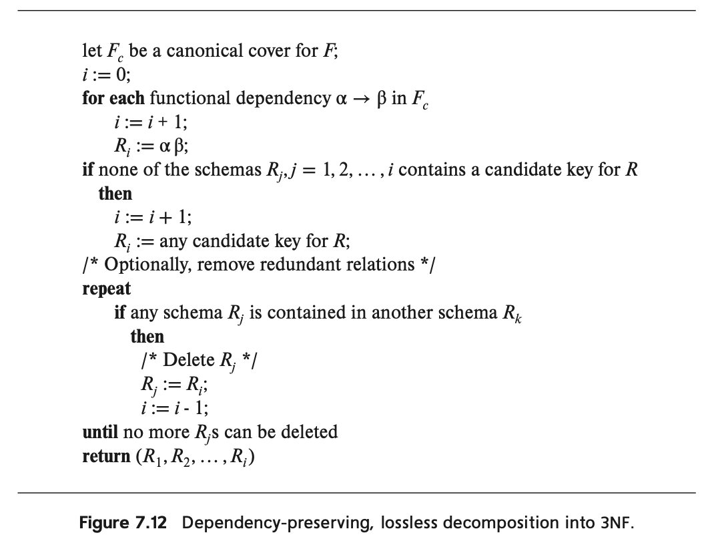

# 관계형 DB 설계 (2)

# 함수적 종속성을 이용한 분해 알고리즘

실제 세계의 데이터베이스 스키마는 책 페이지에 맞는 예제보다 훨씬 큰 편임. 이러한 이유로, 적절한 정규형으로 설계를 생성하기 위한 알고리즘이 필요함. 이 섹션에서는 BCNF와 3NF를 위한 알고리즘을 제시함.

## 알고리즘 : BCNF

- 우리는 BCNF의 정의와 BCNF를 만들 때 쓰는 분해 규칙을 알아보았다.
- 그러나 실제 거대한 데이터베이스를 이렇게 정의만 가지고 BCNF로 만드는 것은 너무 힘들다! 따라서 좀 더  체계적이고 완전한 정규화 과정을 수행하기 위한 알고리즘이 필요하다.
- BCNF 여부를 확인하고, 아닐 경우 BCNF를 만드는 알고리즘을 알아보자.

### BCNF 여부 확인

관계 스키마 R이 BCNF를 만족하는지 테스트하는 과정은 일부 경우에 간소화될 수 있음:

- ✅ 관계 스키마 R이 BCNF인지 확인하려면, F+의 모든 종속성을 확인하는 대신 **주어진 집합 F의 종속성만 BCNF 위반 여부를 확인하면 됨.**
- ✅ 비자명 종속성 α → β가 BCNF 위반을 일으키는지 확인하려면, **α + (α의 속성 폐포)를 계산하고, 이것이 R의 모든 속성을 포함하는지 (= 즉, R의 슈퍼키인지) 확인**함.

**<예시>**

학생 정보를 담는 테이블을 생각해보자:

```
학생테이블(학번, 이름, 학과, 학과장)
```

여기서 다음과 같은 종속성이 있다고 가정해보자. 

- 학번 → 이름, 학과
- 학과 → 학과장

주어진 집합 F 안의 비자명 종속성 α → β가 BCNF를 위반하는지 확인하는 절차 :

- **(리마인드) 비자명 종속성 : β가 α의 부분집합이 아닌 경우를 의미.**
- `학번 → 이름, 학과`의 경우:
    - 학번의 속성 폐포 `학번+ = {학번, 이름, 학과, 학과장}` (학번으로부터 이름과 학과를 결정하고, 학과로부터 학과장을 결정할 수 있음)
    - 모든 속성을 포함하므로 이 종속성은 BCNF를 위반하지 않습니다.
- `학과 → 학과장`의 경우:
    - 학과의 속성 폐포 `학과+ = {학과, 학과장}`
    - 모든 속성(학번, 이름, 학과, 학과장)을 포함하지 않으므로 이 종속성은 BCNF를 위반합니다.

결론: 위 테이블은 `학과 → 학과장` 종속성 때문에 BCNF를 위반.

### BCNF 생성하기

**핵심 특징**

- 알고리즘이 생성하는 분해는 BCNF를 만족할 뿐만 아니라, '무손실 분해'이기도 함.
- 무손실인 이유: 스키마 $R_i$를 $(R_i - β)$와 $(α, β)$로 대체할 때, $α → β$ 종속성이 유지되고 $(R_i - β) ∩ (α, β) = α$가 성립하기 때문
- 만약 α ∩ β = ∅ 조건이 없다면, α ∩ β에 있는 속성들이 (Rᵢ - β) 스키마에 나타나지 않게 되어 α → β 종속성이 더 이상 성립하지 않을 수 있음.

**예시 : 수업 관리 시스템**

```
class (course_id, title, dept_name, credits, sec_id, semester, year, 
				building, room_number, capacity, time_slot_id)
```

이 스키마에 유지되어야 할 함수적 종속성 집합:

- `course_id → title, dept_name, credits`
- `building, room_number → capacity`
- `course_id, sec_id, semester, year → building, room_number, time_slot_id`

이 스키마의 후보키 : `{course_id, sec_id, semester, year}`

**<알고리즘 적용 과정>**

1단계: 첫 번째 BCNF 위반 처리

- 함수적 종속성 **course_id → title, dept_name, credits**가 성립하지만, course_id는 슈퍼키가 아님.
- 따라서 class는 BCNF가 아니므로, class를 두 개의 관계로 쪼갬 :

```
course (course_id, title, dept_name, credits)
class-1 (course_id, sec_id, semester, year, building, room_number, 
					capacity, time_slot_id)
```

2단계: 두 번째 BCNF 위반 처리

- class-1의 후보키는 `{course_id, sec_id, semester, year}`.
- 함수적 종속성: **building, room_number → capacity**가 class-1에서 성립하지만, `{building, room_number}`는 class-1의 슈퍼키가 아님.
- class-1을 두 개의 관계로 대체 :

```
course (course_id, title, dept_name, credits)
classroom (building, room_number, capacity)
section (course_id, sec_id, semester, year, building, room_number, time_slot_id)
```

- 이 두 스키마는 BCNF를 만족!

**알고리즘의 시간 복잡도**

- BCNF 분해 알고리즘은 초기 스키마 크기에 지수적인 시간이 소요됩니다.
- 다항 시간에 BCNF 분해를 계산할 수 있는 알고리즘도 있지만, 이는 "과도한 정규화"를 할 수 있습니다 (즉, 불필요하게 관계를 분해할 수 있음).

## 알고리즘 : 3NF



3NF로의 종속성 보존 및 무손실 분해를 찾기 위한 알고리즘.

> 함수적 종속성 집합 $F_c$는 $F$의 canonical cover.
**(리마인드) Canonical Cover :** 주어진 함수적 종속성 집합 F 와 **동일한 폐포(Closure)를 가지면서도, 더 간단한 형태의 함수적 종속성 집합**
> 

1. **초기화**:
    - Fc는 F의 표준 형태(canonical cover)로 설정
    - i를 0으로 초기화 (현재까지 만든 관계 스키마 수)
2. **함수적 종속성으로부터 스키마 생성**:
    - Fc에 있는 각 함수적 종속성 α → β에 대해:
        - i를 1 증가시킴
        - 새 스키마 Ri를 생성하며, 속성은 α와 β의 합집합
3. **후보키 처리**:
    - 만약 생성된 스키마들(R1부터 Ri까지) 중 어느 것도 원래 관계 R의 후보키를 포함하지 않는다면:
        - i를 1 증가시킴
        - 새 스키마 Ri를 생성하며, 이는 R의 임의의 후보키로 구성
4. **중복 제거** (선택적):
    - 반복:
        - 만약 어떤 스키마 Rj가 다른 스키마 Rk에 완전히 포함된다면:
            - Rj를 삭제 (실제로는 마지막 스키마 Ri를 Rj 위치로 이동)
            - i를 1 감소시킴
        - 더 이상 삭제할 스키마가 없을 때까지 반복
5. **결과 반환**:
    - 최종 스키마 집합 (R1, R2, ..., Ri) 반환

### 예제에 적용하기

7.3.2절에서 살펴본 dept_advisor 예제에 이 알고리즘을 적용해보자. dept_advisor는 다음과 같이 생겼다.

```
dept_advisor (s_ID, i_ID, dept_name)
```

이 스키마는 BCNF는 아니지만 3NF이며, 다음과 같은 함수적 종속성 F가 있음.

- $f_1$ : i_ID → dept_name
- $f_2$ : s_ID, dept_name → i_ID

$F$의 함수적 종속성에는 불필요한 속성이 없으므로, $F_c$는 $f_1$과 $f_2$를 포함한다.

알고리즘은 $R_1$으로 (i_ID, dept_name) 스키마를, $R_2$로 (s_ID, dept_name, i_ID) 스키마를 생성합니다. 

그 후 알고리즘은 $R_2$가 후보키를 포함하고 있음을 발견하므로 추가 관계 스키마는 생성되지 않습니다.

### 중복 스키마 제거

- 결과 스키마 집합은 중복 스키마를 포함할 수 있음.
    - 예를 들어 한 스키마 $R_k$가 다른 스키마 $R_j$의 모든 속성을 포함할 수 있음.
- 이 경우, 알고리즘은 **중복 제거** 과정을 통해 중복 스키마를 제거.
- 그래도 여전히 종속성 보존과 무손실 조인이 모두 가능.

### 알고리즘의 특성

이제 class 관계 스키마를 다시 살펴보고 3NF 분해 알고리즘을 적용해보자.

```
<적용 전>
class (course_id, title, dept_name, credits, sec_id, semester, year, 
				building, room_number, capacity, time_slot_id)
```

```
<적용 후>
course (course_id, title, dept_name, credits)
classroom (building, room_number, capacity)
section (course_id, sec_id, semester, year, building, room_number, time_slot_id)
```

여전히 결과적으로 알고리즘은 course, classroom, section이라는 동일한 세 스키마를 제공한다.

즉, 3NF 알고리즘을 써도 때로는 결과가 3NF뿐만 아니라 BCNF에도 속할 수 있음.

그렇다면, 3NF 설계를 먼저 하고 BCNF 설계를 해도 되지 않을까? 

이런 아이디어를 기반으로 대안적인 설계를 해보자면,

1. 먼저 3NF 알고리즘을 사용!
2. 3NF 설계에서 BCNF가 아닌 스키마에 대해 BCNF 알고리즘을 사용하여 분해
3. 결과가 종속성을 보존하지 않는다면 3NF 설계로 돌아간다.

# 다중값 종속성

> **(리마인드) BCNF로도 여전히 ‘정보 반복' 문제를 겪을 수 있다.**
> 

예제 : 대학 조직 관계 스키마

```
inst (ID, dept_name, name, street, city)
```

- 한 교수가 여러 학과에 소속될 수 있고, 여러 주소를 가질 수 있는 상황
- 함수적 종속성 : ID → name, street, city. 근데 ID는 inst 릴레이션의 주 키가 될 수 없음.
- ID는 고유한 값이나, 한 교수가 여러 학과에 속하고 여러 주소를 가질 수 있는 상황. 
예를 들면, 다음과 같은 상황이 벌어질 수 있음.

```
(101, 컴퓨터공학과, 김교수, 서울시, 강남구)
(101, 컴퓨터공학과, 김교수, 부산시, 해운대구)
(101, 전자공학과, 김교수, 서울시, 강남구)
(101, 전자공학과, 김교수, 부산시, 해운대구)
```

여기에 BCNF를 적용해보면 다음과 같이 2개의 릴레이션이 생긴다.

```
r1 (ID, name)
r2 (ID, dept_name, street, city)
```

물론, r1과 r2 모두 BCNF이다. 왜?

> **(리마인드) BCNF의 조건**
> 
> - X → Y가 자명한 함수적 종속성(trivial FD)
> - 테이블의 모든 함수적 종속성 X → Y에 대해, X가 슈퍼키(super key)이거나 X가 후보키(candidate key)여야 함.

그러나 **r2에서는 여전히 데이터 중복 문제가 발생함**.

즉, **한 교수가 여러 학과에 속할 경우, 같은 주소 정보가 여러 번 반복됨**.

이를 해결하기 위해 r2를 **더 작은 두 개의 릴레이션으로 분해 가능함**:

```
• r21 (dept_name, ID)
•	r22 (ID, street, city)
```

하지만 **함수 종속성(FD)만으로는 이를 강제할 수 없기에, 다중값 종속성(MVD, Multivalued Dependency)** 개념이 꼭 필요함.

## 다중값 종속성이란?

- **어떤 속성 집합이 두 개의 속성 그룹을 독립적으로 결정할 때 발생하는 종속성**을 의미
- 함수 종속성(Functional Dependency, FD)은 **하나의 값만 결정**하는 반면, 다중값 종속성(MVD)은 **여러 개의 독립적인 값들을 결정**할 수 있음.
- 즉, 다중값 종속성은 **하나의 속성이 여러 개의 독립적인 값을 가질 수 있는 상황을 나타냄**.
- 이를 통해 **데이터 중복 문제를 식별하고 정규화를 수행하는 기준**이 됨.

### **수식으로 표현하기**

*릴레이션 $r(R)$에서 속성 집합 $α ⊆ R$과 $β ⊆ R$이 있을 때, 다음 조건을 만족하면 다중값 종속성 (MVD)가 릴레이션 $R$에서 성립한다고 함.*

$$
\alpha \rightarrow\rightarrow \beta
$$

**만약 α 값이 동일한 두 개의 튜플이 존재하면, 특정한 형태의 튜플 두 개가 추가로 존재해야 함.**

- 즉, **α와 β 간의 관계는 α와 R − β 간의 관계와 독립적이어야 함.**

이를 수식적으로 증명해보자면 다음과 같음.

$*t_1[α] = t_2[α]$이면 반드시 $t_3$와 $t_4$가 존재하여 다음을 만족해야 함.*

- $t_1[α] = t_2[α] = t_3[α] = t_4[α]$
- $t_3[β] = t_1[β],~t_3[R - β] = t_2[R - β]$
- $t_4[β] = t_2[β],~ t_4[R - β] = t_1[R - β]$

### **특징 및 예시**

다중값 종속성 α → → β가 다음 중 하나를 만족하면 **자명(Trivial)한 MVD**임.

1. **β ⊆ α**
2. **β ∪ α = R**

💡 **즉, β가 α의 부분집합이거나, β와 α가 합쳐서 전체 R이 되면 자명한 MVD임.**

✔ **MVD와 함수 종속성(FD)의 차이점 예시**

- 릴레이션 r2 (ID, dept_name, street, city)를 다시 생각해보면:
    - 하나의 교수(ID)는 여러 학과(dept_name)에 속할 수 있음.
    - 하나의 교수(ID)는 여러 주소(street, city)를 가질 수 있음.
- 현재 구조에서는 **교수의 주소 정보가 학과마다 반복**됨. 이 문제를 해결하기 위해서는 다음과 같은 다중값 종속성이 필요함.

```
ID →→ street, city
```

- 반대로, 다음 역시 동일하게 성립함.

```
ID →→ dept_name
```

- 즉, **이 두 가지 MVD는 사실상 동일한 의미를 가짐**.

### **다중값 종속성의 활용**

MVD는 다음과 같은 두 가지 목적으로 사용됨.

1. **릴레이션이 주어진 FD와 MVD를 만족하는지 테스트하기 위해**
2. **릴레이션이 특정한 제약 조건을 만족하도록 제한하기 위해**

📌 **중요한 성질**

- 함수 종속성(FD) α → β가 성립하면, 다중값 종속성(MVD) α → → β도 성립함.
- 다중값 종속성 α → → β가 성립하면, **나머지 속성 집합**에 대한 MVD도 성립함.

```
α →→ (R - α - β)
```

이러한 규칙을 활용하면 **보다 정규화된 릴레이션을 만들 수 있음**.

## 제4정규형

우리가 앞서 다룬 **BCNF 스키마**

```
r2 (ID, dept_name, street, city)
```

이 스키마에서는 **다중값 종속성(MVD)**이 성립함.

```
ID → → street, city
```

이전에도 언급했듯이, 이 스키마는 **BCNF를 만족하지만 데이터 중복 문제가 발생함**.

즉, **교수(ID)가 여러 학과(dept_name)에 속할 경우, 같은 주소(street, city) 정보가 반복됨**.

이 문제를 해결하기 위해 **4NF를 이용하여 스키마를 개선할 수 있음.**

### **제4정규형(4NF)의 정의**

릴레이션 스키마 $R$가 **주어진 함수 종속성과 다중값 종속성의 집합 D**에 대해 **4NF에 속하기 위한 조건**은 다음과 같음:

✔ 모든 **다중값 종속성** α → → β에 대해, 다음 중 하나가 성립해야 함:

1.  α → → β**가 자명한(trivial) 다중값 종속성**
    - 즉, $β \subseteq α$이거나 $α \cup β = R$인 경우
2. α**가** R**의 슈퍼키(Superkey)인 경우**

💡 **쉽게 말하면:**

- 다중값 종속성으로 인해 중복이 발생하는 경우, α**가 슈퍼키가 아니면 분해해야 함**.
- **모든 4NF 릴레이션은 BCNF를 만족하지만, 모든 BCNF 릴레이션이 4NF는 아님**.

### **BCNF vs 4NF 차이점**

✔ **BCNF는 함수 종속성(FD)만 고려**

✔ **4NF는 다중값 종속성(MVD)까지 고려**

📌 **4NF가 BCNF보다 강력한 이유**

- 만약 **R**이 BCNF를 만족하지 않는다면, **비자명(non-trivial)한 FD**가 존재함.

```
α → β (α가 슈퍼키가 아님)
```

- **모든 함수 종속성(FD)는 다중값 종속성이므로** 다음과 같이 됨.

```
α → β ⟹ α → → β
```

- 따라서 **BCNF를 만족하지 않는 릴레이션은 4NF도 만족할 수 없음.**
- **즉, 모든 4NF 스키마는 BCNF이지만, BCNF 스키마가 4NF가 아닐 수도 있음.**

### **4NF 적용 예제**

**🎯 문제 상황: 교수와 학과, 주소 정보**

```
r2 (ID, dept_name, street, city)
```

- 교수(ID)는 **여러 학과(dept_name)에 속할 수 있음**
- 교수(ID)는 **여러 주소(street, city)를 가질 수 있음**
- 학과와 주소 간에는 **독립적인 관계**가 있음

📌 **MVD가 존재함:**

```
ID → → street, city
```

✔ **교수의 학과 정보와 주소 정보는 서로 독립적이므로, 분해가 필요함!**

**🎯 4NF를 만족하는 분해**

1️⃣ 교수와 학과 관계

```
r21 (ID, dept_name)
```

2️⃣ 교수와 주소 관계

```
r22 (ID, street, city)
```

이렇게 분해하면 **중복 없이 데이터를 저장할 수 있음!** ✅

**🔹 4NF 적용을 위한 체크 방법**

릴레이션 $R$을 **4NF로 분해할 때**, 각 서브 릴레이션 $R_1, R_2, …, R_n$이 **4NF를 만족하는지 확인하는 방법**:

✔ 각 **서브 릴레이션** $R_i$에서 어떤 **MVD가 유지되는지** 확인

✔ 함수 종속성(FD)와 다중값 종속성(MVD)을 **각 서브 릴레이션에 대해 검사**

✔ 모든 서브 릴레이션이 $\alpha → → \beta$ 조건을 만족하는지 확인

# 추가 정규화 형태 (1)

## 정규화의 확장

- 제4정규형(4NF)은 최종 정규형이 아니며, 더 릴레이션(테이블)을 나눌 수 있음.
- 이때, Multivalued Dependencies는 정보 반복을 이해하는 데 도움을 줌

### 추가적인 정규화 형태

1. **프로젝트-조인 정규형(PJNF)**
    - 일부 교재에서는 제5정규형으로 불림
    - 다치 종속성을 일반화한 제약 조건에 기반
2. **도메인-키 정규형(DKNF)**
    - 더 일반적인 제약 조건을 다룸

### 실용적 한계

- 이러한 일반화된 제약 조건들은 다음과 같은 문제점 존재
    - 추론하기 어려움
    - 추론을 위한 완전하고 건전한 규칙 부재
- 따라서 PJNF와 DKNF는 매우 드물게 사용됨

### 주목할 점

- 제2정규형(2NF)은 역사적 관심사로만 취급됨
- 제1정규형은 이전에 논의된 정규형과는 다른 접근 방식을 다룸

# 추가 정규화 형태 (2)

## 원자적 도메인

- **원자적 도메인**: 더 이상 나눌 수 없는 불가분의 단위로 간주되는 도메인
- **제1정규형(1NF)**: 관계 스키마의 모든 속성 도메인이 원자적인 상태

### 비원자적 도메인의 예시 🚫

1. 이름 집합
2. 복합 속성 (예: 주소의 street, city 등)
3. 정수 집합
4. 특정 패턴을 가진 식별자 (예: "CS001" 형태의 직원 ID)

### 실무적 고려사항 🤔

식별자 처리

- 비원자적 식별자 사용의 문제점
    - 추가 프로그래밍 필요
    - 정보가 애플리케이션 프로그램에 인코딩됨
    - 부서 변경 시 ID 전체 수정 어려움

데이터 일관성 문제 ⚠️

- 집합 값 속성 사용 시 발생할 수 있는 문제
    - 데이터 중복 저장
    - 업데이트 시 일관성 유지 어려움

## 현대적 접근 🌐

- 일부 비원자적 값은 유용할 수 있음
- 현대 데이터베이스 시스템은 복잡한 값 지원
- 그러나 초기 관계형 모델에서는 원자적 도메인 강제

### 주의사항 ✅

- 강제로 제1정규형 표현을 사용하면 애플리케이션 프로그래머에게 부담
- 데이터 변환에 따른 런타임 오버헤드 발생 가능

### 예외적 접근 📝

- 강제 변환이 불필요한 경우 비원자적 값 허용 가능

# DB 설계 프로세스

> 그래서, 최종적으로 DB는 어떻게 만드는 것인가?
> 

## **E-R 모델과 정규화**

**E-R 다이어그램**을 정확하게 설계하면, 생성된 **릴레이션 스키마**는 추가적인 정규화가 크게 필요하지 않음.

- 하지만 **엔티티 세트 내부에서 함수적 종속성**이 발생할 수 있음.
- 예: instructor 엔티티에 dept_name → dept_address 종속성이 있으면 정규화 필요
- 해결책: department 엔티티를 따로 만들고, instructor와 관계 설정

대부분의 경우, **E-R 다이어그램을 잘못 설계하면** 추가적인 정규화가 필요하게 됨.

정규화는 **두 가지 방식**으로 수행될 수 있음:

1. **E-R 모델 단계에서 정규화**
2. **릴레이션 스키마 변환 후 정규화**

**E-R 모델이 잘 설계되면 대부분 4NF까지 충족**하는 구조를 갖게 됨.

- 다중 값 종속성이 발생하는 경우:
    - **다대다 관계 세트**
    - **엔티티 세트의 다중 값 속성**
- 다대다 관계는 별도의 릴레이션 스키마를 만들어 해결함.
- 다중 값 속성은 해당 속성과 엔티티의 **기본 키를 포함한 별도 스키마**를 생성하여 해결함.

## **속성과 관계 이름 지정**

**🔍 유일한 역할 가정 (Unique-Role Assumption)**

- 속성 이름이 데이터베이스 내에서 **유일한 의미를 가지도록 설계**하는 것이 중요함.
- 예: `number` 속성이 **강의실 번호**와 **전화번호**로 동시에 사용되면 혼란이 발생할 수 있음.
- 같은 이름을 공유하는 속성은 **동일한 의미를 가져야 함**.
- 예: `instructor`와 `student` 엔티티에 각각 `name` 속성을 사용 → 이후 `person` 엔티티로 일반화 가능

**📌 속성 순서 지정**

- 기본 키 속성을 **스키마에서 가장 먼저 배치**하는 것이 일반적인 관례임.
- 예: `select *` 실행 시 기본 키를 앞에서 확인 가능하도록 함.

**🔗 관계 집합 명명 규칙**

- **엔티티 세트의 이름을 조합하여 관계 이름을 생성**하는 것이 일반적임.
- 예: `inst_sec`, `student_sec` 등
- 하지만 **관계의 의미를 반영하는 이름을 사용**하는 것이 더 효과적일 수도 있음.
- 예: `teaches`, `takes` 등

**🔄 동일한 엔티티 세트 간의 관계 명명**

- 같은 엔티티 세트 간의 관계는 의미를 명확히 해야 함.
- 예: `employee-employee` → `manager, works_for` 등으로 구분

**📢 일관된 명명 규칙 사용**

- 엔티티 세트의 이름은 **단수형(singular) 또는 복수형(plural) 중 하나로 통일**해야 함.
- 예: `student` 또는 `students` 중 하나를 선택하여 일관성 유지
- 관계가 많아질수록 **속성, 관계, 엔티티의 일관된 네이밍 규칙**이 중요함.

## **성능 최적화를 위한 비정규화**

때때로 **성능 최적화**를 위해 **정규화되지 않은(중복된 정보가 포함된) 스키마**를 선택하는 경우가 있음.

**비정규화의 단점**

- 중복 데이터 유지로 인해 **추가적인 코드 작성 및 실행 시간 증가**
- 데이터 **일관성을 유지하는 부담**이 증가함.

**예시: 과정(course)와 선수과목(prereq) 데이터**

- 정규화된 스키마에서는 course와 prereq를 **조인(join)** 해야 전체 정보를 확인할 수 있음.
- 비정규화된 스키마에서는 course와 prereq를 **하나의 릴레이션**에 저장하여 조회 속도를 향상할 수 있음.
- 하지만 **각 과정의 정보가 중복 저장되며**, 선수 과목이 추가/삭제될 때 모든 데이터를 갱신해야 하는 부담 발생

**📌 대안: 물리적 뷰(Materialized View) 사용**

- 정규화된 스키마를 유지하면서도 성능을 향상하는 방법.
- **course와 prereq의 조인 결과를 미리 저장해두고(materialized view)**, 관계가 변경될 때 자동 갱신하도록 설정.
- 데이터베이스 시스템이 갱신을 담당하므로 **애플리케이션 개발자가 직접 중복 데이터를 관리할 필요 없음**.
- 공간과 시간 오버헤드는 있지만, **데이터 일관성을 유지하면서 성능을 향상**할 수 있음.

## **기타 설계 문제**

정규화만으로는 해결되지 않는 **잘못된 설계 패턴**이 존재함.

**시간(time) 또는 범위(range) 데이터를 다룰 때 발생하는 문제**를 예로 들 수 있음.

**❌ 잘못된 설계 사례**

**1️⃣ 연도별 강사진 수 저장 문제**

대학 데이터베이스에서 각 학과(department)의 연도별 교수 수를 저장한다고 가정함.

- **정규화된 설계**:
    - total_inst(dept_name, year, size)
    - 함수 종속성: dept_name, year → size
    - **BCNF를 만족하지만, 문제 없음**

**비효율적인 설계 방식들**

**방식 1️⃣: 연도별 개별 릴레이션 생성**

- total_inst_2017(dept_name, size), total_inst_2018(dept_name, size), total_inst_2019(dept_name, size)
- 각 연도마다 **새로운 릴레이션을 생성해야 함** → 유지보수가 어려워짐.
- 쿼리 작성도 복잡해지고, 매년 새로운 SQL 쿼리를 추가해야 함.

**방식 2️⃣: 연도를 컬럼으로 추가 (Crosstab 형식)**

- dept_year(dept_name, total_inst_2017, total_inst_2018, total_inst_2019)
- **새로운 연도가 추가될 때마다 테이블을 수정해야 함.**
- 다중 속성을 다룰 때 쿼리가 복잡해짐.

**🚨 교훈: 데이터베이스에서 Crosstab(피벗 테이블) 사용은 지양해야 함!**

- **Crosstab 형식은 데이터 분석 도구(예: Excel, BI 도구)에서는 유용하지만, 데이터베이스 설계에서는 바람직하지 않음.**
- SQL에서는 **정규화된 데이터를 Crosstab 형식으로 변환하는 기능**을 제공하므로, 테이블 자체를 이렇게 설계할 필요 없음.

# **시간 데이터 모델링**

**🧑‍🏫 시간 정보를 포함한 데이터 관리**

- 대학에서 강사의 **주소**뿐만 아니라 **과거 주소**까지 저장하는 경우, 예를 들어 “1981년에 프린스턴에 거주한 강사”를 찾는 질의가 가능함.
- 이런 경우, **한 명의 강사가 여러 주소**를 가질 수 있으며, 각 주소에는 시작일(start)과 종료일(end)이 함께 저장되어야 함.
- 종료일을 null 또는 9999-12-31처럼 미래의 날짜로 설정해 **현재 거주 중**임을 표현할 수 있음.

**⏳ 시간 데이터(Temporal Data)의 정의**

- 시간 데이터는 특정 **유효 기간(time interval)** 동안만 유효한 데이터를 말함.
- 시간 데이터 모델링은 다음 이유로 어려움:
- 속성(attribute)의 값이 시간에 따라 변할 수 있음.
- 엔터티(예: 학생)는 유효 기간이 존재함 (입학일 ~ 졸업일).
- 관계(relationship)도 유효 기간을 가질 수 있음 (예: 어떤 과목이 다른 과목의 선수과목이 된 시점).

**⚙️ ER 다이어그램에서의 한계**

- 시간 정보를 표현하려면 속성, 엔터티, 관계 모두에 **유효 시간 정보**를 추가해야 함.
- 하지만 이렇게 되면 **ER 다이어그램이 복잡해지고 이해하기 어려워짐**.
- 따라서 대부분의 설계자들은 시간 정보를 처음부터 반영하지 않고, 나중에 필요한 테이블에만 유효 기간을 추가함.

**🗃️ 예시: 시간 속성 추가된 테이블 설계**

**🧾 course 테이블 예시**

```
course(course_id, title, dept_name, credits, start, end)
```

- 과목명이 변경될 수 있으므로 start, end를 추가해 **유효 기간**을 나타냄.
- SQL:2011 표준에서는 유효 기간을 **왼쪽 닫힘, 오른쪽 열림** 구간 [start, end)으로 처리함.
- 예: 과목명이 2020-01-01에 “Intro. to Scala”로 바뀌면:
- 기존 튜플의 end 값을 2020-01-01로 업데이트.
- 새로운 튜플 추가: `(CS-201, Intro. to Scala, Comp. Sci., 4, 2020-01-01, 9999-12-31)`

## **🔁 시간에 따른 제약 조건 변화**

**📌 함수적 종속성**

- 일반적인 함수적 종속성: `course_id → title, dept_name, credits`
- 시간 데이터를 고려하면 항상 성립하지 않음.
- 대신 다음과 같은 제약이 필요함:
    - 👉 “동일한 시간 t에서는 course_id가 하나의 title과 dept_name만을 가짐”
- 이러한 제약을 **시간적 함수적 종속성(temporal functional dependency)**이라고 부름.

**📸 스냅샷(Snapshot)**

- 특정 시점의 데이터 상태를 의미함.
- 시간적 함수적 종속성은 모든 시점의 스냅샷에서도 종속성이 성립해야 함.

## **🔐 키와 제약 조건**

> 외래 키 제약조건 역시 시간 데이터에서는 더 까다로워짐.
> 

**🗝️ 기본 키(primary key)**

- 시간 정보 추가 시, 기존 기본 키로는 튜플을 고유하게 식별할 수 없음.
- 단순히 `start`, `end`를 기본 키에 추가해도 **기간 중복(overlap)**을 막을 수 없음.
- 해결책 → 동일한 기본 키 값을 가진 튜플 간에는 **기간이 겹치면 안됨**.

**🌐 외래 키(foreign key)**

- 시간 정보까지 고려해야 함.
- 예: takes 테이블의 takes.course_id는 course 테이블을 참조함.
- takes의 기간이 course의 기간 안에 포함되거나, 여러 course 튜플의 기간에 **덮여져 있어야** 함.

**🕰️ 대안 방법:** 

1. **이력 테이블 사용**
- 기존 테이블의 기본 키와 외래 키에 위와 같은 추가 정보를 넣는 대신 다음과 같은 방법도 생각해볼 수 있다.
    - 본 테이블(course 등)은 그대로 두고, 이력 테이블(course_history 등)을 따로 생성하여 업데이트 내역을 저장하는 방식도 존재함.
    - 단점: course_history만으로는 학생이 어떤 과목명을 들었는지 정확히 파악하기 어려움.

1. **SQL:2011의 시간 데이터 지원**
- 한편, 새로운 버전의 SQL(SQL:2011)에서는 시간 데이터를 지원하기도 한다.
- **선언 예시는 다음과 같음.**

```
period for validtime (start, end)
```

- **시간 기반 기본 키**

```
primary key (course_id, validtime without overlaps)
```

- **시간 기반 외래 키**
    - 참조 테이블과 참조하는 테이블 모두에 **기간(period)**을 지정 가능.
    - 하지만 대부분의 DBMS는 이를 **지원하지 않음**.
    
1. **PostgreSQL에서의 대체 방법**
- PostgreSQL에서는 `tsrange` 타입으로 기간을 저장할 수 있음.
- `&& 연산자`를 이용해 **기간 중복 여부**를 검사 가능.

## **🧮 관계 연산에서 시간 정보 다루기**

**✅ 선택(select), 투영(project)**

- 입력 튜플과 동일한 유효 기간 유지함.

**🔗 조인(join)**

- 조인 결과의 유효 기간 = **입력 튜플들의 유효 기간 교집합**.
- 교집합이 없으면 결과에서 제외됨.

※ 대부분의 DBMS는 **시간 조인을 기본적으로 지원하지 않음**, 하지만 SQL로 수동 구현 가능.