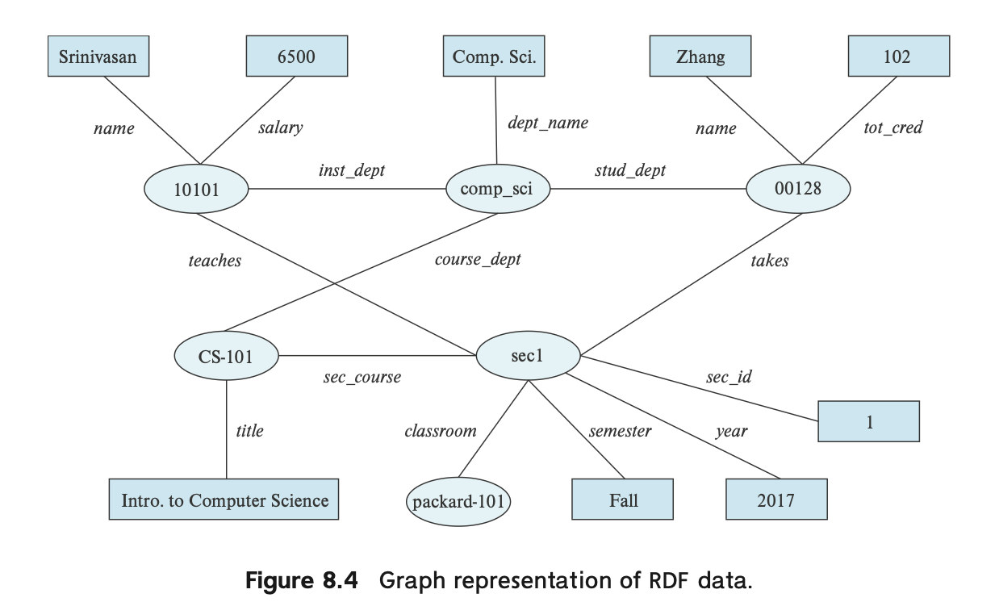

# 복합 데이터 타입

관계형 모델의 중요한 요구사항 = 데이터 값이 원자적이어야 한다.

데이터 값이 원자적이어야 한다 = **하나의 칸(속성, column)에 여러 값이 들어가면 안 된다**

| **회원ID** | **이름** | **취미** |
| --- | --- | --- |
| 1 | 철수 | 독서, 영화감상, 등산 |

→ 취미 칼럼의 “독서, 영화감상, 등산”처럼 **여러 개의 값**을 한 셀에 넣은 경우, 이는 **비원자적임.**

| **회원ID** | **이름** | **취미** |
| --- | --- | --- |
| 1 | 철수 | 독서 |
| 1 | 철수 | 영화감상 |
| 1 | 철수 | 등산 |

→ 이렇게 **각 행이 하나의 정보(원자값)**만 담고 있어야 “원자적”이라고 할 수 있음.

그렇지만 원자적이지 않은 데이터들 역시 존재하며, 이를 처리하는 방법을 알아보자.

# 반구조형 데이터

**📌 개요**

전통적인 관계형 데이터베이스(RDB)는 고정된 스키마 구조를 가지며, 속성마다 원자 값(atomic value)을 저장함. 하지만 현대의 웹 애플리케이션처럼 **스키마가 자주 바뀌고, 복잡한 데이터**를 다루는 경우에는 적합하지 않음.

→ 이런 상황에 맞춰 **반정형 데이터(semi-structured data)**가 등장함.

---

**🛠️ 반정형 데이터가 필요한 이유**

- 사용자 프로필처럼 **속성이 자주 바뀌거나**, **복합적인 형태의 데이터를 저장해야 할 때** 필요.
- 웹 서비스에서 **서버와 클라이언트 간의 데이터 교환**을 위해 복잡한 구조를 효율적으로 다뤄야 함.
- 예: JSON, XML 등은 백엔드와 프론트엔드 간 **유연하고 구조적인 데이터 교환**에 매우 유리함.

---

## 반정형 데이터의 특징

1. **유연한 스키마 (Flexible Schema)**
- **Wide Column 모델**

각 튜플(행)이 서로 다른 속성을 가질 수 있음.

- **Sparse Column 모델**

고정되긴 했지만 아주 많은 속성을 정의하고, 필요한 것만 사용하며 나머지는 NULL로 비움.

1. **다중 값 속성 (Multivalued Data Types)**
- 속성에 **배열(array), 집합(set), 맵(map)** 등 **비원자 값**을 저장할 수 있음.
- 예: 사용자의 관심사 {농구, 요리, 재즈} → 효율적 저장 및 조회.
    - **Map :** `{(brand, Apple), (size, 13)}`처럼 제품 정보 저장에 유용.
    - **배열(Array) :** 과학/모니터링 데이터에 적합, 압축 저장이 가능하며 공간 효율적.
- 과거에도 이런 모델은 존재했으며, **NFNF (Non First Normal Form) 라고 명명**
    - Oracle, PostgreSQL 등은 이미 array/set 타입을 지원함.

1. **중첩 데이터 타입 (Nested Data Types)**
- 속성 내에 또 다른 속성들을 **계층적으로 중첩**시켜 저장 가능 (ex. name → {firstname, lastname})
- JSON/XML은 중첩 구조를 가지며, 각 객체는 **트리 구조**를 형성함.
- 이를 통해 하나의 구조 안에 다양한 정보를 함께 저장 가능 → **조인 없이 빠른 조회 가능**

**🌐 JSON vs XML**

| **항목** | **JSON** | **XML** |
| --- | --- | --- |
| 구조 | 키-값 쌍, 중첩 구조 | 태그 기반 구조 |
| 유연성 | 매우 유연함 | 약간 제한적 |
| 주 사용처 | 웹/모바일 앱에서의 데이터 교환 | 설정 파일, 레거시 시스템 데이터 |
1. **지식 표현 (Knowledge Representation)**
- 인간의 지식을 데이터로 표현하고자 하는 목적에서 출발.
- **대표적인 예시 : RDF (Resource Description Framework)**
    - 객체, 속성, 관계를 **삼중항(triple)** 또는 **그래프** 형태로 표현.
    - **웹 스케일의 방대한 지식 표현**에 적합.
- 예: ("스티브 잡스", "창립자", "Apple")

## JSON

- JSON은 **복합 데이터를 표현하기 위한 텍스트 기반 포맷**
- **웹 서비스 간 데이터 전송** 및 **복합 객체 저장**에 가장 널리 사용되는 형식

JSON의 핵심적인 요소는 다음과 같음.

- **기본 데이터 타입**: 정수, 실수, 문자열
- **복합 데이터 타입**:
- **배열 (Array)**: [ "A", "B", "C" ]
- **객체 (Object)**: { "name": "Alice", "age": 30 }
    - **속성명(key)**과 **값(value)**의 쌍으로 구성된 맵 형태

📌 배열은 내부적으로 **인덱스 기반 맵 구조로도 볼 수 있음.**

---

**사용 예시**

- 웹 애플리케이션이 서버와 통신할 때 JSON으로 데이터를 주고받음
- 예: 이메일 앱에서 로그인, 메일 목록 조회, 메일 내용 보기, 메일 전송 등은 모두 JSON 사용

```json
{
  "user": "alice123",
  "emails": [
    {
      "subject": "Meeting Reminder",
      "time": "2025-04-01T10:00"
    },
    {
      "subject": "Welcome!",
      "time": "2025-03-31T15:00"
    }
  ]
}
```

### JSON의 특징

**JSON과 프로그래밍 언어**

- 대부분의 언어(JavaScript, Python, Java, PHP 등)는 JSON ↔ 객체 간 변환 라이브러리를 제공
- 쉽게 직렬화/역직렬화가 가능하여 **응답 속도 및 개발 편의성** 우수

**단점 및 보완 기술**

| **단점** | **해결 방안** |
| --- | --- |
| 텍스트 기반이라 **용량이 큼** | ➤ **BSON(Binary JSON)** 사용 (압축된 이진 포맷) |
| 파싱 비용이 **CPU를 많이 소모**함 | ➤ 전처리된 구조나 인덱스 활용 |

### **SQL과 JSON 통합**

현대의 SQL은 JSON을 다음과 같이 다룰 수 있도록 확장됨:

**✅ 저장**

- JSON 데이터 타입으로 저장 가능 (PostgreSQL, MySQL 등)

**🛠️ 생성**

- **객체 단위 생성**
    - PostgreSQL : `json_build_object('ID', 123, 'name', 'Einstein'}` → { `"ID": 123, "name": "Einstein" }`
- **집계(Aggregation)**
    - PostgreSQL: `json_agg()` → 여러 JSON 객체를 하나의 배열로 묶음
    - Oracle: `json_objectagg`, `json_arrayagg`
    - SQL Server: `FOR JSON AUTO` 사용 가능

**🔍 조회**

- **경로 표현(Path Expression)**으로 특정 필드 추출
- PostgreSQL: `v->'ID'`
- Oracle: `v.ID`
- SQL Server: `JSON_VALUE(value, '$.ID')`

## XML

XML은 텍스트 데이터에 태그를 추가하여 정보를 표현하는 방식임. 태그는 꺾쇠괄호(<>)로 둘러싸여 있으며, `<tag>`와 `</tag>` 쌍으로 정보의 시작과 끝을 구분함.

- **태그 활용 예시**:
    
    ```xml
    <title>Database System Concepts</title>
    ```
    
- **관계형 데이터 표현**:
    
    ```xml
    <course>
      <course_id> CS-101 </course_id>
      <title> Intro. to Computer Science </title>
      <dept_name> Comp. Sci. </dept_name>
      <credits> 4 </credits>
    </course>
    ```
    
- **장점**
    - 💡 새로운 태그를 쉽게 도입할 수 있음
    - 💡 데이터가 "자체 문서화" 되어 사람이 이름만으로도 의미를 이해할 수 있음
    - 💡 관계형 모델에서는 불가능한 계층적 구조 생성 가능
- **활용 사례**
    - 비즈니스 문서(청구서, 구매 주문서 등) 표현에 적합함
    - 서로 다른 조직 간 데이터 교환에 유용함
    - 구매 주문서 같은 복잡한 정보를 단일 문서로 자연스럽게 표현 가능

### 🔍 XQuery와 SQL 확장

- XQuery: XML 데이터 쿼리를 위해 개발된 언어지만, SQL에 비해 채택률이 제한적임
- SQL 확장 기능:
    1. XML 데이터 타입 저장 지원
    2. 관계형 데이터에서 XML 데이터 생성 가능
    3. 개별 행에서 XML 표현 구성 및 XMLAGG 집계 함수로 여러 행의 데이터를 XML 문서로 생성
    4. XPath 언어를 활용하여 XML 데이터에서 원하는 부분 추출 가능

## RDF와 지식 그래프

**🔍 개요**

RDF(Resource Description Framework)는 개체-관계 모델에 기반한 데이터 표현 표준임. 이 섹션에서는 RDF의 개요를 제공함.

**트리플 표현 (Triple Representation)**

RDF 모델은 데이터를 다음 두 가지 형태의 트리플(triple) 집합으로 표현함:

1. (ID, 속성-이름, 값)
2. (ID1, 관계-이름, ID2)

여기서 각 요소의 역할은:

- **주어(Subject)**: 첫 번째 속성 (ID 또는 ID1)
- **술어(Predicate)**: 두 번째 속성 (속성-이름 또는 관계-이름)
- **목적어(Object)**: 세 번째 속성 (값 또는 ID2)

💡 RDF 모델은 이진 관계만 지원하며 더 일반적인 n항 관계는 지원하지 않음


**📈 그래프 표현 (Graph Representation)**

RDF는 자연스러운 그래프 해석이 가능함:

- 개체와 속성 값 → 노드로 표현
- 속성 이름과 관계 → 노드 간의 간선으로 표현
- 관계 이름 → 간선의 레이블로 표현

이러한 RDF 그래프 모델(또는 변형 및 확장)을 사용한 정보 표현을 **지식 그래프(Knowledge Graph)**라고 함.



**📚 지식 그래프 활용**

- 다양한 데이터 소스(Wikipedia, Wikidata 등)에서 수집한 사실을 저장
- 예: "워싱턴 D.C.는 미국의 수도이다" → 'capital-of' 레이블이 있는 간선으로 표현
- 개체에 관한 질문에 답변 가능 (예: "미국의 수도는 어느 도시인가?")

**SPARQL 쿼리 언어**

SPARQL은 RDF 데이터를 쿼리하기 위해 설계된 언어로, 변수를 포함할 수 있는 트리플 패턴에 기반함:

```graphql
select ?name
where {
  ?cid title "Intro. to Computer Science" .
  ?sid course ?cid .
  ?id takes ?sid .
  ?id name ?name .
}
```

💡 **주요 특징**:

- 트리플 패턴 간에 변수를 공유하여 조인 조건 적용 가능
- SQL과 달리 술어(predicate)도 변수가 될 수 있음
- 집계, 선택적 조인(외부 조인과 유사), 하위 쿼리 등 다양한 기능 지원

🔄 N항 관계 표현 방법

RDF에서 간선으로 표현된 관계는 이진 관계만 모델링할 수 있음. 더 복잡한 관계를 저장하기 위해 지식 그래프가 확장됨:

1. **시간 정보 추가**: 사실이 참인 기간을 기록
2. **인공 개체 생성(Reification)**:
    - n항 관계의 튜플에 해당하는 인공 개체를 생성하고 관계에 참여하는 각 개체에 연결
    - E-R 모델의 집합화(aggregation) 개념과 유사함
3. **콘텍스트 추가**:
    - 트리플에 네 번째 속성인 콘텍스트를 추가 (쿼드/quad 저장)
    - 관계에 콘텍스트 개체를 연관시킬 수 있음

**주요 지식 베이스**

Wikidata, DBPedia, Freebase, Yago 등은 다양한 지식의 RDF/지식 그래프 표현을 제공함.

💡 **링크드 오픈 데이터 프로젝트**:

- 다양한 지식 그래프를 오픈 소스로 만들고 독립적으로 생성된 지식 그래프 간의 링크 생성이 목표
- 이러한 링크를 통해 쿼리가 여러 지식 그래프의 정보를 사용하여 추론 가능

# 객체 지향성

객체-관계형 데이터 모델은 복잡한 데이터 타입과 객체 지향성을 포함한 더 풍부한 타입 시스템을 제공하여 관계형 데이터 모델을 확장함. SQL과 같은 관계형 쿼리 언어도 이에 맞게 확장되었음.

💡 **데이터베이스와 객체 지향 프로그래밍 통합 방식**:

1. 객체-관계형 데이터베이스 시스템 구축
2. 객체-관계형 매핑을 통한 데이터 자동 변환
3. 객체 지향 데이터베이스 시스템 구축

## 객체-관계형 DB

**1️⃣ 사용자 정의 타입**

SQL의 객체 확장은 구조화된 사용자 정의 타입, 참조, 그리고 이러한 타입의 튜플을 포함하는 테이블 생성을 허용함:

```sql
create type Person
(ID varchar(20) primary key,
name varchar(20),
address varchar(20))
ref from(ID);
create table people of Person;
```

많은 데이터베이스 시스템은 배열 및 테이블 타입을 지원함:

- PostgreSQL: `integer[]` (크기가 미리 지정되지 않은 정수 배열)
- Oracle: `varray(10) of integer` (10개 정수의 배열)
- SQL Server: 테이블 값 타입 지원

사용자 정의 타입에는 메서드도 연결될 수 있음 (Oracle 등 일부 시스템만 지원).

**2️⃣ 타입 상속**

상속을 사용하여 서브타입 정의 가능:

```sql
create type Student under Person
(degree varchar(20));
create type Teacher under Person
(salary integer);
```

- Student와 Teacher는 Person의 속성(ID, name, address)을 상속받음
- Student와 Teacher는 Person의 서브타입이고, Person은 슈퍼타입임
- 메서드도 속성처럼 상속되며, 서브타입에서 재정의 가능

**3️⃣ 테이블 상속**

테이블 상속은 E-R 모델의 특수화/일반화 개념에 해당함. 데이터베이스 시스템마다 지원 방식이 다름:

**PostgreSQL**:

```sql
create table students
(degree varchar(20))
inherits people;
```

**Oracle (SQL:1999)**:

```sql
create table people of Person;
create table students of Student
under people;
```

- 서브테이블에 튜플을 삽입하면 해당 튜플은 슈퍼테이블에도 암시적으로 존재함
- 슈퍼테이블을 쿼리하면 모든 서브테이블의 튜플도 포함됨
- `only people`을 사용하여 서브테이블에 없는 슈퍼테이블의 튜플만 찾을 수 있음

**4️⃣ SQL의 참조 타입**

Oracle과 같은 일부 SQL 구현은 참조 타입을 지원함:

```sql
create type Department (
  dept_name varchar(20),
  head ref(Person) scope people);
create table departments of Department;
```

- 기본적으로 SQL은 튜플에 시스템 정의 식별자를 할당하지만, 기존 기본 키 값을 사용할 수 있음
- 참조는 `>` 기호로 역참조됨 (예: `head->name`)
- 참조는 조인 연산을 숨길 수 있어 쿼리를 단순화함
- `deref` 연산을 사용하여 참조가 가리키는 튜플을 반환할 수 있음

## 🔄 객체-관계형 매핑 (ORM)

객체-관계형 매핑 시스템은 데이터베이스 관계의 튜플과 프로그래밍 언어의 객체 간의 매핑을 정의.

**📊 주요 특징:**

- 객체를 속성 조건에 따라 검색 가능
- 검색된 객체 업데이트, 새 객체 생성, 객체 삭제 후 저장 명령 실행 가능
- 객체-관계 매핑을 사용하여 데이터베이스의 튜플을 업데이트, 삽입 또는 삭제함

**👍 장점:**

- 프로그래머에게 객체 모델을 제공하면서 관계형 데이터베이스의 이점 유지
- 메모리에 캐시된 객체로 작업할 때 성능 향상 가능
- 객체 모델에서 직접 쿼리 작성 가능
- 여러 데이터베이스 간 전환이 용이함 (SQL 차이를 숨김)

**👎 단점:**

- 대량 데이터베이스 업데이트나 복잡한 쿼리에서 성능 비효율 발생 가능

**📚 널리 사용되는 ORM 시스템:**

- Java: Hibernate
- Python: Django, SQLAlchemy

# 텍스트 데이터

## **키워드 쿼리**

- 텍스트는 보통 **문서 단위**로 저장됨 (예: 웹페이지, 텍스트 속성 등)
- 사용자는 **키워드 쿼리**를 통해 문서를 검색함
    - 예: "database system" → 데이터베이스 관련 문서 검색
- 단순 검색은 **모든 키워드가 포함된 문서** 반환
- 고급 검색은 **문서의 관련성(relevance)**을 계산하여 **순위별로 정렬**함
- 텍스트 외에도 **오디오/비디오/이미지**도 키워드 태그로 검색 가능

## **관련성 순위 매기기**

1. **TF-IDF 기반 순위 매김**
- **TF (Term Frequency)**: 특정 문서에서 단어가 얼마나 자주 등장하는지를 계산함.

$$
\text{TF(d, t)} = \log\bigg(1 + 
\frac{n(d, t)}{n(d)}\bigg)
$$

- **IDF (Inverse Document Frequency)**: 전체 문서 중 해당 단어가 얼마나 희귀한지

$$
\text{IDF(t)} = \frac{1}{n(t)}
$$

- **종합 관련성 점수**:

$$
r(d, Q) = \sum_{t \in Q} = \text{TF(d, t)} \times \text{IDF(t)}
$$

- 자주 등장하는 단어(예: “and”, “or”)는 **stop words**로 제거됨
- 단어 간 **거리(근접성)**도 순위에 영향을 줌

1. **하이퍼링크 기반 순위 매김 (PageRank)**
- **Google의 PageRank** 알고리즘이 대표적
- 많은 링크를 받거나, **중요한 페이지로부터 링크**받은 페이지는 더 중요하다고 판단
- 페이지 중요도는 다음과 같은 반복 수식으로 정의됨:

$$
P[j] = \frac{\delta}{N} + 
(1 - \delta) 
\sum_{i=1}^{N} T[i, j] \cdot P[i]
$$

- 보통 δ는 0.15, 각 P[i]는 반복 계산으로 수렴시킴
- 최종적으로 **TF-IDF와 PageRank를 결합**하여 문서 순위를 결정함

## 검색 성능 측정

- **Precision**: 검색된 문서 중 관련 있는 문서 비율
- **Recall**: 관련 있는 문서 중 검색된 문서 비율
- 보통 **Precision@10**, **Recall@20**처럼 제한된 결과 수 기준으로 평가함

## 구조화 데이터 및 지식 그래프에 대한 키워드 쿼리

**🗃️ 구조화 데이터 검색**

- SQL을 몰라도 **키워드 기반 쿼리**로 구조화된 데이터 검색 가능
    - 예: “Zhang Katz” → 학생 Zhang과 교수 Katz를 advisor 관계로 연결하는 경로 탐색
- 데이터베이스를 **그래프처럼 모델링**하여 연결 경로 기반으로 검색 결과 도출
- 결과가 다양할 수 있으므로 **경로 길이, 방향, 연결 강도 등으로 랭킹** 매김

**🌐 지식 그래프 활용**

- **엔터티(사람, 장소, 개체 등)**를 고유 ID로 연결해 의미 분석
- 예: "Stonebraker developed PostgreSQL" → “Stonebraker”를 “Michael Stonebraker”로 매핑
- “Turing award PostgreSQL”이라는 쿼리에 대해 **문서 + 지식 그래프**를 이용해 정확한 답변 제공 가능

# 공간 데이터

> 공간 데이터는 위치 기반 정보를 포함하는 데이터임. 
효율적인 저장, 인덱싱, 쿼리 처리를 위해 DBMS에서 별도로 다루어짐.
> 

## 공간 데이터 유형

**📌 지리 데이터 (Geographic Data)**

- 예: 도로지도, 토지 사용 지도, 고도 지도, 정치 경계 지도 등
- **위도(latitude), 경도(longitude), 고도(elevation)** 등 **구면 좌표계** 기반

**🧱 기하 데이터 (Geometric Data)**

- 예: 건물, 자동차, 항공기 등의 구조
- **X, Y, Z** 축을 사용하는 **유클리드 좌표계** 기반

## **기하 정보 표현**

**📐 표현 방식**

- **점 (Point)**: 위치 (ex. 위도/경도)
- **선분 (LineSegment)**: 시작점과 끝점 좌표
- **폴리라인/라인스트링 (Polyline/Linestring)**: 선분들의 연속
- **다각형 (Polygon)**: 꼭짓점 리스트, 또는 삼각형 분할 (triangulation)
- **곡선, 원, 타원**: 다각형으로 근사 표현 가능

**📊 저장 방식**

- **1NF**로 저장하려면 각 요소(선분/삼각형 등)를 개별 튜플로 분리 + 식별자 부여
- **OGC 표준** 기반 표현 사용: 예)
    - LINESTRING(1 1, 2 3, 4 4)
    - POLYGON((1 1, 2 3, 4 4, 1 1))
- 주요 함수: `ST_GeometryFromText(), ST_Intersection(), ST_Union()`


## 디자인 데이터베이스

**💡 특징**

- CAD 시스템 등에서 사용됨
- 객체 지향 DB를 사용하여 설계 요소를 객체로 저장함
- **2D/3D 기하 객체**를 결합/교차/차집합 등 연산으로 구성 가능
- **와이어프레임**으로 3D 형상 표현 가능
- 재질 등 **비공간 정보**도 함께 저장 가능

**🧩 공간 무결성 제약**

- 예: “두 파이프가 같은 공간에 있어선 안 됨”
- 공간 오류 방지를 위해 DB 수준의 제약조건 필요
- **다차원 인덱스(R-tree 등)**로 무결성 검증

## **지리 데이터**

**🧭 활용 분야**

- 온라인 지도/내비게이션
- 통신, 수도, 전력 등 **공공시설망**
- 토지 소유, 생태, 도시 계획 등

**🖼️ 표현 방식**

**📸 래스터(Raster)**

- **픽셀 기반** 이미지 (예: 위성사진)
- 각 픽셀에 위치 정보 + 해상도 포함
- 줌 레벨별로 **타일(tile)** 분할 → 효율적 확대/축소 처리
- 3D 가능 (예: 고도, 온도), 시간도 추가 가능 (4D)

**📐 벡터(Vector)**

- 점, 선분, 다각형 등의 **기하 객체**
- 도로는 Polyline, 지역은 Polygon, 강은 경우에 따라 Curve 또는 Polygon
- **정확도 높고 압축 가능**, 대신 래스터 기반 데이터에는 부적합

**🏔️ 고도 정보 표현**

- 래스터: 고도값이 포함된 이미지
- 벡터:
    - 동일 고도 영역을 다각형으로 표현
    - **TIN (Triangulated Irregular Network)**: 삼각형 분할로 3D 시각화 용이

**🧪 하이브리드 지도**

- 보통 **래스터(위성 이미지)** + **벡터(도로/건물)** 레이어 오버레이
- 보안/브라우저 호환성 위해 벡터를 **래스터로 변환**해 전송하기도 함

**🔍 공간 쿼리**

**📍 영역 쿼리 (Region Query)**

- 예: 특정 도시 내의 모든 상점 찾기
- 함수: `ST_Contains(), ST_Overlaps(), ST_Touches()` 등

**📏 거리/근접 쿼리 (Nearness Query)**

- 예 : 특정 지점 반경 500m 내의 식당 검색, 가장 가까운 주유소 찾기
- 함수: `ST_Distance()`

**🛣️ 공간 그래프 쿼리 (Spatial Graph Query)**

- 예: 도로망을 통한 최단 경로 찾기
- 내비게이션 시스템의 핵심 기능

**🔗 공간 조인 (Spatial Join)**

- 예: **강수량 + 인구 밀도**를 위치 기준으로 조인
- `ST_Contains()` 등 공간 연산자를 조인 조건으로 사용

**🎯 복합 조건 쿼리**

- 예: “가장 가까운 채식 가능 + 1만원 이하 식당”