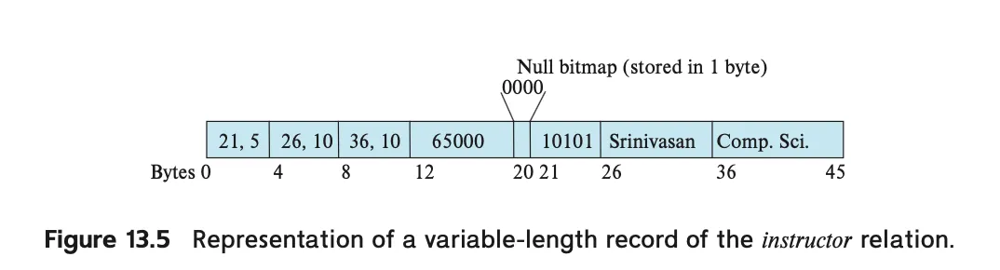
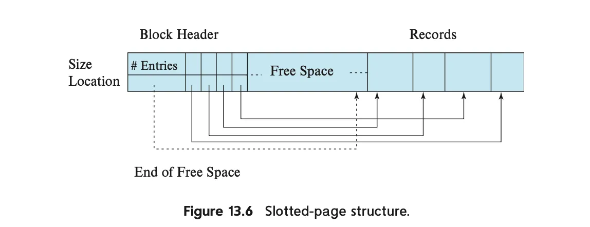
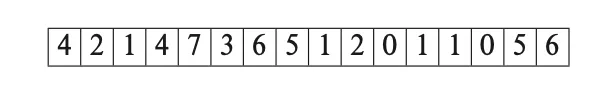
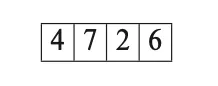
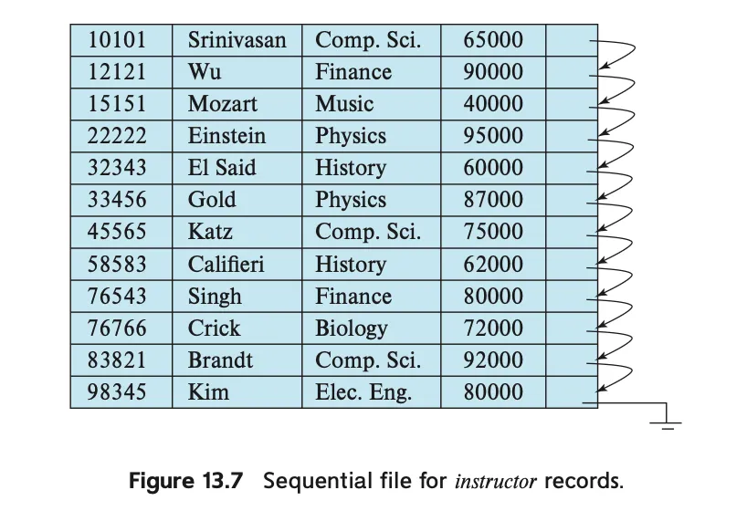
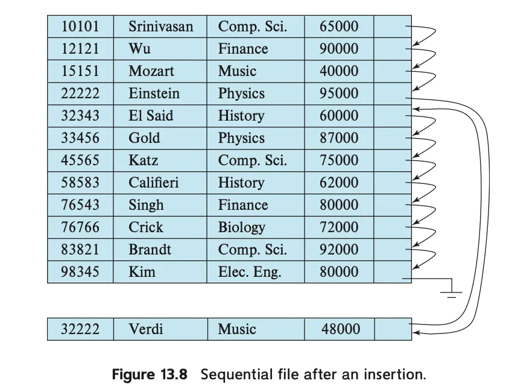
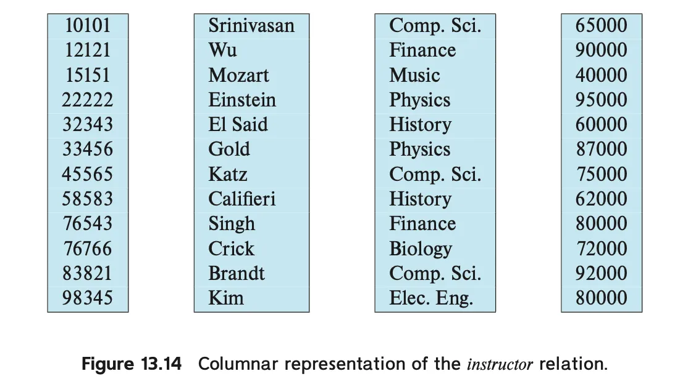

# DB 저장장치 구조

일반적인 데이터 저장구조 : 블록 단위로 읽고 쓴다.

DB의 데이터 저장구조 : 레코드 단위로 읽고 쓴다.

- (레코드의 크기) < (블록의 크기)

그러나 효율적인 접근 & 장애 복구를 위해 DB는 블록 단위를 계속 인식해야 함.

**→ 따라서 블록 구조를 고려하며 레코드가 저장되는 방법을 다룸**

**→ 또 레코드를 어떻게 파일에 배치할지 결정하는 방법을 다룸**

또한 데이터베이스는 데이터 사전의 내용들도 저장할 수 있어야 함.

- 데이터 사전 : 릴레이션의 스키마 정보 및 저장 구조를 관리하는 구조
- **따라서 데이터 사전을 다루는 방법 또한 역시 다룸**

데이터베이스 속 데이터를 다루기 위한 방법 역시 다룬다.

- CPU는 DB 속 데이터에 직접 접근이 불가!
- 따라서, SSD → RAM으로 데이터를 꺼내와야 함
- **SSD 속 DB 데이터 블록을 저장하는 데이터베이스 블록을 다룸**

**또한 분석용 질의에서 좋은 성능을 발휘하는 열 지향 저장방식을 다룸**

**추가적으로, 메모리 기반 데이터베이스(ex. Redis)에 대해서도 다룸.**

# 파일 구성

**💿 데이터베이스와 파일 시스템의 관계**

- 데이터베이스는 **운영체제가 관리하는 여러 개의 파일**로 매핑됨
- 이 파일들은 **디스크에 영구적으로 저장**됨
- 파일은 **레코드들의 논리적 시퀀스**로 구성되며, 각 레코드는 **디스크 블록**에 저장됨

**📦 블록 단위 저장**

- 파일은 **고정 길이 블록(block)** 단위로 나눔
    - 블록은 **저장 단위이자 데이터 전송 단위**
    - 보통 블록 크기는 **4KB ~ 8KB**이며, 생성 시 설정 가능
- 하나의 블록에는 여러 개의 레코드가 들어갈 수 있음
    - 단, 대부분의 DB는 **레코드 크기 ≤ 블록 크기**를 전제로 설계됨
    - **이미지, 대용량 데이터** 등은 예외이며, 13.2.2절에서 다룸

📌 **제약 조건**:

- **레코드는 반드시 하나의 블록 내에 완전히 포함되어야 함**
    
    → 블록 경계를 넘는 레코드는 허용하지 않음
    
    → 접근 속도 향상 및 단순화 목적
    

**🗃️ 고정 길이 vs 가변 길이 레코드**

- 릴레이션 간 튜플은 서로 크기가 다를 수 있음
- **두 가지 파일 구성 방식** 존재:
    1. **고정 길이 레코드**만 저장하는 파일
    2. **가변 길이 레코드**를 지원하는 파일
- 고정 길이 파일이 구현이 더 간단함
    
    → 따라서 먼저 고정 길이 레코드를 다루고 이후 가변 길이 방식 설명 예정
    

## 고정 길이 레코드

**✏️ 예시: instructor 레코드 구조**

```sql
type instructor = record
  ID         varchar(5);     // 5 byte
  name       varchar(20);    // 20 byte
  dept_name  varchar(20);    // 20 byte
  salary     numeric(8,2);   // 8 byte
end
```

📌 총 크기 = 5 + 20 + 20 + 8 = **53 byte**

**🔢 블록에 레코드 저장 시 문제점**

**1. ✅ 블록 경계 문제**

- 블록 크기가 53의 배수가 아닐 경우, **레코드가 두 블록에 걸쳐 저장**될 수 있음
- 레코드 하나 읽는데 블록을 **두 번 접근해야 하며, 이는** 비효율적임

**2. ❌ 삭제 처리 문제**

- 레코드 삭제 시, 공간을 **다른 레코드로 채워야 하거나**, 삭제된 레코드임을 표시할 **마커(marker)**가 필요함

**🛠️ 문제 해결 전략**

**✅ 문제 1 해결법 → 블록에 레코드를 꽉 채우지 않음**

- **블록 크기 ÷ 레코드 크기**로 최대 수 계산 후, **남는 공간은 버림**

**✅ 문제 2 해결법 → 삭제 후 공간 재사용**

- 단순히 뒤 레코드들을 앞으로 당기는 방식 → 너무 많은 이동 필요
- 대안: **마지막 레코드를 삭제된 위치로 이동** → 블록 접근 줄일 수 있음
- 최종 대안: **삭제된 레코드를 따로 표시하고, 링크드 리스트 형태로 관리**

**🧷 삭제 레코드 관리 - Free List**

- 파일의 맨 앞에 **파일 헤더(file header)** 영역 확보
    - 헤더는 삭제된 레코드의 주소를 담음
    - 이 삭제된 레코드는 다음 삭제된 레코드의 주소를 담고 있음 → **링크드 리스트 형태로 연결됨**
- 이를 **free list (여유 공간 리스트)**라고 부름
- 📌 삽입 시:
    - 헤더가 가리키는 위치에 새 레코드를 삽입하고
    - 헤더를 다음 삭제된 레코드로 갱신
- 📌 삽입할 공간이 없을 경우:
    - 파일 끝에 레코드를 추가함

## 가변 길이 레코드

💡 다음과 같은 경우에는 **고정 길이로는 저장이 어려움**:

- 문자열(string)과 같은 **가변 길이 필드** 존재
- **반복 필드(repeating fields)** → 예: 배열, 멀티셋(multiset)
- **하나의 파일에 여러 레코드 타입**이 섞여 있을 경우

**🛠️ 해결해야 할 두 가지 핵심 문제**

1. **개별 속성이 가변 길이일 때**, 어떻게 쉽게 추출할 수 있을지
2. **하나의 블록 내에 가변 길이 레코드들을 어떻게 저장할지**

**📐 가변 길이 속성을 포함한 레코드 구조**

레코드는 **두 부분**으로 구성됨:

1. **고정 길이 정보 부분**: 모든 레코드에서 동일한 구조
2. **가변 길이 속성 데이터**: 문자열 등 실질 데이터

**📌 저장 방식**

- 고정 길이 속성 (예: 숫자, 날짜 등)은 필요한 만큼 바이트를 바로 할당함
- 가변 길이 속성 (예: varchar)은 (offset, length) 쌍으로 표현
    - offset: 해당 데이터가 시작되는 위치
    - length: 데이터의 바이트 길이
- 가변 길이 데이터는 고정 정보 뒤에 연속적으로 저장됨

**🧩 예시 (그림 13.5 기반)**

<div align="center">
    
</div>

- instructor 레코드:
    - ID, name, dept_name → 가변 길이 문자열
    - salary → 고정 길이 숫자 (8 bytes)
- offset/length: 각 속성당 4 bytes 사용 (2+2)
- 문자열: 글자 수만큼 바이트 차지

**Null 값 표현: Null 비트맵 (null bitmap)**

- **null 값 여부를 1비트씩 기록하는 비트맵**
    
    → 예: 4개 속성이 있다면 1바이트면 충분
    
- 특정 속성이 null이라면 해당 비트를 1로 설정
    
    → 그 속성에 해당하는 데이터는 무시됨
    

**확장 포인트**

- 어떤 구현에서는 **null 속성에 대해 offset/length조차 저장하지 않음**
- 공간 절약 가능, 대신 속성 추출 시 연산 증가

**슬롯 페이지 구조 (Slotted-Page Structure)**
<div align="center">
    
</div>

각 블록의 **헤더(header)**에 다음 정보 포함:

- 레코드 수
- 블록 내 여유 공간 끝 위치
- 각 레코드의 **위치(location)**와 **크기(size)**를 담은 **엔트리 배열**

**저장 방식**

- **레코드는 블록의 끝부터 거꾸로 저장**
- **헤더 엔트리 → 앞에서부터**
- **여유 공간 → 헤더 배열 끝과 레코드 시작 사이**

**🔁 삽입/삭제/갱신 처리**

| **동작** | **설명** |
| --- | --- |
| 삽입 | 여유 공간의 끝에 공간 할당 → 헤더에 위치/크기 추가 |
| 삭제 | 해당 엔트리의 크기를 -1로 설정 (삭제 표시) |
| 정리 | 삭제된 레코드 이후의 레코드를 앞으로 당겨서 공간 재정렬 |
| 갱신 | 공간 여유가 있으면 레코드 크기 변경도 가능 |

삭제된 레코드를 정리할 때 전체 레코드를 이동하는 작업은 **블록 크기가 작기 때문에(4~8KB)** 부담되지 않음

**🔗 간접 참조를 통한 유연성 확보**

블록 외부에서 **레코드 직접 주소를 참조하지 않음.** 

- 대신 헤더 엔트리를 참조함
- 레코드 이동 시에도 **간접 포인터만 갱신하면 됨**
- **조각화(fragmentation)**를 방지하면서도 유연하게 대응 가능

## **대용량 객체 저장**

**📦 대용량 데이터의 예**

- DB는 **디스크 블록보다 훨씬 큰 데이터**도 저장해야 할 수 있음
    - 이미지 🖼️, 오디오 🎵 → 수 MB
    - 동영상 🎥 → 수 GB
- SQL은 이런 데이터를 위해 **BLOB (Binary Large OBject)**, **CLOB (Character Large OBject)** 타입을 제공함

**📏 일반적인 제약: 블록 크기 이하**

- 많은 DB는 개별 **레코드 크기를 블록 크기 이하로 제한**함
- 따라서, **레코드 내에 대용량 객체 전체를 직접 저장하지 않음**
- 대신, 대용량 객체는 **분리된 영역에 저장**되고,
    
    → 레코드에는 해당 객체의 **논리적 포인터**만 포함함
    

**🗃️ 대용량 객체 저장 방식**

**① DB 외부 파일 시스템에 저장**

- DB가 관리하는 별도 **파일 시스템 영역**에 저장
- 레코드에는 **파일 경로(path)**만 저장함
- 예: /media/video123.mp4

**② DB 내부 구조로 저장**

- 대용량 객체를 **DB 내부의 파일 구조**로 관리
- 특히 **B+-트리 파일 구조** 사용 가능
    - **효율적인 랜덤 접근/부분 접근 가능**
    - 전체 객체 읽기, 특정 바이트 범위 접근, 부분 삽입/삭제 등 지원

**🚧 성능 및 백업 측면 문제**

| **문제** | **설명** |
| --- | --- |
| 💨 성능 | DB 인터페이스를 통해 대용량 객체에 접근 시 느릴 수 있음 |
| 🧱 백업 크기 | DB 덤프 시 전체 데이터가 포함되므로 백업 크기 증가 |

**🔄 외부 파일 시스템 저장 시 고려사항**

1. **❌ 외부 저장의 단점**
- 레코드가 참조하는 파일이 삭제되었을 경우 무결성 제약(foreign key-like) 위반 발생
- DB 권한 시스템이 파일 시스템에는 적용되지 않음

1. **일부 DB의 통합 지원**
- 몇몇 DBMS는 **파일 시스템과의 통합**을 지원하여 다음 기능 제공:
    - 파일 삭제 방지 (참조 중이면 삭제 차단)
    - 접근 제어 연동 (DB 권한과 파일 접근 동기화)
- 예: Oracle의 SecureFiles, Database File System (DBFS)

# 파일 내 레코드 조직 방식

**📂 관계(Relation)는 레코드의 집합**

- 지금까지는 레코드가 파일 내에서 어떻게 표현되는지를 다룸
- 이번에는 레코드를 어떻게 조직화해서 저장할지에 대한 방식들을 소개함

**📌 주요 레코드 조직 방식**

| **조직 방식** | **설명** |
| --- | --- |
| **힙 파일 (Heap file)** | 아무 순서 없이, 공간만 있다면 아무 곳에나 저장함 |
| 순차 파일 | 지정된 검색 키(search key)를 기준으로 **정렬된 순서**로 저장 |
| 다중 테이블 군집 파일 | 여러 관계의 레코드를 **하나의 파일** 또는 **블록에 함께 저장**하여 **Join 성능 향상** |
| **B+ 트리** | **정렬된 접근 지원** + 많은 삽입/삭제에도 성능 유지 가능한 구조 |
| 해싱 파일 | 특정 속성에 대해 **해시 함수**를 계산해 저장 블록을 결정 |

## 힙 파일 (Heap file)

**🧱 기본 개념**

- 레코드는 파일 내 **아무 위치**에 저장 가능
- **삽입 시**에는 보통 **파일 끝에 추가**
- 하지만 삭제가 발생하면, **비어 있는 공간을 재활용**하는 것이 효율적임
- 효율적으로 빈 공간을 찾기 위해 **free-space map**이라는 구조를 사용함

**📍 free-Space Map (여유 공간 맵)**

**✅ 정의**

- 각 블록마다 **얼마나 공간이 비어 있는지**를 기록한 배열 구조
- 배열의 **각 항목은 하나의 블록**을 나타냄
- PostgreSQL) 1 byte로 표현, 값을 **256으로 나누면 비율**이 됨

**📌 예시**

- 3비트를 사용해 저장 시 → 값 7이면, **7/8 이상 공간이 비어 있음**
<div align="center">
  
  
</div>
**📦 삽입 시 처리 과정**

1. **free-space map을 탐색**해 충분한 공간이 있는 블록을 찾음
2. 해당 블록에 레코드 저장
3. 공간 정보가 변경되면 → free-space map도 **갱신**함
- 직접 블록을 다 읽는 것보다 free-space map 탐색이 훨씬 빠름

**🔁 2단계 Free-Space Map**

- 파일이 매우 클 경우, free-space map 탐색조차 느릴 수 있음
- **100개 단위로 묶어서**, 각 묶음에 대해 **최대 free-space 값을 저장하는 상위 맵**을 만듦
    - 이를 통해 **탐색 속도 100배 향상 가능**
    

**📌 작동 방식**

1. 2단계 맵을 먼저 스캔해 적절한 묶음을 찾음
2. 해당 묶음(100개)의 하위 맵을 스캔해 실제 블록을 찾음
3. 필요하다면 **3단계, 4단계 구조**도 확장 가능

**🔄 free-space map의 유지 및 동기화**

- **레코드 삽입/삭제** 시마다 디스크에 쓰는 건 비효율적
- 따라서 **주기적으로 갱신함**
- 이로 인해 발생 가능한 문제:

| **상황** | **영향** |
| --- | --- |
| 맵이 공간이 있다고 주장 → 실제 없음 | 블록 접근 시 오류 감지 후 재탐색함 |
| 맵이 공간이 없다고 주장 → 실제 있음 | 문제는 없지만 공간 낭비 발생 |

주기적으로 관계(relation)를 스캔하여 **맵을 재계산하고 디스크에 기록함**

## 순차 파일 구성

**📘 개요**

- **순차 파일(sequential file)**은 특정 **검색 키(search key)** 기준으로 **정렬된 순서**로 레코드를 저장하고 처리하는 데 최적화된 구조임
- 검색 키는 **기본 키가 아니어도 되며**, **속성 하나 또는 여러 개**일 수 있음

**🔗 순차 접근을 위한 포인터 연결**

- **레코드들은 포인터로 연결**되어 있으며, 각 레코드는 **다음 레코드를 가리키는 포인터**를 가짐
- 또한 **물리적으로도 가능한 한 검색 키 순서로 저장**하여 블록 접근 횟수를 최소화함
- ex) 교수(instructor) 테이블에서 ID를 검색 키로 사용할 경우, ID 순으로 정렬된 레코드들 + 각 레코드는 다음 ID로 연결됨 (그림 13.7 참조)

<div align="center">
  
</div>
**🧾 활용 예**

- **정렬된 출력**이 필요한 경우 (예: 화면 표시)
- **쿼리 처리 알고리즘** (15장에서 학습 예정)에서 유용함

**⚠️ 삽입/삭제 시 문제점**

- 삽입/삭제 시 **기존 레코드를 물리적으로 이동해야 할 수도 있음**
- 많은 레코드를 옮겨야 하므로 **비용이 큼**

**📥 삽입 처리 방식 (두 단계)**

1. **삽입될 위치 이전 레코드를 찾음** (검색 키 순서상)
2. 해당 블록에 **삭제로 인한 빈 공간이 있으면** 거기에 삽입
    - 없다면 **오버플로 블록(overflow block)**에 삽입
    - 어쨌든 포인터를 **검색 키 순서대로 재조정**

🧩 결과적으로 삽입은 빠르게 가능하지만, **물리적 순서와 논리적 순서가 불일치**하게 됨 (그림 13.8 참고)
<div align="center">
  
</div>

**⏳ 시간이 지남에 따라 발생하는 문제**

- 오버플로 블록이 점점 많아지고, 검색 키 순서와 물리적 저장 순서가 완전히 달라질 수 있음
- 이 경우 **순차 처리 성능이 급격히 저하**됨
- 해결 방법: **파일 재정렬(reorganization)** 필요

**⚙️ 재정렬 조건**

- 삽입이 **빈번할수록** 재정렬 필요 주기가 짧아짐
- 반대로 삽입이 **드문 경우,** 항상 물리적으로 정렬된 상태 유지 가능
- 이 경우 **포인터 필드가 필요 없음**

**🌳 B+-트리와의 비교**

- B+-트리 파일 조직(14.4.1절)은 삽입/삭제/갱신이 많아도 **정렬된 접근을 효율적으로 지원**함
- 물리적 재정렬이 필요 없음
- 순차 파일보다 실질적으로 **더 유연하고 효율적인 대안**

## 다중 테이블 군집 파일 구성

**📂 일반적인 저장 방식**

- 대부분의 관계형 데이터베이스는 **각 릴레이션(테이블)을 별도의 파일** 또는 파일 집합에 저장함
- 결과적으로 **한 블록에는 하나의 릴레이션의 레코드만** 저장됨

**🤝 다중 릴레이션을 한 블록에 저장하는 이유**

- 어떤 경우에는 **여러 릴레이션의 레코드를 하나의 블록에 함께 저장**하는 것이 유리함
- 예시 쿼리:

```sql
SELECT dept_name, building, budget, ID, name, salary
FROM department NATURAL JOIN instructor;
```

- 이 쿼리는 department와 instructor를 dept_name으로 **자연 조인(natural join)**함
- 각 department 레코드에 대해 일치하는 instructor 레코드를 찾아야 함

📌 **문제점**:

- 각 관련 레코드가 **서로 다른 블록**에 있다면 **매번 디스크 블록을 따로 읽어야 함**
- 성능 저하를 야기할 수 있음

**📦 클러스터링의 실제 예 (그림 13.11)**

- `dept_name`을 기준으로 `department`와 `instructor` 레코드를 **같은 블록에 묶어서 저장**
- 해당 키를 기준으로 두 릴레이션을 **클러스터링(clustering)**했다고 말함

📌 특징:

- 레코드는 **어느 릴레이션에 속하는지 식별자 포함** (그림에는 생략됨)
- `dept_name` 값을 **한 번만 저장**하여 저장 공간 절약 가능

**🚀 성능 효과**

- 하나의 블록에 `department` + 관련 `instructor` 레코드가 함께 저장되어 있으므로 **조인 쿼리 수행 시 디스크 I/O 횟수가 줄어듦**
- 만약 한 부서에 강사가 많아 한 블록에 다 못 담는다면 **인접 블록에 분산 배치**

**📉 단점 및 고려사항**

- 단순하게 department 테이블만 조회할 경우:

```sql
SELECT * FROM department;
```

→ **블록마다 포함된 department 레코드 수가 적어짐**

→ 조회에 필요한 **블록 수 증가**

→ 비효율적

📌 해결 방법:

- 같은 릴레이션의 레코드를 **포인터로 연결**하면 탐색은 편리함
- 하지만 **블록 수 자체는 줄지 않음**

**🎯 적용 판단 기준**

- **어떤 쿼리가 자주 수행되는지**에 따라 다중 클러스터링의 사용 여부를 결정해야 함
- **자연 조인이나 연관된 릴레이션 간 접근이 많은 경우** → **큰 성능 이득** 가능

**🛠️ 오라클에서의 지원**

- Oracle DBMS는 **다중 테이블 클러스터링(multitable clustering)**을 지원함
- 다음과 같은 명령으로 생성 가능:

```sql
CREATE CLUSTER cluster_name (cluster_key ...);
CREATE TABLE table_name (...) CLUSTER cluster_name (cluster_key);
```

- 하나의 클러스터에 여러 릴레이션 할당 가능

## **파티셔닝 (Partitioning)**

**📘 개요**

- **파티셔닝(partitioning)**이란 하나의 릴레이션(테이블)을 **작은 릴레이션들로 분할하여 별도로 저장하는 방식.**
- 보통 **특정 속성(attribute)**의 값을 기준으로 분할함

**🧾 예시: 연도별 거래 테이블**

- 회계 시스템의 transaction 테이블을 예로 들면, year 값을 기준으로 다음과 같이 나눌 수 있음

```sql
- transaction_2018
- transaction_2019
- transaction_2020 등
```

**🔍 쿼리 처리 방식**

- 쿼리는 여전히 transaction 테이블을 대상으로 작성함:

```sql
SELECT * FROM transaction WHERE year = 2019;
```

- 그러나 DBMS는 이 쿼리를 내부적으로 transaction_2019 테이블로 변환함. 불필요한 파티션은 접근하지 않음 → 성능 향상 🎯

**📌 조건 없는 쿼리는?**

```sql
SELECT * FROM transaction;
```

→ 이 경우 **모든 연도 테이블을 다 읽음**

# **메타데이터의 저장**

**📚 메타데이터란?**

- 지금까지는 **릴레이션(테이블) 자체의 저장 방식**만 다뤘음
- 하지만 관계형 데이터베이스 시스템은 **릴레이션에 대한 정보**도 저장해야 함
- 이를 **메타데이터(metadata)**라고 하며, “데이터에 대한 데이터”를 의미함

**📘 데이터 사전 / 시스템 카탈로그** 

- 메타데이터를 저장하는 구조를 **데이터 사전** 또는 **시스템 카탈로그**라 함
- 주요 저장 정보는 다음과 같음

```
📌 릴레이션 관련 메타데이터
- 릴레이션 이름
- 각 릴레이션의 속성 이름
- 속성의 도메인 및 길이
- 뷰 이름 및 정의
- 무결성 제약조건 (예: 키 제약조건 등)

👤 사용자 관련 메타데이터
- 사용자 이름, 기본 스키마, 인증 정보 (비밀번호 등)
- 사용자 권한 정보

📈 통계 및 설명 데이터
- 릴레이션당 튜플 수
- 각 속성의 고유 값 개수 등

💾 저장 구조 및 위치 정보
- 릴레이션의 저장 방식 (Heap, Sequential, Hash 등)
- 릴레이션이 저장된 파일명 또는 블록 목록

🗂️ 인덱스 관련 메타데이터 (→ 14장에서 더 자세히 다룸)
- 인덱스 이름
- 인덱스가 적용된 릴레이션 이름
- 인덱스가 정의된 속성들
- 인덱스 유형
```

**🧩 메타데이터 저장 방법**

| **방식** | **설명** |
| --- | --- |
| 특수 자료구조 | 일부 DBMS는 전용 구조 및 코드로 메타데이터를 저장 |
| ✅ **릴레이션으로 저장** | 대부분은 **시스템 메타데이터도 릴레이션 형식으로 저장**함 |

→ **쿼리 처리와 동일한 방식으로 접근 가능**

→ **구조 단순화 + 빠른 접근 가능**

**🧪 예시: 메타데이터 릴레이션 스키마 (그림 13.12)**

- 예시: `Index_metadata` 릴레이션은 속성들을 문자열로 저장
    - 예: `"dept_name, building"`
    - 이는 제1정규형(NF1)을 위반하지만, **접근 효율이 높음**
- 실제 DBMS는 훨씬 더 많은 정보를 저장함. 따라서 사용 중인 DB의 **공식 매뉴얼**을 참조할 것

**🛠️ 메타데이터 접근 흐름**

1. DBMS가 릴레이션에서 데이터를 가져오려면,
2. 먼저 **Relation_metadata** 릴레이션에서 해당 릴레이션의 **저장 방식 및 위치**를 확인하고
3. 해당 정보를 이용해 데이터를 가져옴

🔐 단, `Relation_metadata` 자체의 위치는 **DB 코드에 하드코딩되어 있거나**, **DB의 고정 위치에 저장됨**

**🚀 성능 최적화를 위한 인메모리 캐싱**

- 메타데이터는 **자주 접근됨.** 따라서 대부분의 DB는 **시작 시 메모리로 로딩함**
- 쿼리 처리 전에 **인메모리 구조로 준비**됨. 빠른 접근 가능

# 데이터베이스 버퍼

**🔸 데이터베이스 버퍼란?**

**데이터베이스 버퍼**란, SSD에 저장된 데이터 블록을 **메인 메모리(RAM)**로 가져와 임시로 저장해두는 공간임.

버퍼 풀(buffer pool)이라고도 부름.

**🧩 왜 필요한가?**

- 대부분의 데이터는 **디스크에 저장**됨. 왜?
    - 일정 규모 이상의 데이터는 **메모리에 다 담기지 않음**
- 하지만 **메인 메모리에 데이터를 두면, 해당 데이터에 대한 접근이 빠름**
- 그래서 자주 사용하는 블록을 **메모리에 미리 올려두면 성능이 향상**됨

사용자가 SQL 쿼리를 날리면 → 해당 데이터는 디스크에 있으므로 → 버퍼 매니저가 데이터를 메모리로 가져옴 → 이후 연산은 메모리 상에서 진행됨 → 결과 반환

**🧩 어떻게 쓰여야 하는가?**

- DB 버퍼는 다음과 같이 작동된다.
    - 디스크에서 데이터를 읽어와 메모리에 올리고, 수정된 데이터는 다시 디스크로 저장!
- 그렇다면, 디스크 ↔ 메모리 간 블록 이동을 최소화해야 성능이 높아질 것이다.
- 이를 해주는 것이 바로 **버퍼 매니저!**

**🔁 버퍼 매니저(Buffer Manager)의 역할**

- 디스크 ↔ 메모리 간의 **데이터 블록 이동을 관리**함
- 블록을 메모리에 올릴지 결정하고, 교체 정책(LRU 등)**을 통해 오래된 블록 제거함
- 수정된 블록은 디스크에 다시 써야 함.

## **버퍼 매니저**

**🛠️ 동작 방식**

1. DB 시스템은 디스크 블록 요청 시, 버퍼 관리자에 요청(call)함.
2. 버퍼에 이미 블록이 있으면, 해당 메모리 주소를 반환함.
3. 없다면:
    - 공간을 확보하기 위해 **다른 블록을 버퍼에서 제거**함 (필요 시 디스크로 저장)
    - 새 블록을 디스크에서 읽어와 버퍼에 올림.
- 버퍼 관리자의 동작은 사용자에게 **투명하게 처리**

**📍운영체제의 가상 메모리 관리와 비교**

- DB 버퍼 관리자는 일반적인 OS의 가상 메모리보다 **더 정교한 전략**이 필요함. 왜?
    1. DB는 **메모리 주소만으로 모든 블록을 다룰 수 없음.**
    2. **액세스 패턴을 예측**할 수 있기 때문에, 단순 LRU보다 나은 전략 가능

### 버퍼 매니저의 역할

1. 버퍼 교체 전략 : 버퍼가 꽉 찼을 때 어떤 블록을 제거할지 결정함
2. 블록 고정하기 : 현재 사용 중인 블록은 교체되지 않도록 pin/unpin으로 고정함
    - **pin**: 블록을 고정시켜 교체되지 않도록 함
    - 각 블록은 pin count를 가지고 있음.
3. 공유/베타 락 제공하기
    - 여러 프로세스가 안전하게 블록에 데이터를 읽고 쓸 수 있도록 잠금 장치를 제공함
    - **공유 락 (shared lock)**: 여러 프로세스가 동시에 읽기 가능
    - **배타 락 (exclusive lock)**: 단 하나의 프로세스만 접근 가능 (읽기/쓰기 중)
4. 다시 저장장치에 쓰기
    - 메모리에 있는 블록을 미리 저장장치로 옮기는 작업.
    - 미리 디스크에 기록해두면 **나중에 버퍼가 꽉 찼을 때 바로 버릴 수 있음**
    - 단, **업데이트 중인 블록은 디스크에 쓰지 말아야 함**
    - 대부분의 DB는 **지속적으로 업데이트된 블록을 감지하고 디스크에 기록하는 작업을 뒤에서 수행.**
5. 강제로 저장장치에 쓰기
    - 어떤 경우, 무조건 지금 이 블록을 디스크에 써야만 하는 경우가 있음
    - 예: 어떤 트랜잭션이 **커밋**되었을 때
        - **수정한 내용이 디스크에 확실히 저장되었는지 보장**해야 함
        - 그래서 **지금 강제로 디스크에 쓰는 작업**을 실행함

## 버퍼 교체 전략

> 버퍼 매니저가 구현하는 여러가지 버퍼 교체 전략을 알아보자.
> 

| 전략 | 설명 |
| --- | --- |
| **LRU (Least Recently Used)** | **과거에 최근 사용된 블록은 앞으로도 사용될 가능성이 높다**는 가정 |
| **Toss-Immediate** | 사용이 끝난 블록을 즉시 제거하는 전략. |
| **MRU (Most Recently Used)** | 가장 최근에 사용된 블록을 제거하는 전략 |
| **통계 기반 교체 전략** | 통계적으로 데이터 딕셔너리 등 **자주 참조되는 블록을 체크하는 전략** |

**⚠️ 동시성 및 복구와의 연계**

- **동시성 제어**와 연계해 **활성 요청에 필요한 블록 우선 유지** 가능
- 복구 시스템은 **변경된 블록의 쓰기를 제한**할 수 있음
    - **로그를 먼저 강제로 쓰도록 요구**하는 경우도 있음

**⚠️ 언제 Toss-Immediate와 MRU가 필요한가?**

**📍** 예시 : instructor와 department 테이블 조인 쿼리

```sql
select * from instructor natural join department;
```

이 SQL이 실제로 돌아갈 때 쓰이는 코드는 다음과 같다.

```sql
for each tuple i of instructor do
	for each tuple d of department do
		if i[dept name] = d[dept name] # i는 여기서만 쓰인다.
		then begin
			let x be a tuple defined as follows:
			x[ID] := i[ID]
			x[dept name] := i[dept name]
			x[name] := i[name]
			x[salary] := i[salary]
			x[building] := d[building]
			x[budget] := d[budget]
			include tuple x as part of result of instructor ⋈ department
		end
	end
end
```

- instructor 블록의 경우, 하나의 튜플은 **department 전체를 순회하는 동안에만** 사용됨
    - 다음 i로 넘어가면, **이전 i는 다시는 쓰이지 않음**
- **1번 쓰고 다시 안 쓸 걸 시스템이 아는 경우**, **LRU로 계속 보관하는 건 낭비**임
- 이럴 때 Toss-Immediate를 쓴다.

- 반면, department 블록은 반복적으로 사용. (**instructor 튜플마다 전체 순회)**
- **가장 최근에 사용된 블록이 가장 나중에 다시 사용.**
- 이럴 때 MRU 전략이 적합.

## 쓰기 순서 변경과 복구

- 버퍼는 쓰기를 **나중에 디스크에 기록 가능**
- 하지만, **순서가 뒤바뀌면 충돌/오류 위험이 있음**

**📉 예시: 파일 시스템의 쓰기 순서 재정렬**

- 연결 리스트 구조의 파일에서 **포인터 먼저 쓰고, 노드 내용은 나중에 쓰는 상황** 발생
- 시스템 크래시 발생 시, 노드 내용이 손실되어 **데이터 구조가 망가질 수 있음**

**💡 해결책: 저널링(journaling)**

- 모든 쓰기 정보를 **로그 디스크에 순차적으로 기록**함
- 시스템이 크래시되면, **로그를 읽고 아직 쓰지 못한 데이터를 다시 수행**함 → **파일 시스템 복구 시간 단축**
- 데이터베이스는 **파일 시스템 대신 자체적인 로그를 사용**함

# Column 기반 저장

**📦 행 지향 vs 열 지향 저장**

- 전통적인 데이터베이스는 **행(Row)-지향 저장 방식**을 사용함
    
    → 하나의 튜플에 해당하는 모든 속성 값을 **한 레코드로 함께 저장**함
    
- 반면, **열(Column)-지향 저장 방식**에서는 각 속성(컬럼) 값을 **별도의 파일로 분리하여 저장**함
    
    → 각 파일은 특정 속성의 연속된 튜플 값만 저장함
    

```sql
예: instructor 테이블 (ID, name, dept_name, salary)
- 열 지향 저장: ID 파일, name 파일, dept_name 파일, salary 파일 각각 존재
```

<div align="center">
  
</div>

**📁 열 지향 저장의 기본 특징**

- 속성마다 **개별 파일**로 저장
- 각 파일은 압축(compression)을 통해 크기 감소
- 한 행의 모든 속성을 조회하려면, **각 열 파일에서 i번째 값을 읽어 조합해야 함**

**📈 열 지향 저장의 장점**

**🔻 1. I/O 감소**

- 일부 속성만 필요할 때, **불필요한 열을 디스크에서 불러오지 않아도 됨**
- 반면, 행 지향 저장은 전체 속성을 항상 함께 불러와야 함 → I/O 낭비 발생

**⚡ 2. CPU 캐시 성능 향상**

- 현대 CPU는 **캐시 라인 단위로 연속 바이트**를 캐시에 올림
- 열 단위로 저장된 데이터는 **모두 동일한 속성 값**이므로 캐시 적중률이 높고 낭비 없음

**🗜️ 3. 압축 효율 향상**

- 같은 속성 데이터는 타입이 동일하고 중복이 많음 → 압축 효율이 높음
- 압축된 데이터는 **디스크 읽기 속도 향상** + **메모리 절약**

**🧮 4. 벡터 처리 (Vector Processing) 가능**

- CPU는 한 번에 여러 데이터를 병렬 처리할 수 있음
- 열 단위 데이터는 **벡터 연산**(예: 선택 조건, 집계 계산)에 최적화됨

**📊 사용 예: 데이터 분석 쿼리**

- 열 지향 저장은 **데이터 분석 쿼리(DW, OLAP)**에 매우 적합함
- 많은 행을 처리하지만, **일부 속성만 사용하는 쿼리**에 최적화되어 있음

**🛑 열 지향 저장의 단점**

**🧩 1. 튜플 복원 비용**

- 여러 열에서 값을 모아야 하므로, **전체 행을 복원하는 데 비용이 큼**
- OLTP에는 부적합

**✏️ 2. 수정/삭제 비용**

- 압축된 상태에서는 한 튜플을 수정/삭제하려면 **전체 블록을 다시 압축**해야 함
- OLTP처럼 자주 수정되는 환경에는 비효율적임

**🔓 3. 압축 해제 비용**

- 압축된 데이터를 읽으려면 해제 필요
- 특정 레코드만 필요한 경우, **불필요한 레코드까지 해제해야 하는 비용** 발생

**🧠 최적화 방법: 부분 압축 해제**

- 압축을 일정 간격마다 나누어 저장 (예: 10,000개마다)
- → i번째 데이터를 찾을 때 ⌊i/10,000⌋번째 구간만 압축 해제하면 됨

**📁 ORC와 Parquet 포맷**

- 빅데이터 환경에서 사용되는 **열 지향 포맷**
- ORC:
    - 데이터를 **stripe** 단위로 나눔 (250MB 정도)
    - 각 stripe에 대해: 인덱스 → 열 데이터 → footer 순 저장
    - 10,000개 단위 인덱스를 통해 빠른 조회 가능

**🧩 하이브리드 저장 방식**

- 일부 DB는 **행 저장 + 열 저장** 모두 지원
- SAP HANA:
    - 신규 튜플은 행 저장에 → 이후 분석 목적이면 열 저장으로 마이그레이션
- OLTP 시스템은 행 저장, 데이터 웨어하우스는 열 저장을 사용하여 **분리 운영**

**🧠 행 저장 시스템에서 열 지향 효과 흉내내기**

- 하나의 릴레이션을 속성 그룹별로 분해:
    - 예: instructor → (ID, name), (ID, dept_name), (ID, salary)
- → 일부 열만 필요할 때 이점 있음
- 단점: **ID가 중복 저장되어 공간 낭비**

**💾 블록 내 열 저장 방식**

- 하나의 디스크 블록 안에 여러 튜플의 각 속성을 열 형태로 배치
- 블록 내 메모리 접근 성능은 향상되지만, **디스크 수준에서 열 선택 최적화는 불가**

**🏛️ 대표적인 Column Store 제품**

- Sybase IQ: 초기 열 저장 DBMS
- 이후 등장: C-Store, Vertica, MonetDB, Vectorwise 등

# **메인 메모리 DB의 구조**

**💡 메인 메모리 DB의 전제 조건**

- 오늘날 메인 메모리는 **용량이 크고 가격이 저렴**해졌기 때문에,
- 많은 **기업용 데이터베이스가 메모리 내에 전부 적재될 수 있게 되었음**.
- 이러한 상황에서는 전체 DB를 **버퍼에 로딩하여 디스크 I/O를 제거**할 수 있음.
- 단, **업데이트된 블록은 디스크에 지속성(persistence)을 위해 여전히 저장해야 함**.

→ 디스크 기반 구조보다 훨씬 빠른 성능을 제공할 수 있음.

**🏎️ 성능 최적화를 위한 구조 조정**

- 전체 DB가 메모리에 상주할 수 있다면,
- 기존의 디스크 기반 구조(버퍼 관리자 등)를 버리고,
- 메모리 중심 구조로 **전용 설계**하면 성능을 극적으로 향상시킬 수 있음.

📌 이를 위해 **버퍼 관리자(buffer manager)** 는 아예 제거됨.

**📌 레코드 접근 방식 비교**

| **항목** | **디스크 기반 데이터베이스** | **메인 메모리 데이터베이스** |
| --- | --- | --- |
| 저장 방식 | 블록 단위 저장 (슬롯 포함) | 메모리에 직접 레코드 저장 |
| 레코드 포인터 구조 | (블록 ID, 슬롯 번호) | 메모리 주소를 직접 가리킴 |
| 접근 방식 | 블록 탐색 → 버퍼 확인 → 위치 탐색 | 포인터 한 번 따라가면 끝 |
| 접근 속도 | 느림 (버퍼 관리 + 디스크 I/O 포함) | 매우 빠름 (순수 메모리 접근) |
| 필요 조건 | 버퍼에 블록 로딩 필요 | 레코드가 이동하지 않아야 함 |
| 동시성 고려 | 블록 간섭 가능성 있음 | 설계에 따라 최소화 가능 |

**🧱 레코드 배치 전략**

| **항목** | **슬롯 페이지 구조 (디스크 기반)** | **메모리 직접 할당 (메인 메모리 DB)** |
| --- | --- | --- |
| 구조 방식 | 블록 내 슬롯을 통해 레코드 위치 추적 | 메모리 상에 직접 레코드 할당 |
| 레코드 이동 여부 | 있음 (삭제/삽입/수정 시 위치 변경) | 없음 (이동 금지 설계) |
| 포인터 방식 | 간접 참조 필요 (슬롯 → 레코드) | 직접 참조 가능 (포인터만 따라감) |
| 동시성 관리 | 블록 락(lock) 필요 | 락 없이 처리 가능하게 설계 가능 |
| 단점 | 포인터 안정성 떨어짐, 접근 속도 낮음 | 메모리 단편화 발생 가능성 있음 |
| 해결 방안 | OS가 메모리 관리 | DB 자체 메모리 관리자 또는 압축(compaction) 수행 |

**🧬 열 지향 저장 + 메모리 DB**

- 열(column) 단위로 모든 값을 **연속된 메모리 공간에 저장** 가능
- 하지만 데이터가 추가되면 기존 열을 **재배치해야 할 수도 있음** → 비효율적

**🔁 해결 방법: 다중 배열 & 간접 테이블**

- 하나의 논리 배열을 **여러 개의 물리 배열로 분할**
- indirection table (간접 테이블)을 사용하여 어떤 물리 배열에 해당하는지 추적

```sql
[Indirection Table]
      ↓
[Physical Array 1] → [0 ~ 99]
[Physical Array 2] → [100 ~ 199]
...
```

- i번째 요소를 찾을 때:
    1. 간접 테이블에서 i가 포함된 배열을 확인
    2. 해당 배열 내 offset을 계산하여 접근