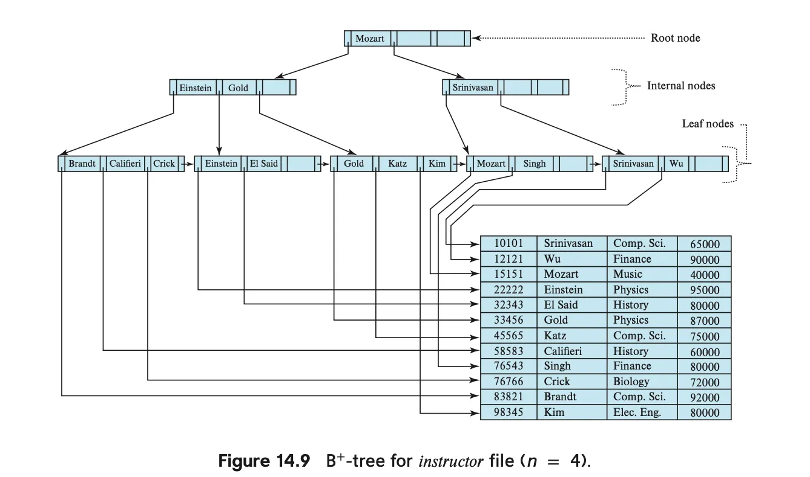
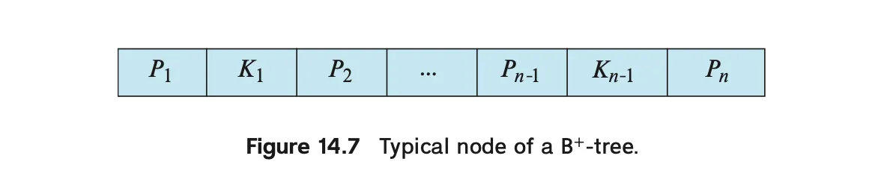
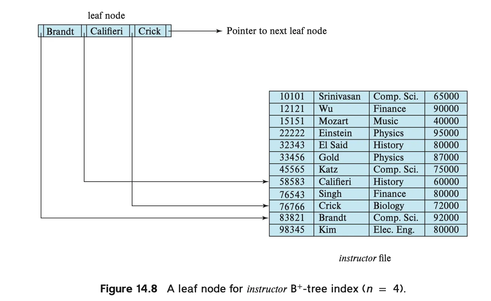

# B+ 트리 인덱스 파일

우리가 [인덱싱 (1) - 순서 인덱스](chapter14_1.md)에서 다룬 순서 인덱스는 한계를 가지고 있다.

1. 파일이 커질수록 인덱스를 조회하는 성능이 떨어진다. 
2. 파일이 커질수록 데이터를 순차 탐색하는 성능이 떨어진다.

파일을 재구성하면 이 문제를 해결할 수 있으나, 이를 자주 수행하는 것은 바람직하지 않음

그래서 나온 대안 중 하나가 바로, B+ 트리 구조임.
B+ 트리는 다음과 같은 트리의 특징을 가지고 있음:

- 균형 트리 구조(balanced tree) 임.
- root에서 leaf까지의 경로 길이가 모두 동일함 → 균형 트리 조건 만족.
- 루트 노드를 제외한 모든 비단말 노드(non-leaf node) 는 자식 노드를 $⌈n/2⌉$개 이상, $n$개 이하 가짐. 여기서 $n$은 트리의 차수로 고정된 값임.
- 루트 노드는 최소 2개에서 최대 $n$개까지 자식을 가질 수 있음.

## **B+ 트리의 구조**

**📚 B+-트리는 다단계 인덱스 구조임**

- B+-트리는 다단계 인덱스(multilevel index) 구조를 가지며, 기존의 인덱스-순차 파일 구조와는 다름.
- **전제**: 일단 모든 검색 키(search key)는 **고유(unique)** 하다고 가정함 (즉, 하나의 레코드에만 존재).
- **중복 키에 대한 처리**는 뒤에서 다룸.

**예시 : 전체 그림**

인덱스의 모양을 전체적으로 한번 보자. 왜 이것이 B+ 트리라고 하는지 알 수 있다.

- 이 중에서 우선 기본적인 노드의 구조를 살펴보자.
- 그리고, 제일 아래쪽에 있는 리프 노드의 특징을 알아보자.
- 마지막으로, 내부 노드(비단말 노드)를 알아보면 된다.

### **🔗 노드 : 기본 구조**

그림 14.7은 기본적인 B+ 트리의 노드 (node)
노드는 포인터와 검색 키 값으로 이뤄져 있다.

- 검색 키 값 : 검색 시, 어떤 값을 기준으로 데이터를 찾을지 알려주는 **기준점 역할**
- 포인터 : C언어의 포인터를 생각하면 됨. 자식 노드를 가리키거나, 실제 데이터 레코드를 가리킴.

1개의 노드당 포인터의 갯수와 검색 키 값의 갯수는 정해져 있음. 

- **검색 키 값**$(K_1, K_2, \cdots, K_{n-1})$ 은 n-1개.
- **포인터**$(P_1, P_2, \cdots, P_n)$ 는 n개.

**또한 검색 키 값은** 항상 **오름차순으로 정렬**되어 있음 ($K_{i} < K_{i+1}$)

🔗 리프 노드

리프노드에서의 포인터

- 1번째 ~ n-1번째 포인터 : 실제 레코드를 가리킴
- 마지막 포인터 : 다음 리프 노드를 가리킴.
- 이를 통해 리프 노드를 키 순서대로 순차적으로 순회하는 것이 가능함 → 순차 처리에 효율적임.

하나의 리프노드에서 포인터가 n개 있다고 할 때,

- 최소 ⌈(n−1)/2⌉개의 키가 필요하고, 최대 n−1개의 키를 가질 수 있음.
- ex) n = 4이면 최소 2개, 최대 3개의 키 보유 가능.

리프 노드 간에도 **정렬 관계 유지됨**:

- $L_i$가 $L_j$보다 왼쪽에 있다면, $L_i$의 모든 키 $v_i$ < $v_j$ (for all $v_j$ in $L_j$)

### 내부 노드

- 내부 노드는 **리프 노드들을 위한 다단계 인덱스 역할**을 함.
- 포인터는 모두 **다른 트리 노드(리프 or 내부)를 가리킴**.
- 최대 n개의 포인터를 가질 수 있으며, 최소 ⌈n/2⌉개의 포인터를 가져야 함
    - 이때 포인터 개수 m은 **fanout(분기도)** 라고 함.
- 내부 노드에 m개의 포인터가 있을 때
    - $P_1$은 키 값 < K_1인 서브 트리를 가짐.
    - $P_2 \sim P_{m−1}$는 $K_{i-1} \sim K_{i}$ 범위의 서브트리
    - $P_m$은 $K_{m-1}$ 보다 큰 키가 있는 서브트리

내부 노드 중 가장 위에 위치한 **루트 노드**는 다음과 같은 특징이 있음.

- **⌈n/2⌉ 미만의 포인터도 가질 수 있음**.
- 단, 트리가 하나의 노드만으로 구성되지 않는 이상 **최소 2개의 포인터는 필수**임.

### **🧱 예시 : B+ 트리 구조**

**다양한 차수의 B+-트리**

- n = 4인 경우 → 트리 높이가 더 높음.
- n = 6인 경우 → 같은 데이터를 표현해도 트리 높이가 낮아짐.
- 모든 예시는 **균형 트리** 구조임 → 루트에서 리프까지 경로 길이가 동일함.
- B+-트리의 B는 Balanced(균형)를 의미함.