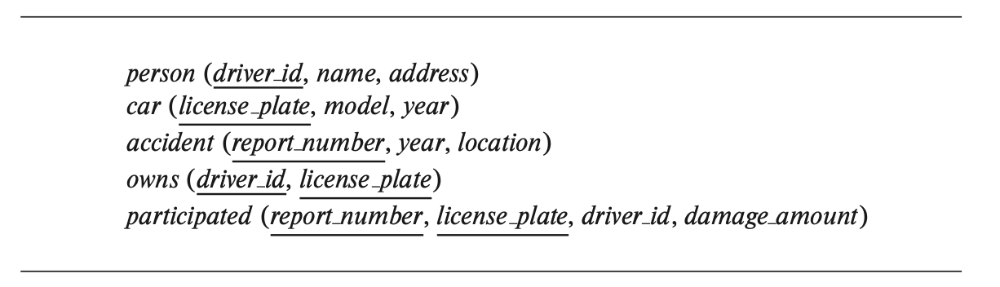

문제에서는 대학교 스키마가 자주 언급된다. `db-book.com`에 들어가면 대학교 스키마를 실제로 따올 수 있으며, 이를 활용해서 문제를 풀 수 있다.

## 1번

> 대학교 스키마를 활용해 다음 질의를 SQL로 작성하라
> 

```sql
-- a) 컴퓨터 과학과의 3학점짜리 과목의 제목을 찾아라
SELECT title 
FROM course 
WHERE dept_name = 'Comp. Sci.' AND credits = 3;

-- b) Einstein 교수가 가르치는 과목을 듣는 모든 학생의 아이디를 찾아라
SELECT DISTINCT id 
FROM takes
WHERE (course_id, sec_id, semester, year) IN 
(
    SELECT course_id, sec_id, semester, year 
    FROM teaches INNER JOIN instructor 
        ON teaches.id = instructor.id
    WHERE instructor.name = 'Einstein'
);

-- c) 교수의 가장 높은 급여를 구하라
SELECT MAX(salary) 
FROM instructor

-- d) 가장 높은 급여를 받는 모든 교수를 찾아라
SELECT id, name
FROM instructor
WHERE salary = (SELECT MAX(salary) FROM instructor)

-- e) 2017년 가을에 개설된 각 분반에 걸친 최대 등록자 수를 구하라
SELECT course_id, sec_id, (
    SELECT COUNT(id)
    FROM takes
    WHERE takes.year = section.year
        AND takes.semester = section.semester
        AND takes.course_id = section.course_id 
        AND takes.sec_id = section.sec_id
) AS enrollment 
FROM section 
WHERE semester = 'Fall' AND year = 2017

-- f) 2017년 가을의 모든 분반에 걸친 최대 등록자 수를 구하라
WITH enrollment_in_fall_2017(course_id, sec_id, enrollment) AS (
    SELECT course_id, sec_id, COUNT(id)
    FROM takes
    WHERE semester = 'Fall' AND year = 2017
    GROUP BY course_id, sec_id
) 
SELECT CASE 
        WHEN MAX(enrollment) IS NOT NULL THEN MAX(enrollment)
        ELSE 0
       END
FROM enrollment_in_fall_2017;

-- g) 2017년 가을의 최대 등록자 수를 찾는 분반을 구하라.
WITH enrollment_in_fall_2017(course_id, sec_id, enrollment) AS (
    SELECT course_id, sec_id, COUNT(id) 
    FROM takes
    WHERE semester = 'Fall' AND year = 2017
    GROUP BY course_id, sec_id
) 
SELECT course_id, sec_id
FROM enrollment_in_fall_2017
WHERE enrollment = (SELECT MAX(enrollment) FROM enrollment_in_fall_2017);
```

## 2번

> takes 릴레이션의 문자로 된 등급을 숫자로 바꾼 grade_points(grade, points)라는 릴레이션이 있다고 가정하자. 예를 들어, ‘A’는 4점, ‘A-’는 3.7점, ‘B+’은 3.3점이다. 위 릴레이션과 대학교 스키마가 있을 때, 다음 질의를 SQL로 작성해보자.
> 
> 
> grade_points(grade, points) 관계가 주어졌다고 가정하자. 이 관계는 takes 관계의 학점(letter grade)을 숫자 점수(numeric score)로 변환하는 정보를 제공한다. 예를 들어, “A” 학점은 4점, “A-” 학점은 3.7점, “B+” 학점은 3.3점, “B” 학점은 3점 등으로 지정될 수 있다. 학생이 특정 과목(section)에서 얻은 학점(point)은 그 과목의 학점 수(credits)에 학생이 받은 학점에 해당하는 숫자 점수를 곱한 값으로 정의된다.
> 
> 위 관계와 우리 대학 스키마를 바탕으로, 아래의 각 쿼리를 SQL로 작성하라. 단, takes 관계에 null 값이 존재하지 않는다고 가정한다.
> a. ID가 ‘12345’인 학생이 수강한 모든 과목에서 얻은 총 학점을 구하라.
> b. 위 학생의 학점 평균(GPA)을 구하라. 즉, 총 학점을 해당 과목의 총 학점 수로 나눈 값을 계산하라.
> c. 각 학생의 ID와 학점 평균(GPA)을 구하라.
> d. 이제, 일부 학점(grade)에 null 값이 존재할 가능성을 고려하여 위 문제에 대한 답을 다시 생각해보라. 기존 해결법이 여전히 유효한지 설명하고, 그렇지 않다면 null 값을 적절히 처리하는 방법을 제시하라.
> 

```sql
-- a번
SELECT SUM(c.credits * g.points)
FROM takes AS t 
    INNER JOIN course AS c ON t.course_id = c.course_id
    INNER JOIN grade_points AS g ON t.grade = g.grade
WHERE t.ID = '12345'

-- b번
SELECT SUM(c.credits * g.points) / SUM(credits) AS GPA
FFROM takes AS t 
    INNER JOIN course AS c ON t.course_id = c.course_id
    INNER JOIN grade_points AS g ON t.grade = g.grade
WHERE t.ID = '12345'

-- c번
SELECT t.ID, SUM(c.credits * g.points) / SUM(credits) AS GPA
FROM takes AS t 
    INNER JOIN course AS c ON t.course_id = c.course_id
    INNER JOIN grade_points AS g ON t.grade = g.grade
GROUP BY t.ID

-- d번
/*
위 쿼리들은 모두 grade_points와 takes 간의 grade 값에 대한 동등성 검사를 포함하고 있다. 
따라서, takes 관계에서 grade가 null인 튜플의 경우 해당 학생의 해당 과목은 결과 계산에서 제외된다. 
결과적으로, 해당 과목의 학점(credits)도 제외되므로, 일부 grade 값이 null이더라도 쿼리는 올바른 
결과를 반환한다.
*/
```

## 3번

> 대학교 스키마를 활용, 다읍의 삽입, 삭제, 갱신을 SQL로 작성하라.
a. Comp. Sci. 학과의 모든 강사의 급여를 10% 인상하라.
b. 한 번도 개설된 적이 없는 모든 과목(즉, section 관계에 나타나지 않는 과목)을 삭제하라.
c. tot_cred 속성이 100을 초과하는 모든 학생을 동일한 학과의 강사로 추가하되, 급여는 $10,000으로 설정하라.
> 

```sql
-- a번
UPDATE instructor
SET salary = salary * 1.10
WHERE dept_name = 'Comp. Sci.'

-- b번
DELETE FROM course
WHERE course_id NOT IN (SELECT course_id FROM section)

-- c번
INSERT INTO instructor
SELECT ID, name, dept_name, 10000
FROM student
WHERE tot_cred > 100
```

## 4번

> 그림 3.17의 보험 데이터베이스를 고려해보자.
a. 2017년에 사고가 있었던 자동차를 소유했던 사람의 총 수를 구하라.
b. ID가 ‘12345’인 사람이 소유한 차 중에 2010년에 생산한 모든 차를 삭제하라.
> 



그림 3.17의 보험 데이터베이스

```sql
-- a번
SELECT COUNT(DISTINCT person.driver_id)
FROM accident, participated, person, owns
WHERE accident.report_number = participated.report_number
      AND owns.driver_id = person.driver_id 
      AND owns.license_plate = participated.license_plate
      AND year = 2017

-- b번
DELECT FROM car
WHERE year = 2010 AND license_plate IN 
    (SELECT license_plate FROM owns WHERE driver_id = '12345')

```

## 5번

> marks(ID, score) 릴레이션이 있고, 다음과 같은 규칙에 의거해 학점을 매긴다고 하자.
- 40 이하는 F, 40 ~ 60은 C, 60 ~ 80은 B, 80 ~ 100은 A
이때 다음과 같은 SQL 질의를 작성해보자.
> 

```sql
-- a. marks 릴레이션을 기반으로 각 학생들의 학점을 출력해보자.
SELECT ID
	CASE
		WHEN score < 40 then 'A'
		WHEN score < 60 then 'C'
		WHEN score < 80 then 'B'
		ELSE 'A'
	END 
FROM marks

-- b. 각 학점에 해당하는 학생 수를 구해라
WITH grades(ID,grade) AS (
    SELECT ID, 
        CASE
            WHEN score < 40 THEN 'F'
            WHEN score < 60 THEN 'C'
            WHEN score < 80 THEN 'B'
            ELSE 'A' 
        END
    FROM marks
) 
SELECT grade, COUNT(ID)
FROM grades
GROUP BY grade
```

## 6번

> SQL의 LIKE 연산자는 대부분의 시스템에서 대소문자를 구분하지만, 문자열에서 lower() 함수를 사용하면 대소문자를 구분하지 않는 매칭을 수행할 수 있다. 이를 보여주기 위해, 대소문자에 상관없이 이름에 “sci”라는 문자열을 부분 문자열로 포함하는 학과(departments)를 찾는 쿼리를 작성하라. 

대학교 스키마를 사용한다.
> 

```sql
SELECT dept_name
FROM department
WHERE LOWER(dept_name) LIKE '%sci%'
```

## 7번

> 다음 SQL 쿼리를 고려하라: 
`SELECT p.a1 FROM p, r1, r2 WHERE p.a1 = r1.a1 OR p.a1 = r2.a1`
위 쿼리가 p.a1 값 중에서 r1에 있거나 r2에 있는 값을 선택하는 조건은 무엇인가? 특히 r1 또는 r2가 비어 있을 경우를 신중히 검토하라.
> 

→ r1과 r2 전부 비지 않았을 때 둘 중 하나를 선택하게 된다. 만약 r1과 r2 둘 중 하나가 비었다면 p, r1, r2의 카테시안 곱은 empty이므로, 결과도 empty. p가 비었다면 결과는 무조건 empty